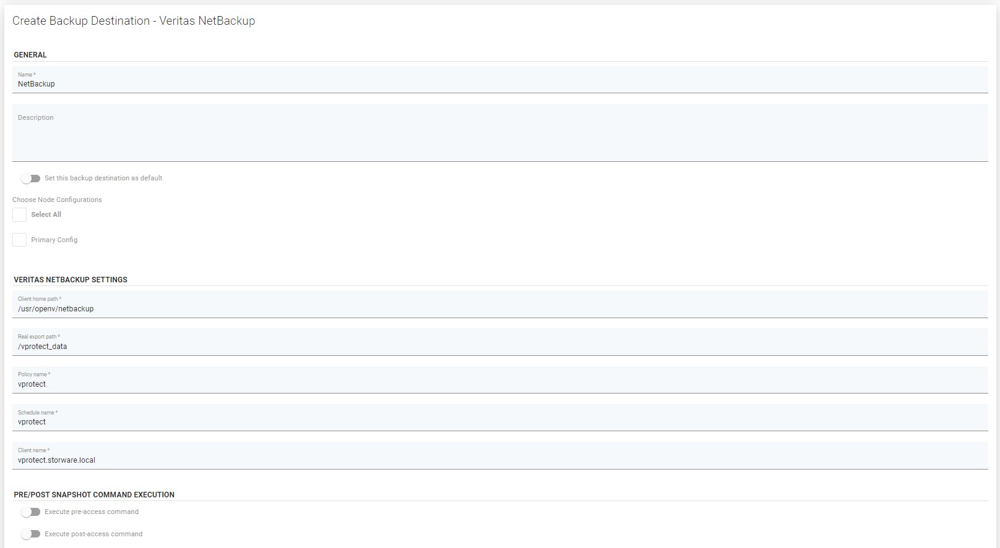

# Veritas Netbackup

* Before we start, you have to generate a token for the clients.
* To do that please log in to the Netbackup Administration Console:


* After successful login please click the “Token Management” submenu under the “Certificate Management”. Next, click the right mouse button on empty space and select “New Token…”


* The next step is to generate a token:


* Now we should copy the token to the clipboard before start the installation of the client software.


* To enable Veritas NetBackup support please download and install Veritas NetBackup Client:
* Download the CLIENTS1 package for UNIX clients or the CLIENTS2 package for Linux clients to a system with sufficient space.


* Extract the contents of the CLIENTS1 or the CLIENTS2 file.

```text
Example:
     AIX         gunzip NetBackup_8.x_CLIENTS1.tar.gz; tar - xvf NetBackup_8.x_CLIENTS1.tar
     HP-UX        gunzip -dc NetBackup_8.x_CLIENTS1.tar.gz | tar -xvf
     Linux        tar -xzvf NetBackup_8.x_CLIENTS2.tar.gz
     Solaris        tar -xzvf NetBackup_8.x_CLIENTS1.tar.gz
```

* Change to the directory for your desired operating system.

```text
 Example:
     AIX, HP-UX, Solaris, Solaris SPARC    cd [path_to_downloaded_tar.gz file]/NetBackup_8.x_CLIENTS1
     Linux, Linux - s390x            cd [path_to_downloaded_tar.gz file]/NetBackup_8.x_CLIENTS2
```


* Type ./install and answer the questions as follows:


* When the following message appears, press Enter to continue:


The client binaries represent the operating system versions where the binaries were compiled. The binaries typically function perfectly on later versions of the operating system. The installation procedure attempts to load the appropriate binaries for your system. If the script does not recognize the local operating system, it presents choices.

* Type y and press Enter to continue with the software installation.


* Type the fqdn name of your NetBackup master server \(for example netbackup.oranization.local for example netbackup.oranization.local \) and press Enter to continue.


* Confirm the NetBackup client name and press Enter to continue.


* \(Conditional\) Enter one or more media servers if prompted:


* After you confirm you want to continue, the installer fetches the certificate authority certificate details.


**Note:** Be aware if you press Ctrl+C, this action requires you to rerun the installation or continue with the installation without the required security components. If these security components are absent, backups and restores fail.

* When prompted, review the fingerprint information and confirm that it is accurate.


* After you confirm the fingerprint information, the installer stores the certificate authority certificate details.


**Note:** Be aware if you press Ctrl+C, this action requires you to rerun the installation or continue with the installation without the required security components. If these security components are absent, backups and restores fail.

* After the Certificate Authority certificate is stored, the installer fetches the host certificate.


**Note:** Be aware if you press Ctrl+C, this action requires you to rerun the installation or continue with the installation without the required security components. If these security components are absent, backups and restores fail.

* \(Conditional\) If prompted for the Authorization Token, please enter it.


The token format is 16 upper case letters. Be aware if you press Ctrl+C, this action requires you to rerun the installation or continue with the installation without the required security components. If these security components are absent, backups and restores fail.

* This is the last question. Next, the setup will make some operations and after all, it will finish its work and exit.


* Once we have finished the installation of the client software we need to modify the firewall service to allow double-sided communication between the server and our client. We need to allow input communication on ports 13782/tcp and 13782/udp. To do that enter commands as below:
* First, we need to know what is our default zone:

```text
firewall-cmd --get-default-zone
```


```text
firewall-cmd --get-active-zones
```


```text
firewall-cmd --list-all
```


* Like we see, there is no allowing for those ports. So we need to open them.

```text
firewall-cmd --zone=public --add-port=13724/udp && firewall-cmd --zone=public --add-port=13724/tcp
```


* Finally, we have to modify the permanent firewall rules so that those services will still be available after a reboot.

```text
firewall-cmd --zone=public --permanent --add-port=13724/tcp && firewall-cmd --zone=public --permanent --add-port=13724/udp
```

* Now we can check the status of our firewall:

```text
firewall-cmd --zone=public --permanent --list-ports && firewall-cmd --list-all
```


* The Last action is to bind the port to the NetBackup client deamon” bpnd”. To do that type the following command in terminal

```text
/usr/openv/netbackup/bin/bpcd -port 13724
```

* To add a new client we need to create a policy rule for it where we will configure the type and schedule of this client backup. The client will add automatically after the end of the creator.

Add new Policy:


* Select machine type to backup:


* Add client to backup:


* Set up configuration details as you want to:


* Finally, we have the client connected to the server.


* Allow manual backup for vProtect node client on Netbackup server.
* Login to vProtect, and go to "Backup Destinations" then select the "enterprise" sub-tab. Click on "Create Backup Destination", choose "Veritas Netbackup". Type name for a new backup destination, client home path, real export path. And set Netbackup parameters:

Client home path  
Real export path  
Policy Name  
Schedule name  
Client name



