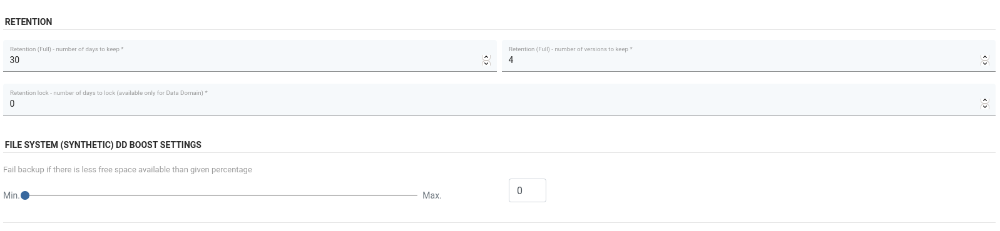

# Synthetic filesystem DD Boost

_**Synthetic**_

A synthetic file system allows us to store and use incremental backups as if they were full backup files, but they take up a fraction of full file size.

**Prerequisites**

* We need to have a configured Storage Unit, user and protocol correctly set up on DELL EMC and boostFS.

  See [How to setup DD Boost FS Plugin](../deduplication-appliances/dell-emc-data-domain.md#dd-boost-fs-plugin).

  \(Do not set up an additional Backup Destination! You just need to follow the instructions regarding boostFS and storage unit setup\)

* For basic setup of filesystems on the Node check [regular-filesystem](regular-filesystem.md).

## Creating a Synthetic Filesystem Backup Destination

1. Select File System from Backup Destinations,

   

2. Select Create Backup Destination -&gt; File System \(Synthetic\)

   

3. Configuration is similar to a regular filesystem.

   

   * **Host**: address of Data Domain server
   * **Account name** and **password**: credentials for Data Domain
   * **Storage unit**: storage unit name from Data Domain
   * **Storage path**: path for storing backups. 
   * Optionally you can switch on "Data Domain is mounted to a different directory than backup destination path" and set up a different **Storage path** than the **DD mount path**.

   _**NOTE**_

   * The **Storage path** must be inside the **DD mount path**. 
   * The **DD mount path** \(or **Storage path**,  in case only a **Storage path** is set\) must point to the mount point of boostFS with corresponding Storage Unit \(see setting up boostFS\).

4. Retention configuration. Due to the nature of the Synthetic Filesystem \(each incremental update is seen on the filesystem as a Full backup\), we only need to set up retention for Full files. 

