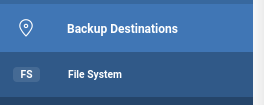
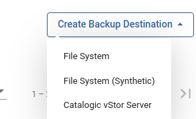
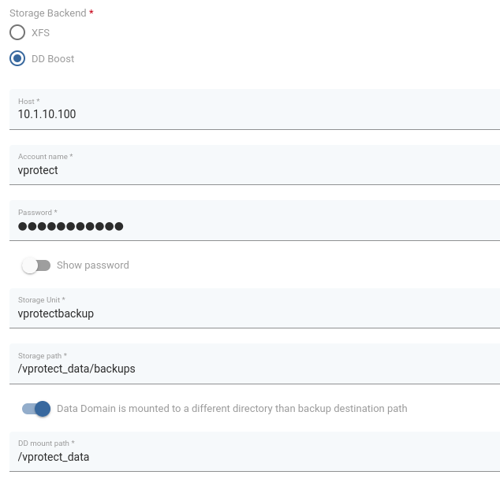

# Synthetic DD Boost

* You need to have configured Storage Unit,user and protocol setup on DELL EMC and boostFS correctly.
  See [How to setup DD Boost FS Plugin](../../backup-destinations/deduplication-appliances/dell-emc-data-domain.md#dd-boost-fs-plugin)
  \(Do not setup additional Backup Destination! You just need to follow instructions regarding boostFS and storage unit setup)
* For a basic setup of filesystems on Node check [regular-filesystem](regular-filesystem.md)  

## Creating Synthetic Filesystem Backup Destination

1. Select File System from Backup Destinations,

      
2. Select Create Backup Destination -> File System \(Synthetic\)

      

3. Configuration is similar to regular filesystem

      
   * **Host**: address of Data Domain server
   * **Account name** and **password**: credentials for Data Domain
   * **Storage unit**: storage unit name from Data Domain
   * **Storage path**: path for storing backups. 
   * Optionally you can switch "Data Domain is mounted to a different directory than backup destination path" on and setup different **Storage path** than **DD mount path**.
    
   ***NOTE*** 
   * The **Storage path** must be inside of the **DD mount path**. 
   * **DD mount path** \(or **Storage path**,  in case only **Storage path** is set\) must point to the mount point of boostFS with corresponding Storage Unit (see setting up boostFS).

