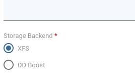
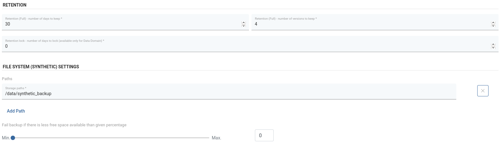

# Synthetic filesystem XFS

_**Synthetic**_

A synthetic file system allows us to store and use incremental backups as if they were full backup files, but they take up a fraction of full file size.

**Note:**

* The only prerequisite to use synthetic XFS as a backup destination is that the selected storage path is on the XFS.  
* For a basic setup of filesystems on the Node check [regular-filesystem](regular-filesystem.md).

## Creating a Synthetic Filesystem Backup Destination

1. Select File System from Backup Destinations, 

 2. Select Create Backup Destination -&gt; File System \(Synthetic\)

1. Configuration is similar to a regular Filesystem.
   * You just need to select XFS as the Storage Backend:

     

   * For Path and Retention configuration, the difference is that due to the nature of the synthetic backup destination, we only set retention for "Full" files.

      

   * **When setting the path, make sure it's actually on the XFS!**

