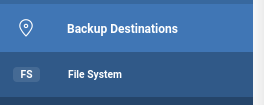
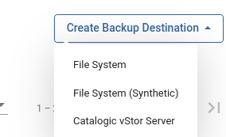
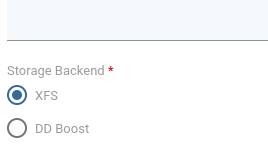
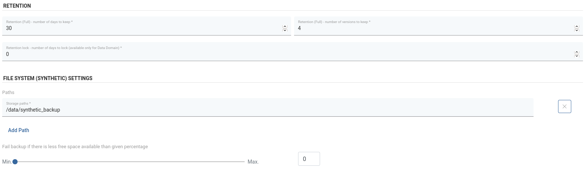

# Synthetic XFS

**Note:**

* The only prerequisite to use synthetic XFS as a backup destination is that selected storage path is on the XFS.  
* For a basic setup of filesystems on Node check [regular-filesystem](regular-filesystem.md)

## Creating Synthetic Filesystem Backup Destination

1. Select File System from Backup Destinations, 

2. Select Create Backup Destination -> File System \(Synthetic\)

3. Configuration is similar to regular Filesystem. 
    * Just need to select XFS as Storage Backend:
      
      
   
    * Path and Retention configuration, the difference is that due to the nature of synthetic backup destination we only set retention for "Full" files. 
    
      
   **When setting the path make sure it's actually on the XFS!**

