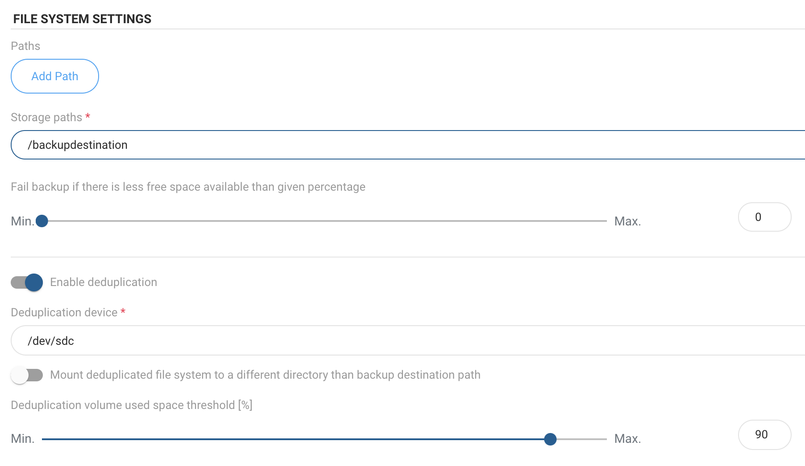
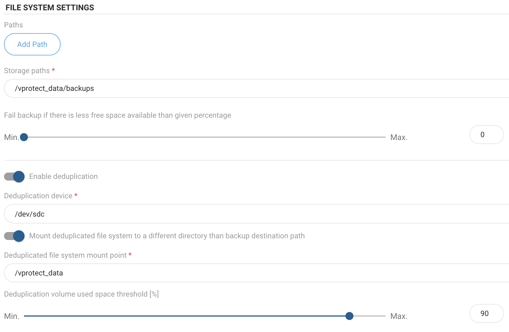

# Virtual Data Optimizer \(VDO\)

In this section you can find information, how to enable deduplication using basically any block storage available. We assume that you have prepared your storage provider and have exposed block device to the system where vProtect Node is installed.

## Preparation

1. Log in to vProtect Node, and create mount directory in example `/backupdestination`

   ```text
   mkdir /backupdestination
   ```

2. List all existing disks, and find your drive:

   ```text
   [root@vProtect01 ~]# fdisk -l | grep dev
   Disk /dev/sda: 32.2 GB, 32212254720 bytes, 62914560 sectors
   /dev/sda1   *        2048     1026047      512000   83  Linux
   /dev/sda2         1026048    62914559    30944256   8e  Linux LVM
   Disk /dev/sdc: 500 GB, 17179869184 bytes, 33554432 sectors
   Disk /dev/sdb: 21.5 GB, 21474836480 bytes, 41943040 sectors
   Disk /dev/mapper/centos-root: 28.5 GB, 28462546944 bytes, 55590912 sectors
   Disk /dev/mapper/centos-swap: 3221 MB, 3221225472 bytes, 6291456 sectors
   ```

3. Let's assume `/dev/sdc` is your empty block device that you want to use
4. Login to vProtect web UI
5. Go to **Backup Destinations**
6. Click on **Create Backup Destination**, choose **File system**
7. Type name for new backup destination, set retention and select at least one node configuration
8. Usually you have to decide if your backup destination is a separate entity than staging space
   * if **staging space is different than your backup destination** storage
     * in **Storage paths** type `/backupdestination` - this path will be used to mount prepared file system \(XFS\) on top of VDO volume
     * check **Enable deduplication**
     * provide your block device \(i.e. `/dev/sdc`\)  as your Deduplication device

```text
 
```

* if **staging space needs to be the same as your backup destination** storage

  * in **Storage paths** type `/vprotect_data/backups` - this path assumes that `/vprotect_data` is your staging space path and `backups`is a subdirectory of the staging space
  * check **Enable deduplication**
  * provide your block device \(i.e. `/dev/sdc`\)  as your **Deduplication device**
  * enable **Mount deduplicated file system to a different directory than backup destination path** and provide mount point - your staging space path, i.e. `/vprotect_data` - this will force vProtect to mount XFS on top of VDO in the staging space directory rather than in backups subdirectory

  

* **Note**: O**nly one file system backup destination with deduplication using VDO pointing to the specific directory can be used**
  * if you want to add another backup  destination using same VDO device, but just different subdirectory
  * create it without deduplication enabled
  * Save configuration.

