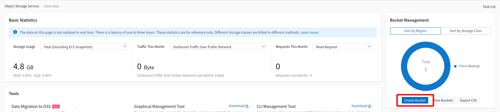
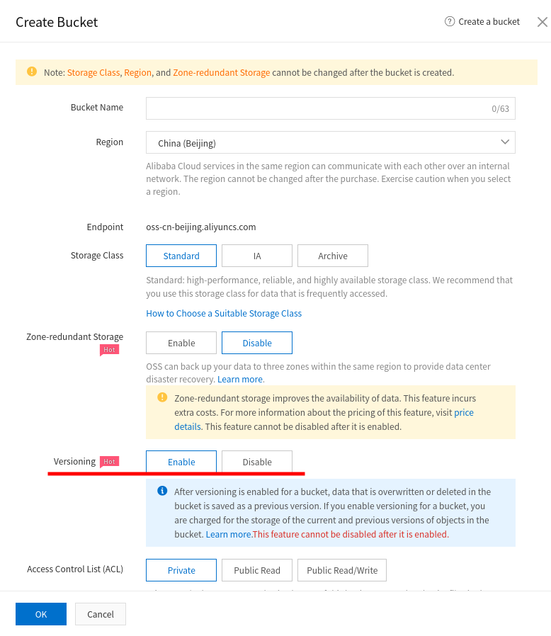
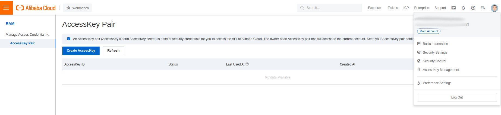
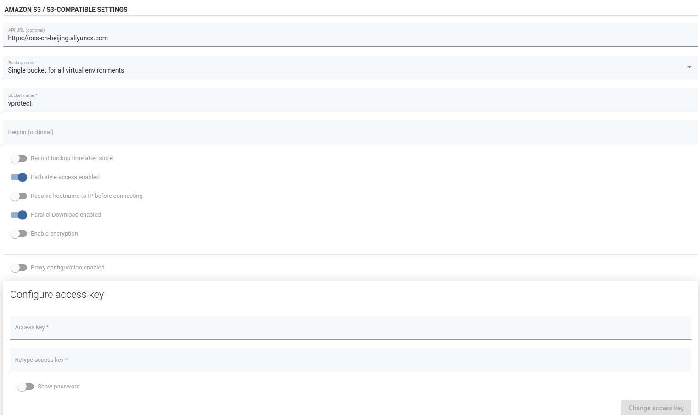

# Alibaba Cloud OSS

## Overview

Albaba Cloud is a S3-compatible backup provider. Configuration as backup destination is similiar to AWS S3.

## Example

After logging in, go to the Object Storage Service and create new bucket.

Provide necessary details for your bucket and enable versioning.

Next, go to Manage AccessKey Management and create new AccessKey

Now go to the Backup destination tab on the vProtect dashboard and change the sub-tab to object storage. Provide the bucket name and key credentials, and then configure the remaining options according to your requirements:

