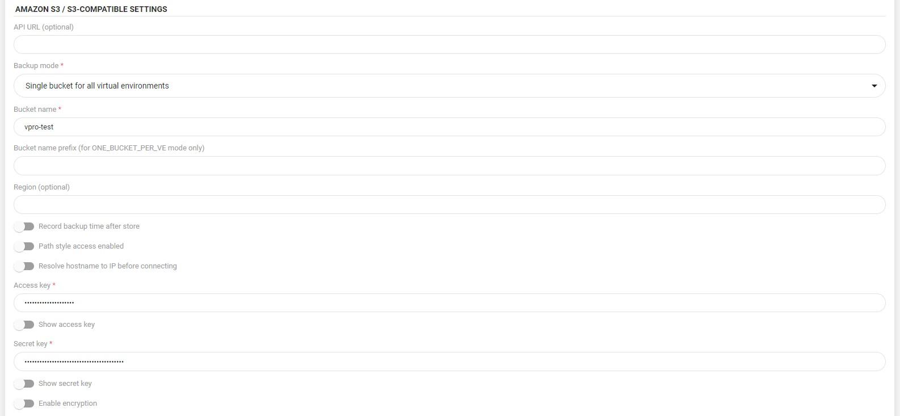

# AWS S3 or S3-compatible

## Overview 

vProtect can store backups in AWS S3 or S3-compatible backup provider. In most cases, you just need to prepare a bucket \(with versioning enabled if possible\) and generate access/secret key for vProtect. vProtect can be installed in AWS \(if EC2 backup is used\), but in most cases, S3 is going to be used just as a cloud backup provider for on-prem environments.

Typical use cases are:

* when AWS is used - choose a single bucket with **versioning enabled** - all backup objects will have names in `/container_name/path/to/backup` format, where `container_name` typically is VM name with an identifier
* when 3rd party is used - you need to verify:
  * which strategy is supported by the vendor - i.e. Scality requires single bucket without versioning
  * when recording timestamp of the object should occur - i.e. Scality does it after data is stored \(unlike AWS\)

vProtect also is able to **encrypt** backups before sending backups \(client-side encryption: SSE-C\). Once enabled, new data being stored is going to be encrypted with keys generated and kept by vProtect. For performance improvements, we also recommend to use AWS Direct Connect to access S3. Otherwise, backups would be sent over the Internet which could result in poor performance.

**Notice:** S3 has a **limit of 5TB** per object. This means that depending on the virtualization platform and backup format used by export/import mode you may have a limit of 5TB per VM \(if it is Proxmox VMA or Citrix XVA image-based backup\) or per VM disk \(in most cases\). Bigger files are currently not supported.

### Permissions

Depending on the mode selected you may different set of permissions. For single bucket, you need to use access keys of a user that has the ability to control objects within the bucket over the specific bucket - here is example IAM policy:

```text
{
  "Version": "2012-10-17",
  "Statement": [
    {
      "Sid": "Stmt1568968204280",
      "Action": [
        "s3:DeleteObject",
        "s3:DeleteObjectTagging",
        "s3:DeleteObjectVersion",
        "s3:DeleteObjectVersionTagging",
        "s3:GetBucketTagging",
        "s3:GetBucketVersioning",
        "s3:GetObject",
        "s3:GetObjectRetention",
        "s3:GetObjectTagging",
        "s3:GetObjectVersion",
        "s3:GetObjectVersionTagging",
        "s3:ListBucket",
        "s3:ListBucketVersions",
        "s3:PutObject",
        "s3:PutObjectTagging",
        "s3:PutObjectVersionTagging",
        "s3:RestoreObject"
      ],
      "Effect": "Allow",
      "Resource": "arn:aws:s3:::BACKUP_DESTINATION_BUCKET/*"
    }
  ]
}
```

You can also use the predefined role and create user from AWS console:  
[https://docs.aws.amazon.com/IAM/latest/UserGuide/id\_credentials\_access-keys.html\#Using\_CreateAccessKey](https://docs.aws.amazon.com/IAM/latest/UserGuide/id_credentials_access-keys.html#Using_CreateAccessKey)

**Notice:** It recommended to periodically rotate your access/secret keys. More information can be found here: [https://aws.amazon.com/blogs/security/how-to-rotate-access-keys-for-iam-users/](https://aws.amazon.com/blogs/security/how-to-rotate-access-keys-for-iam-users/). After changing key in AWS, remember to update it in vProtect as well.

### Parameters

See S3 section in [Backup destinations](https://github.com/Storware/vprotect-manual/blob/44ec389afca4833c392307e4b64205c90e260fd6/admin_webui_overview/admin_webui_bd.md#s3)

### Bucket replication

Even though S3 is a highly available service, you may want to be prepared in case of a region failure. We recommend following this guide[ https://docs.aws.amazon.com/AmazonS3/latest/dev/replication.html](https://github.com/Storware/vprotect-manual/tree/e7b7039b975e5a518e099f05a9079b281ece5f7c/AmazonS3/latest/dev/replication.html) to setup bucket replication so that your data is replicated to the other region in the worst case. Remember to point vProtect to the replicated bucket in case of a disaster.

### Glacier/Deep Archive support

Starting from version 3.9, vProtect is able to move older backups to Glacier/Deep Archive storage tier. In S3 backup provider settings, you need to enable `Move old versions to other storage class` toggle and provide extended retention settings.

Keep in mind that vProtect will try to restore it to S3 with expiration set to 2 days. You'll notice that although the task is running, no progress takes place as it is waiting for the object to be restored from Glacier to S3. This **may take several hours** as Glacier doesn't provide instant access for archival data. Once this part is completed, vProtect is going to proceed with regular restore from a temporary S3 object.

### Costs

When storing backups in S3 additional charges will occur for stored backups. Retention setting in vProtect can limit the storage costs of stored backups. Currently, vProtect doesn't support Glacier \(but will appear in future releases\).

Please visit [https://aws.amazon.com/s3/pricing/](https://aws.amazon.com/s3/pricing/) to check current AWS S3 pricing.

## Example

Now we will show you how to quickly create S3 storage and integrate it with vProtect as a backup destination.  
After logging in, expand the services tab a choose S3 under Storage section:


Now create a new bucket for your backups:


In "Configure options" activate versioning:  
\(In all other tabs, you can leave default settings\)


After creating a bucket, we need to create a new user with appropriate permissions:


Remember to choose "Programmatic access" account type:


From the predefined roles, you can choose "AmazonS3FullAccess" or you can create a new one as described in the Permissions section:


Remember to download .csv or copy key credentials manually:


Now go to the Backup destination tab on the vProtect dashboard. Provide the bucket name and key credentials, configure the remaining options according to your requirements:



