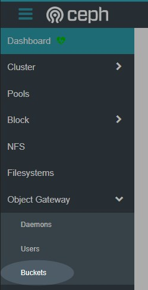
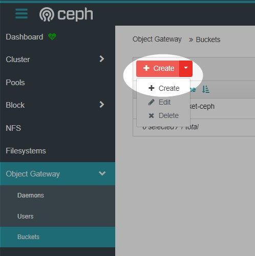
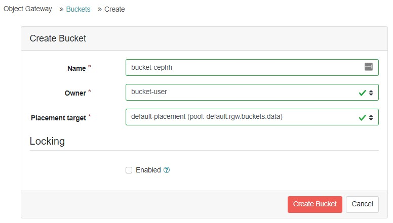
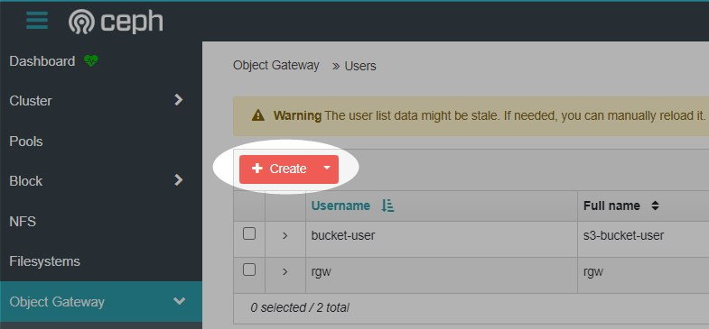
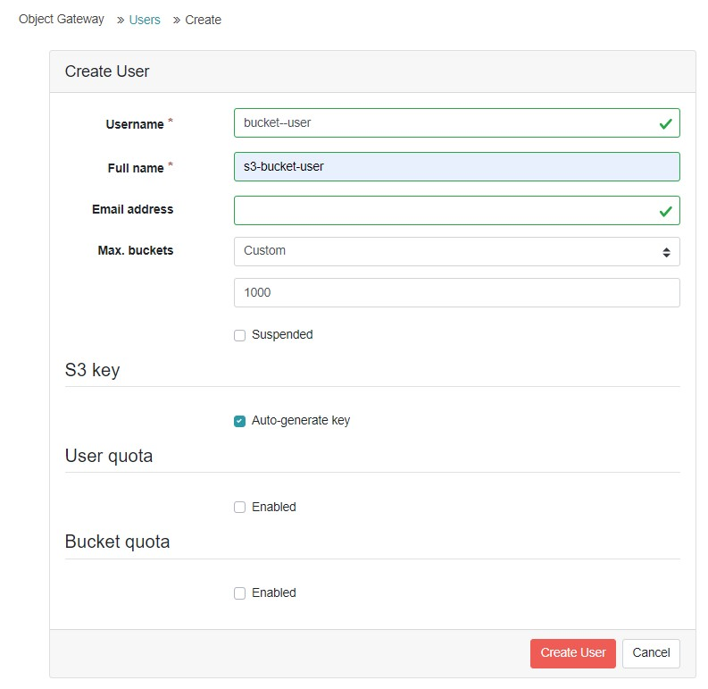
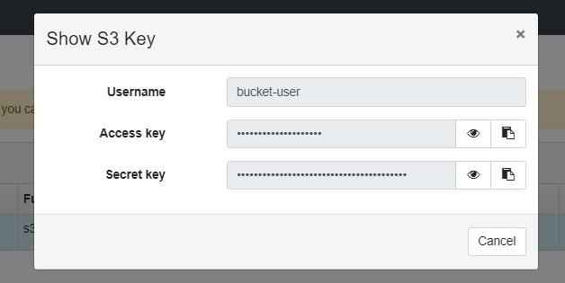
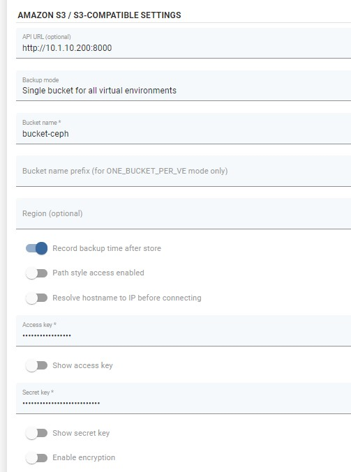

# Ceph Rados Gateway

## Overview

Ceph Object Gateway supports a RESTful API that is compatible with the basic data access model of the Amazon S3 API. Ceph Object Gateway is an object storage interface built on top of librados to provide applications with a RESTful gateway to Ceph Storage Clusters. Ceph Object Storage supports two interfaces:

* **S3-compatible**: Provides object storage functionality with an interface that is compatible with a large subset of the Amazon S3 RESTful API.
* **Swift-compatible**: Provides object storage functionality with an interface that is compatible with a large subset of the OpenStack Swift API.

### Example

Log in to the ceph dashboard. Open Object gateway and then go to "Buckets".

Then click on the "Create" button.

Fill in the required fields.

Now create a dedicated access account for the backup destination. Open the Users tab under the object gateway menu.

Fill in the username field, you can leave the other settings as default.

To see the account key and secret key, expand the user details and open the keys tab, click on the key and then on the show button.

The access key and secret key will be needed to create a backup destination on vProtect.

Now we can go to the vProtect Dashboard. Open the "Backup Destination" tab from the left side menu and choose "Amazon S3 / S3-compatible" as the new type of backup destination.

By default, Ceph provides S3 via port 8000. Also remember to enable the "record backup time after store" option.

