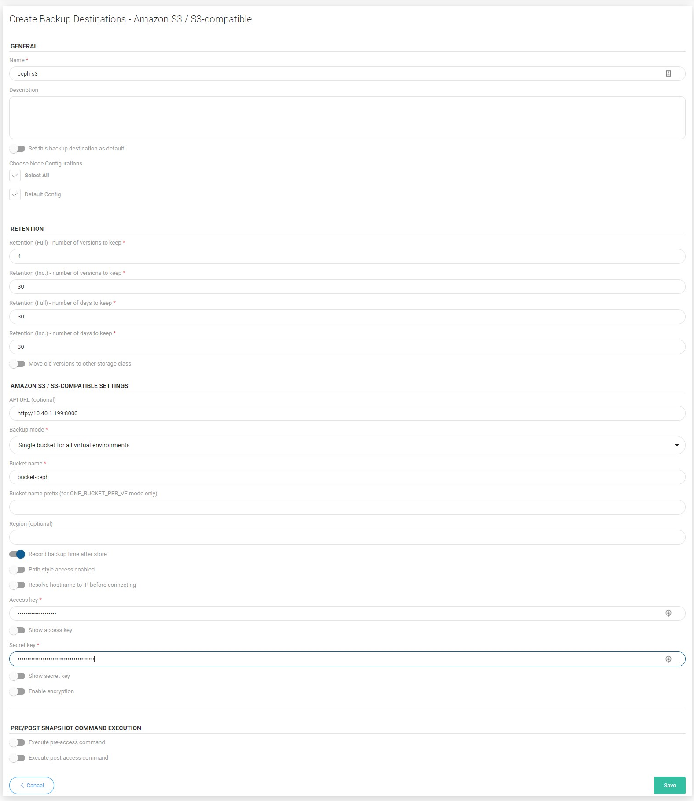
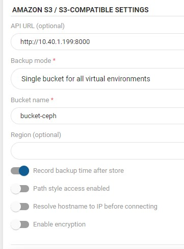

# Ceph Rados Gateway

## Overview

Ceph Object Gateway supports a RESTful API that is compatible with the basic data access model of the Amazon S3 API. Ceph Object Gateway is an object storage interface built on top of librados to provide applications with a RESTful gateway to Ceph Storage Clusters. Ceph Object Storage supports two interfaces:

* **S3-compatible**: Provides object storage functionality with an interface that is compatible with a large subset of the Amazon S3 RESTful API.
* **Swift-compatible**: Provides object storage functionality with an interface that is compatible with a large subset of the OpenStack Swift API.

### Example

Log in to ceph dashboard. Open Object gateway and then go to "Buckets"

Then click on "Create" button

Fill requirement fields

Now create a dedicated access account for the backup destination. Open Users tab under object gateway menu

Fill out the username field, you can leave the other settings as default

To see account key and secret key expand user details and open keys tab, click on the key and then on the show button

The access key and secret key will be needed to create a backup destination on vProtect

Now we can go to the vProtect Dashboard. Open "Backup Destination" tab from the left side menu and choose "Amazon S3 / S3-compatible" as a new type of backup destination

By default, Ceph provides S3 under port 8000. Also remember to enable the "record backup time after store" option

