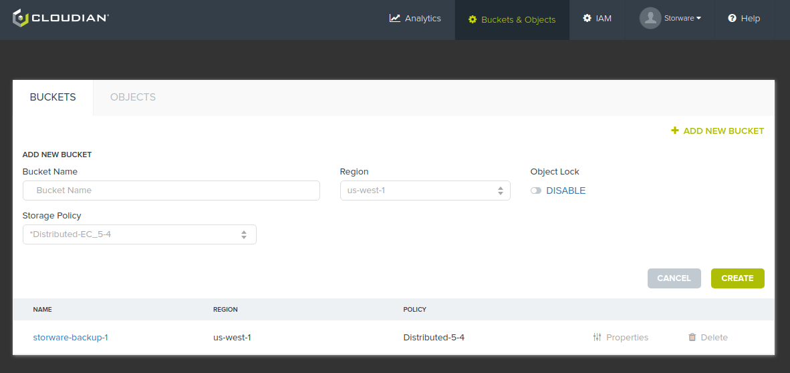
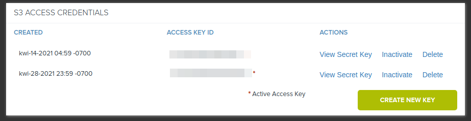
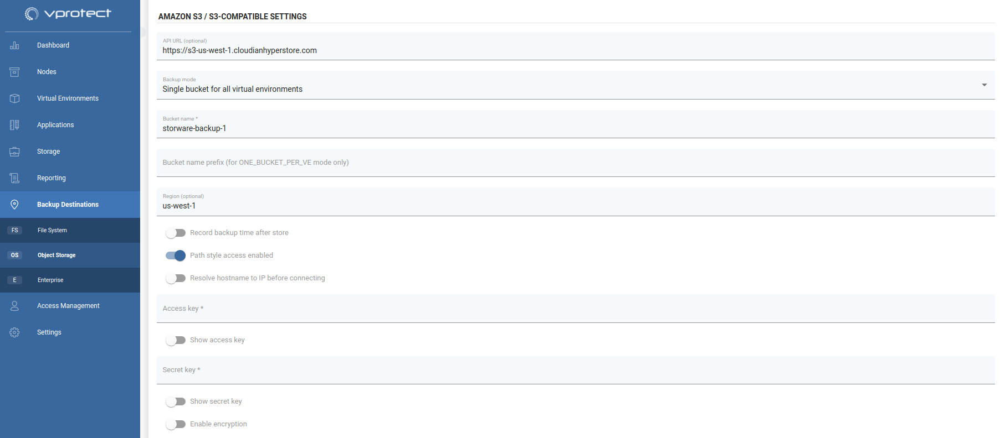

# Cloudian

## Overview

Cloudian is a S3-compatible backup provider. Configuration as backup destination is similiar to AWS S3.

## Example

After logging in, create new bucket for your backups

Next, go to security credentials and generate new access key.

Now go to the Backup destination tab on the vProtect dashboard and change the sub-tab to object storage. Provide the bucket name and key credentials, and then configure the remaining options according to your requirements:

