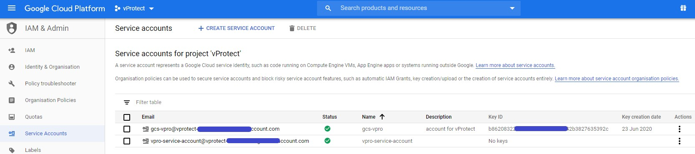
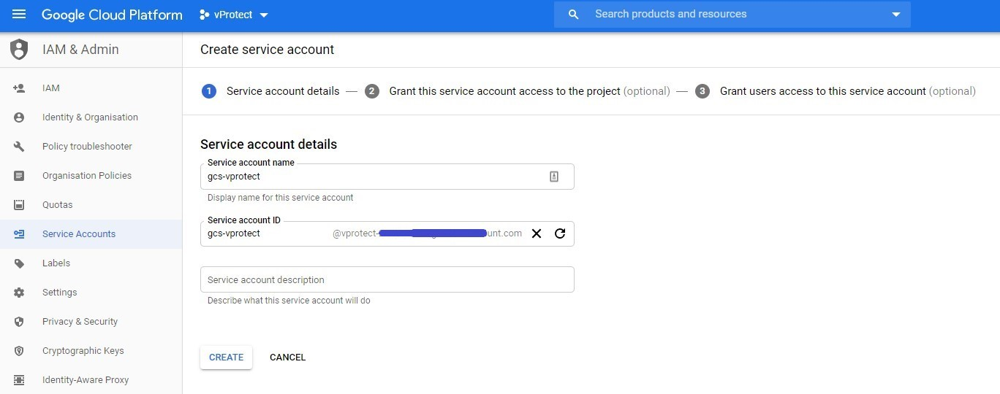
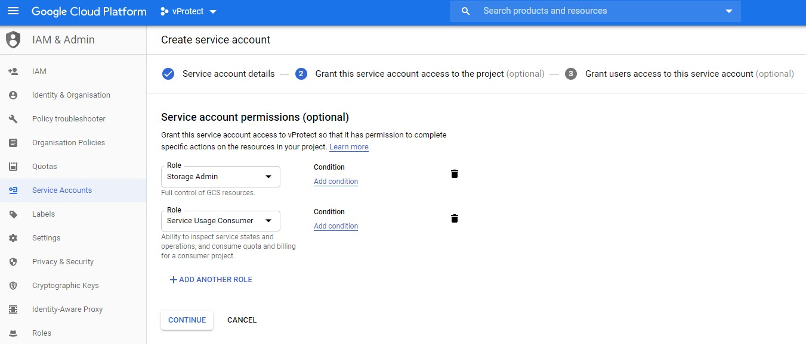
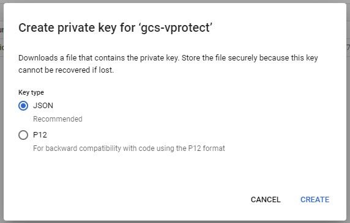
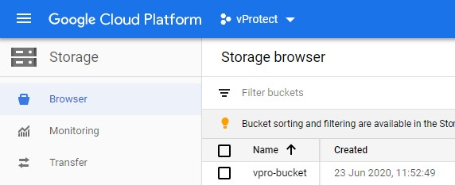
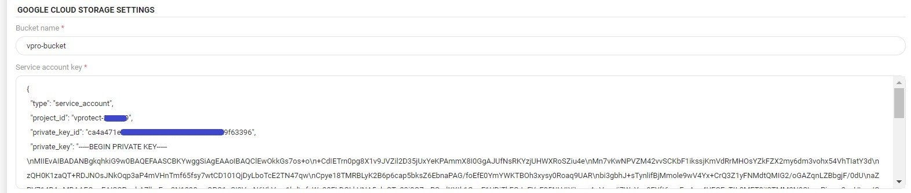

# Google Cloud Storage

**Google Cloud Storage** allows for storing and accessing data on Google Cloud Platform infrastructure. It combines the performance and scalability of Google's cloud with advanced security and sharing capabilities.

### How to use **GCS** as a backup destination for **vProtect**:

1. Create a project: Click [here](https://cloud.google.com/resource-manager/docs/creating-managing-projects) for more info about **Creating and Managing Projects**.
2. Create a bucket: Click [here](https://cloud.google.com/storage/docs/creating-buckets) for more info about **Creating Storage Buckets**.

3. Enable versioning in your bucket: Click [here](https://cloud.google.com/storage/docs/using-object-versioning#gsutil) for more info about **Enabling Object Versioning**.  
`gsutil versioning set on gs://[BUCKET_NAME]`

4. Generate service account key: Click [here](https://cloud.google.com/iam/docs/creating-managing-service-account-keys) for more info about **Creating service account keys**. The service account key should have **Role** set to **Storage Admin and Service Usage Consumer**.

You can leave the third tab - Grant users access to this service account \(optional\)  
To generate account key click on the "three-dot" button next to your service account and then click on "create key".  
Then you should see below the window, click on create to download JSON file. You'll need its content in the last step.

5. After the key is created, open your vProtect server page \(you can also use **CLI**\), click on **BACKUP DESTINATIONS**, press **Create Backup Destination** button, then select **Google Cloud Storage** from the drop-down list. In addition to [standard properties](../), you need to specify: 

* **Bucket name** specified during bucket creation    
* **Service account key** - paste content of service account key .json file created before.

Now you can store vProtect backups on Google Cloud Storage.

