# IBM Cloud Object Storage

## Overview

_IBM Cloud Object Storage is a push-button deployed cloud storage service and is available in IBM Cloud global data centers. It offers leading data protection, high durability, and fast access to your data. You can use it to store and protect data with easy-to-use management features to organize your data and to configure finely-tuned access controls._

### Example

Log in to your IBM Cloud account, on the main dashboard you will see "Create a resource" button - Click on it.

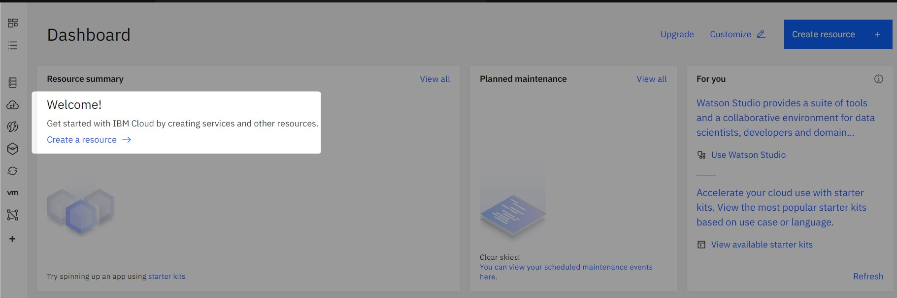

On the next screen search resource named "Object Storage" and click on it.

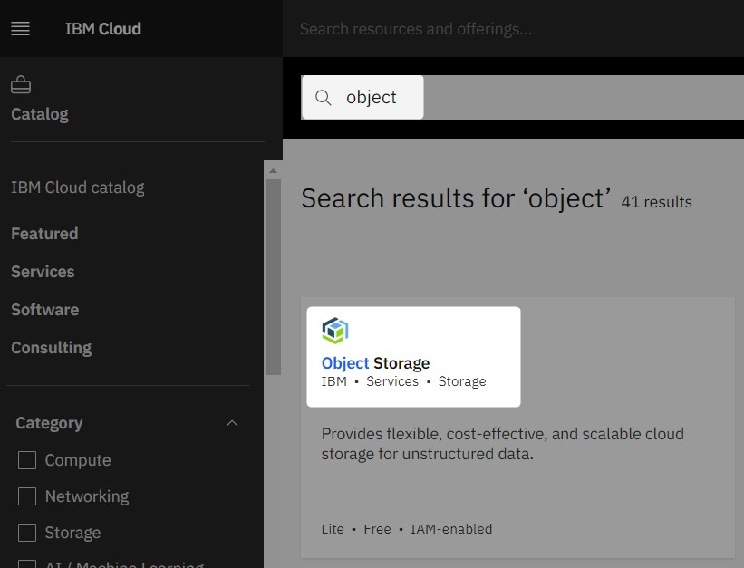

On the next screen you can choose piercing plans etc. Please select options according to your requirements.

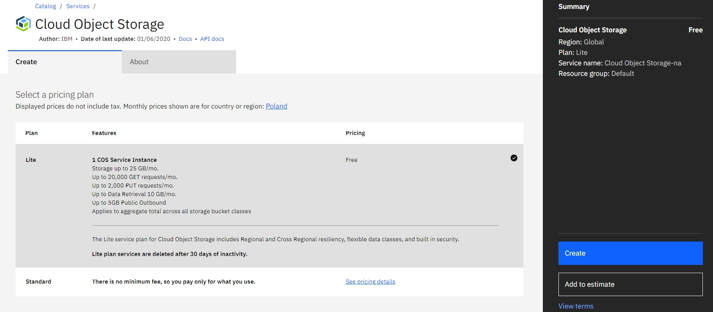

After creating storage resource we need to create a bucket.

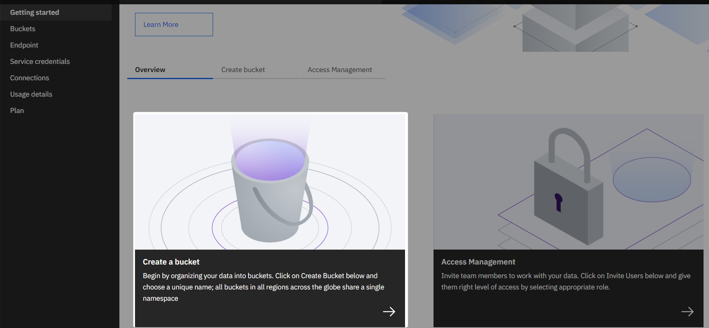

You can choose predefined templates or select the option to create a bucket with your own settings. In this example, we will choose "Custom bucket"

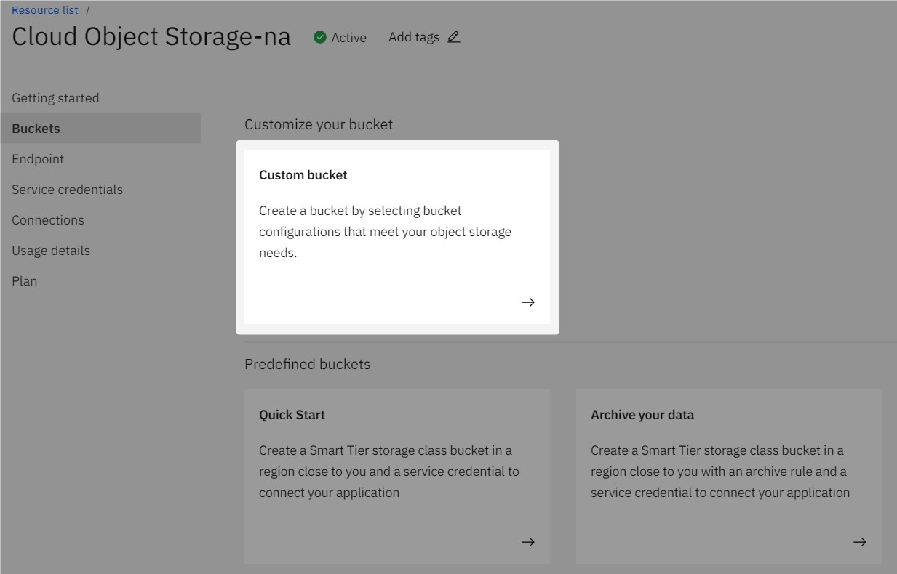

vProtect has no special requirements for the bucket, all options can be configured according to customer needs

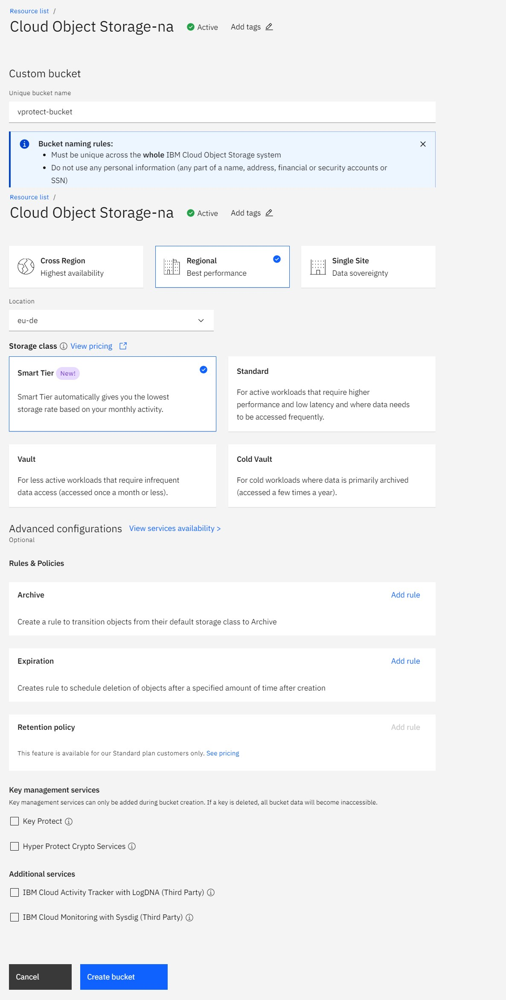

After creating the bucket, you'll see the objects page. From the menu on the left select the configuration tab. You will see a summary of the resource you created. To create a backup destination you will need the _**"public" address from the endpoints section**_ from here

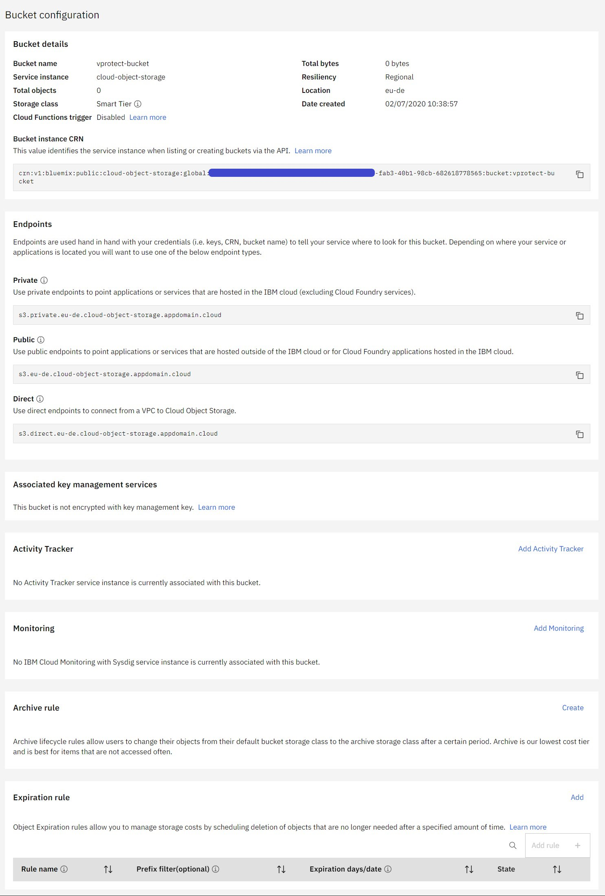

We almost done here, now we need to create API access and secret key. Go to "Service credentials" on the left side menu then create new credentials by blue button on the right.

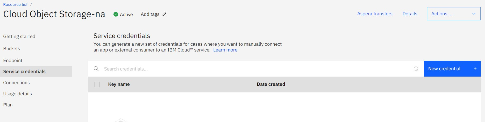

There are two important options on this screen, you must select the appropriate role \(for vProtect it is the "Writer" role\) and select the option "Include HMAC credential"

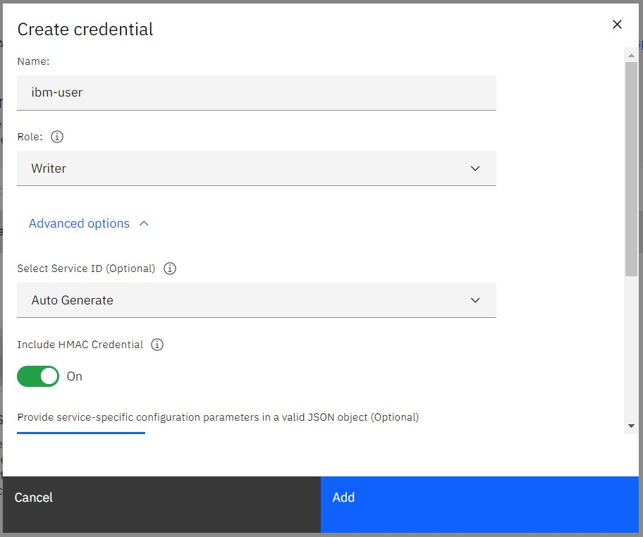

Now expand the detailed information about the created credentials by clicking on the arrow next to the name. What we need is "access\_key\_id" and "secret\_access\_key"

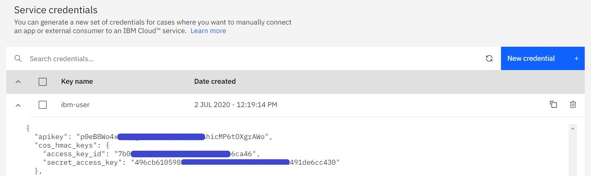

Now we can log in to vProtect Dashboard and create a backup destination. Please go to the backup destination tab on the left side menu and then choose "Amazon S3 / S3-compatible".

As IBM cloud storage is compatible with Amazon-S3, many settings will be very similar. However, remember to enter the API URL \(remember about https:// at the beginning\), select the "Record backup time after store" option, and enter the region.

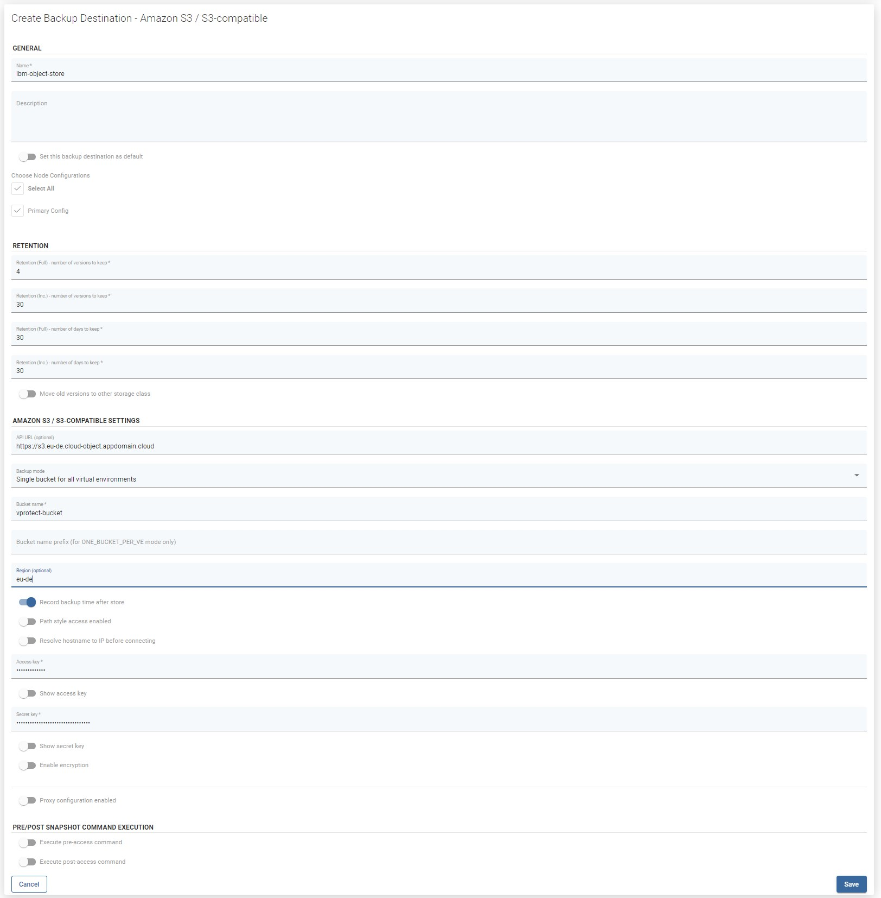

