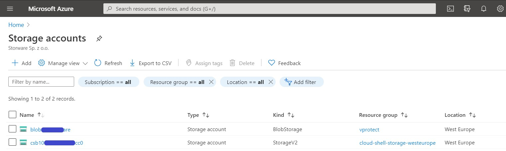
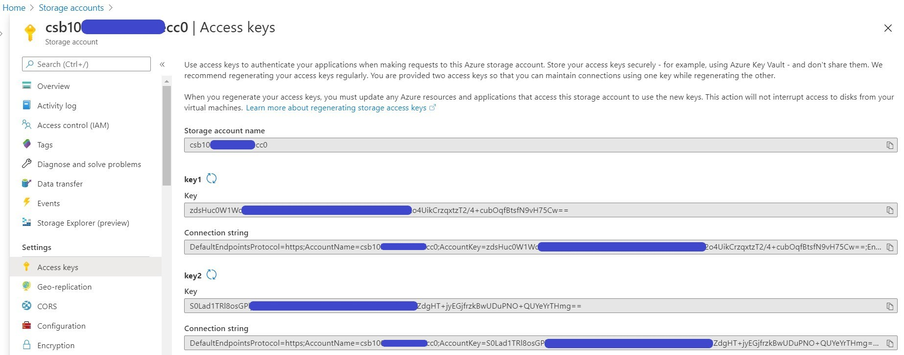
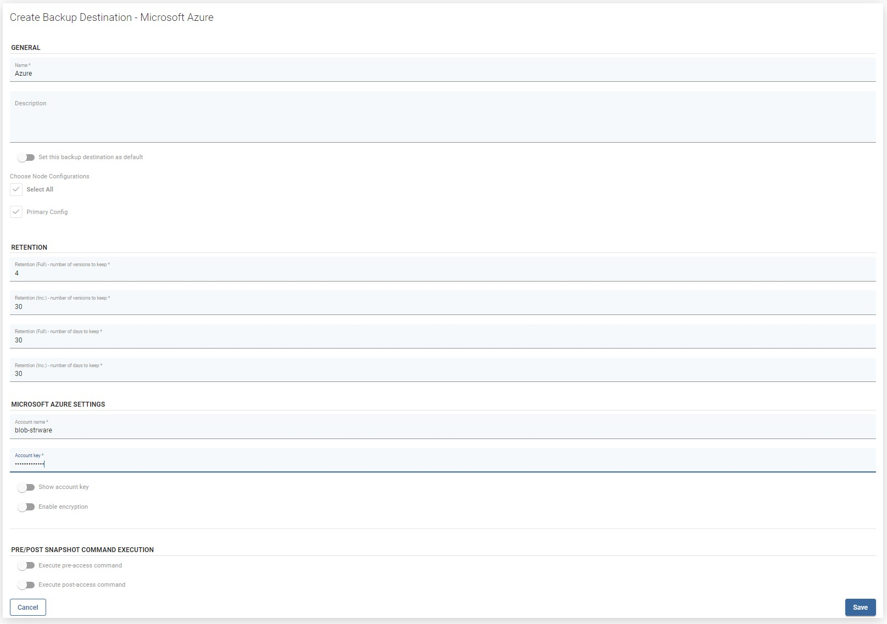

# Microsoft Azure Blob Storage

vProtect support integration with MS Azure Blob Storage. An Azure storage account contains all of your Azure Storage data objects: blobs, files, queues, tables, and disks. The storage account provides a unique namespace for your Azure Storage data that is accessible from anywhere in the world over HTTP or HTTPS. If you don't already know Azure Blob storage, please read this great documentation [https://docs.microsoft.com/en-gb/azure/storage/blobs/](https://docs.microsoft.com/en-gb/azure/storage/blobs/)

To configure Azure as a backup destination for vProtect, we just need:

* Storage account name  
* One of the account keys

Now you can go to the backup destinations tab in vProtect and create a new Microsoft Azure backup destination.

You just need to customize retention and provide an account name and key.

And that's all, as you see in a few minutes you can integrate vProtect with Azure Blob storage to securely store your backups

