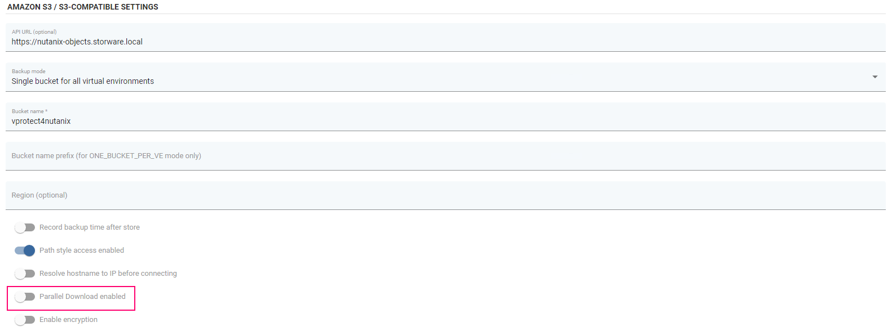

# Nutanix Objects

Nutanix Objects is a S3-compatibile backup provider. Configuration as backup destination is similiar to AWS S3.

## Example

In the vProtect system, go to the `Backup Destinations` -> `Object Storage` tab, then press the `Create Backup Destination` button and select the `Amazon S3 / S3-compatible` option.

In this step, complete the name, retention, add: API URL, Access key and Secret key, indicate the name of the bucket to be used.

Then go to the `AMAZON S3/S3-COMPATIBLE SETTINGS` segment in which you should **deselect** the `Parallel Download enabled` option for Nutanix Objects.

After entering the settings, press the `Save` button to be able to use Nutanix Objects as Backup Destination.