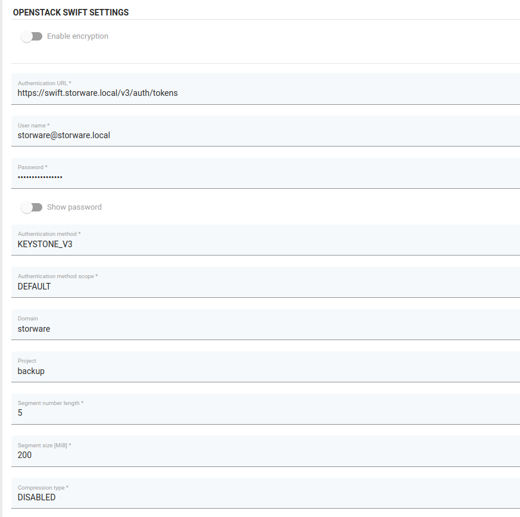

# OpenStack SWIFT

vProtect supports integration with OpenStack SWIFT.

## Example

In the vProtect system, go to the `Backup Destinations` -> `Object Storage` tab, then press the `Create Backup Destination` button and select the `OpenStack Swift` option.

Enter the name of new backup estination, assign it to `Node Configuration` and set up the retention.

Next, provide setting specific to `OpenStack Swift`:
* Authentication URL - URL pointing to authentication service, it should be similiar to the following
  ```text
    https://SWIFT_HOST/v3/auth/tokens
  ```
* User name - domain formatted username used by vProtect to log into OpenStack Swift
* Authentication method - BASIC / TEMPAUTH / KEYSTONE / KEYSTONE_V3
  * in case of KEYSTONE_V3 authentication method, you also need to enter `Authentication method scope`, `Domain` and `Project`



