# Oracle Cloud Infrastructure Object Storage

## Overview

_The Oracle Cloud Infrastructure Object Storage service is an internet-scale, high-performance storage platform that offers reliable and cost-efficient data durability. The Object Storage service can store an unlimited amount of unstructured data of any content type, including analytic data and rich content._

### Example

Log in to Oracle cloud dashboard, expand the left side menu and go to the Object Storage tab.

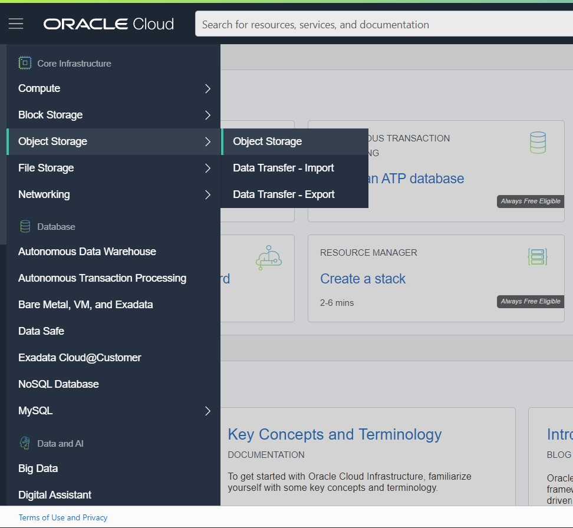

Now let's create a new bucket

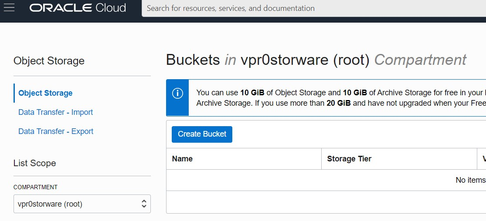

We do not require specific bucket settings for vProtect. The bucket name will be needed when we want to create a backup destination in vProtect.

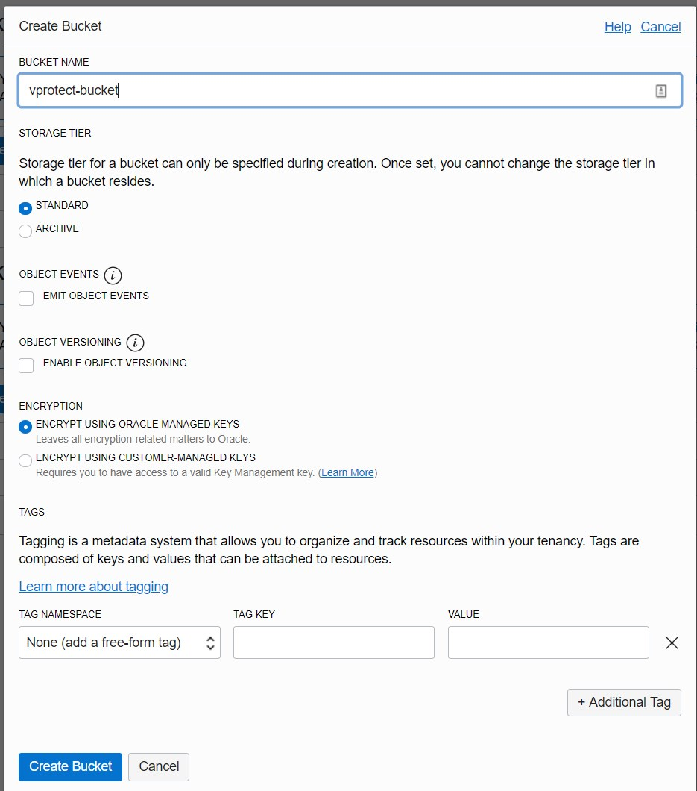

After creating, you'll see a list of buckets, click the name to view the details of the object. Remember the "namespace", we also need it when creating a backup destination.

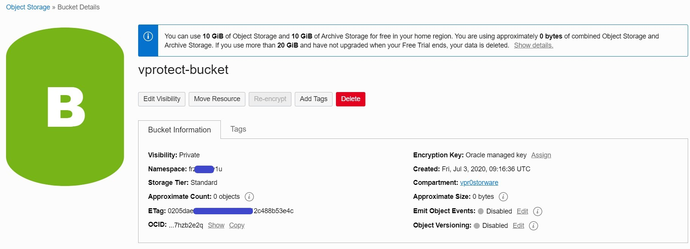

Now we need to create a user, we will use him to authenticate our backup destination. Please go to the Users tab under the Identity tab in the menu on the left.

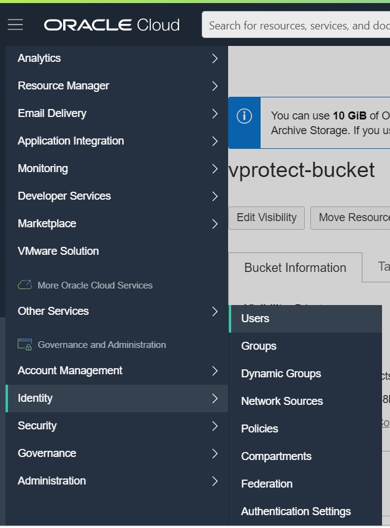

Now create new user

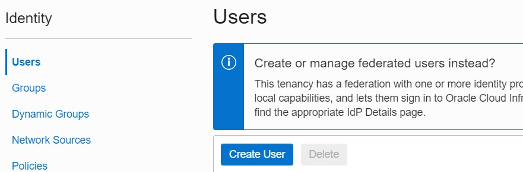

Fill required fields.

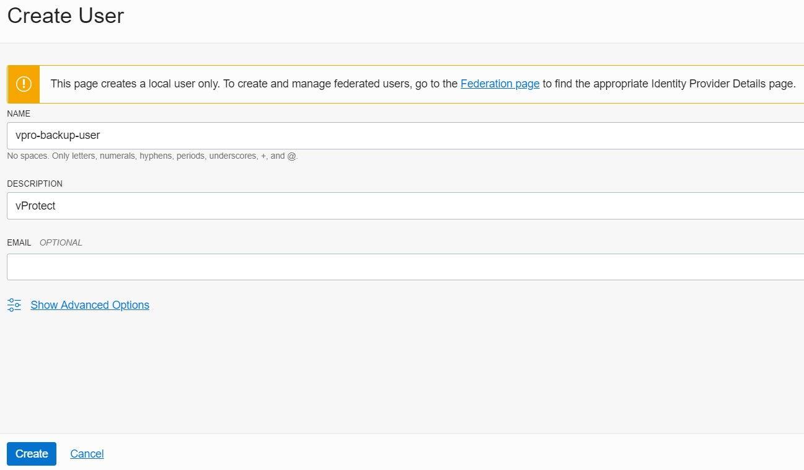

Then go to the Groups page that you can also find under the identity tab in the left side menu

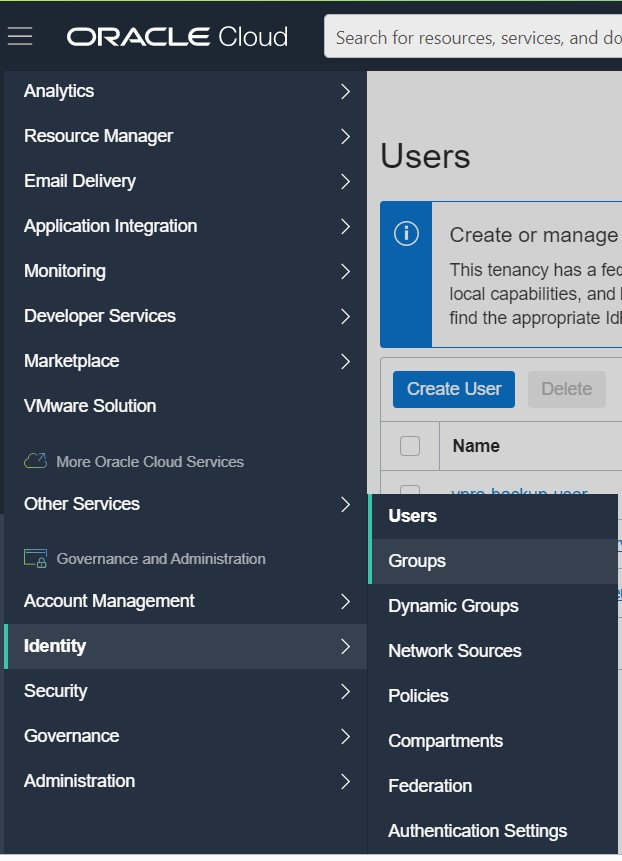

Now click on existing group "Administrators"

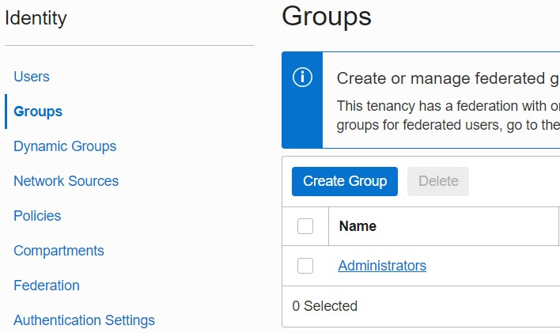

Then click on "Add User to Group" and choose the user you created previously.

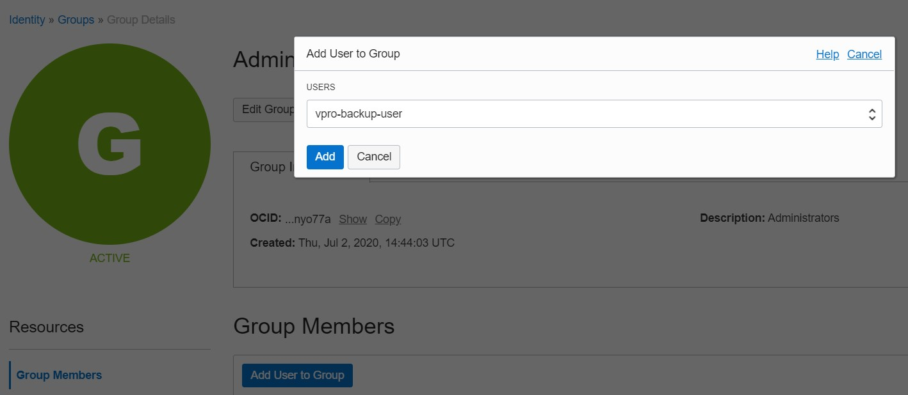

Go back to the Users page and go to the details page of our user.

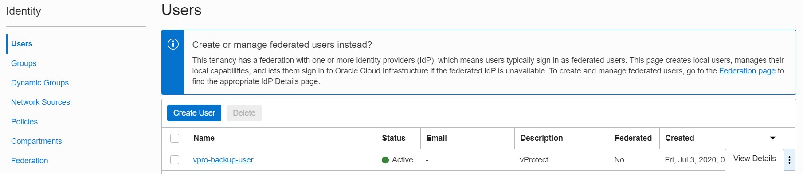

Scroll down and open the "Customer Secret Keys" tab. Click on "Generate Secret Key"

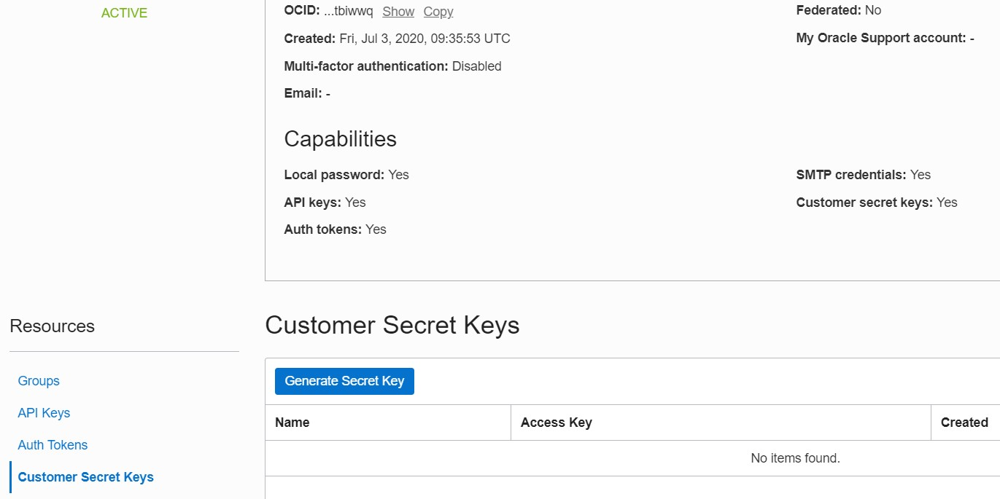

Entry any name

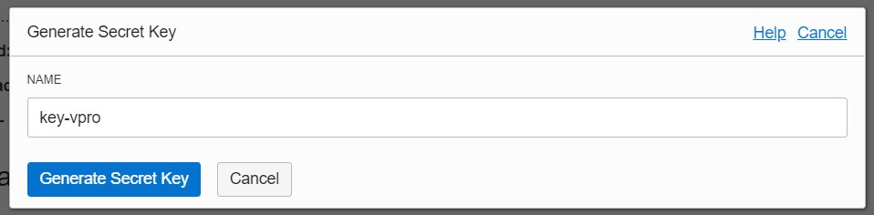

As you see below note, copy and save secret key because you can do this only now

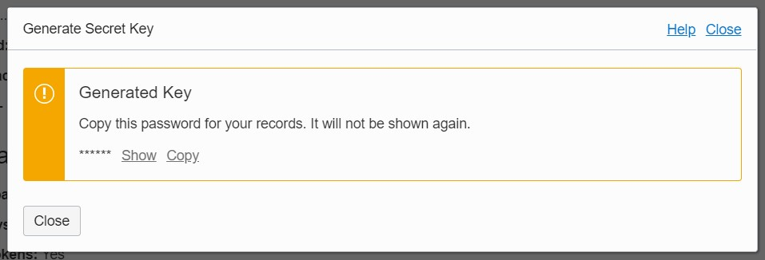

After generating the secret key you can view access key, just move the mouse over it.

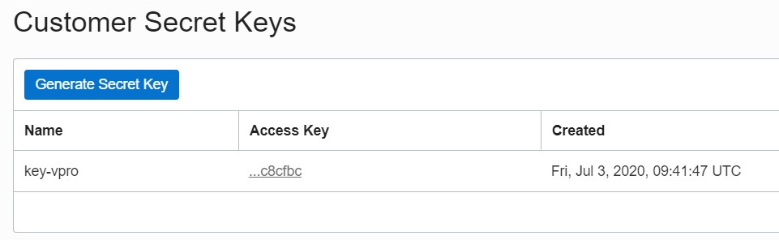

Now we can go to the vProtect Dashboard. Open "Backup Destination" tab from the left side menu, then sub-tab "Object Storage" and choose "Amazon S3 / S3-compatible" as a new type of backup destination

At the beginning let's focus on the "S3-Compatible" section.  
To generate API URL you will need this site: [https://docs.cloud.oracle.com/en-us/iaas/api/\#/en/s3objectstorage/20160918/](https://docs.cloud.oracle.com/en-us/iaas/api/#/en/s3objectstorage/20160918/)  
As I mentioned earlier you will need object storage namespace \(choose API URL from the list according to your region\).  
Then provide your bucket name and region, at the end switch on "Record time after backup" and "Path style access enabled".  
Configure the rest of the settings as desired.

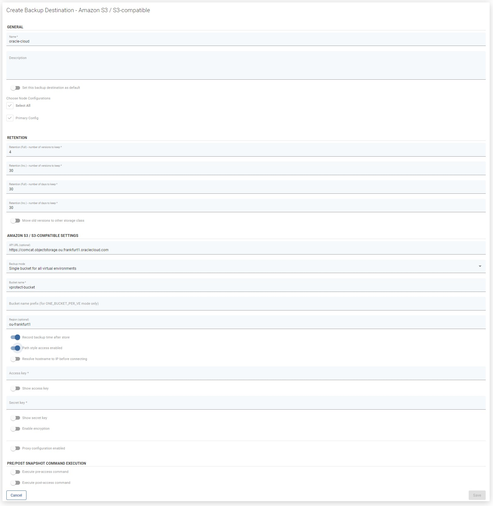

