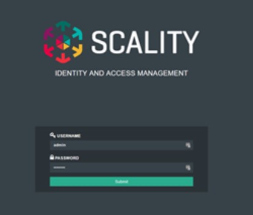
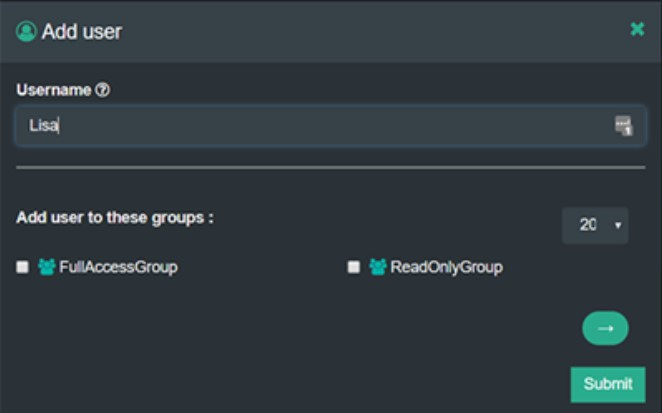
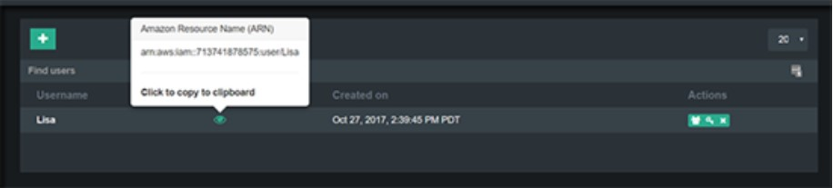
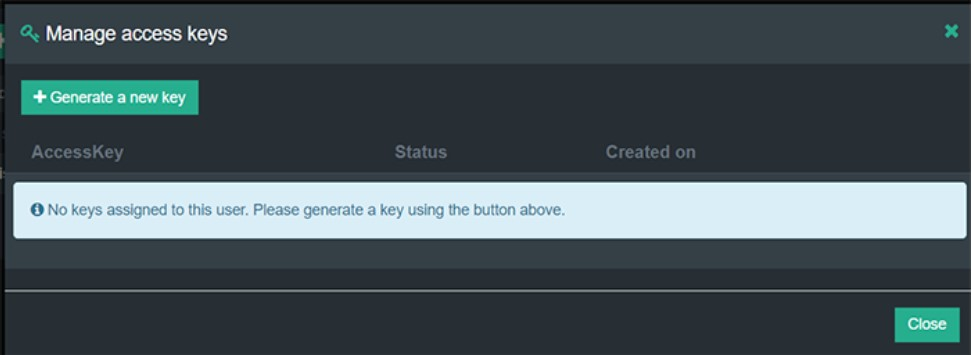
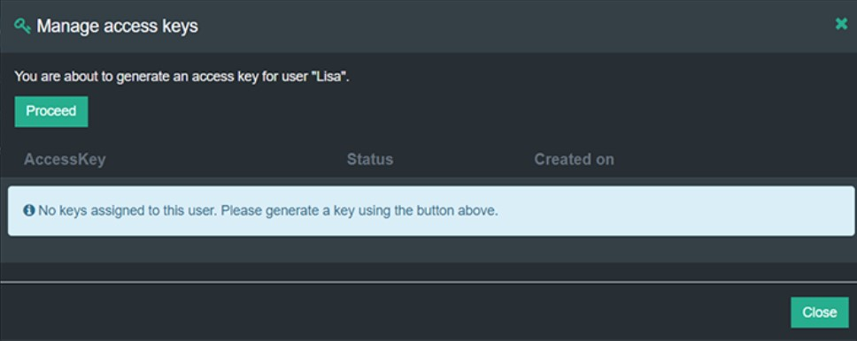
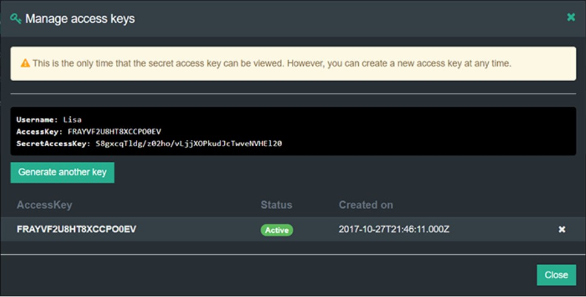
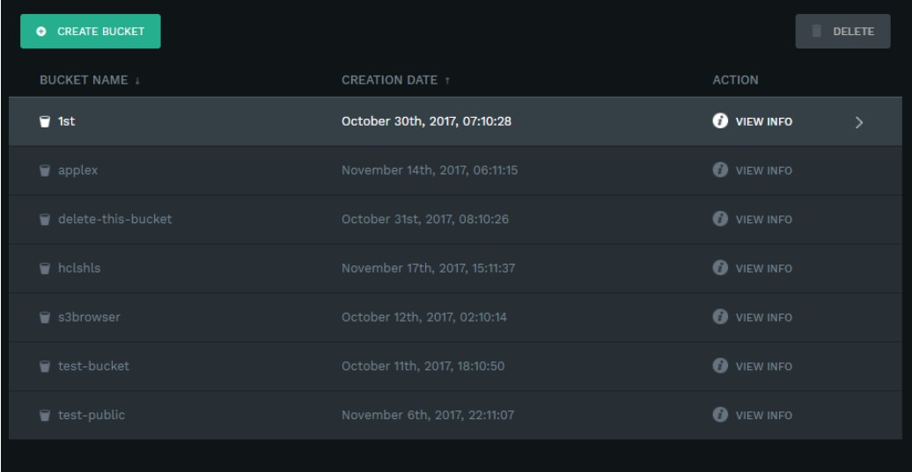
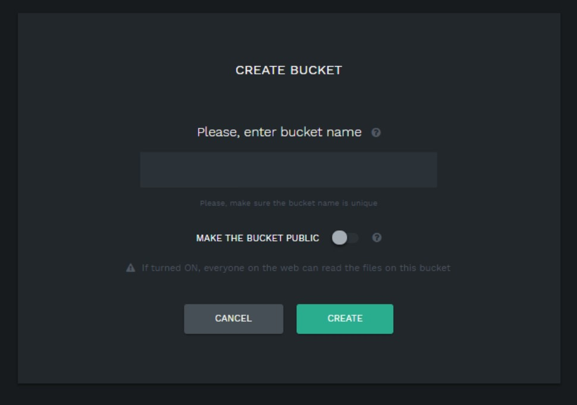
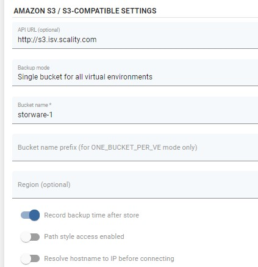

# Scality RING

## Overview

_Scality Ring offers an object storage solution with a native and comprehensive S3 interface. Scality S3 Connector is the first AWS S3-compatible object storage for enterprise S3 applications with secure multi-tenancy and high performance.  
AWS has achieved incredible traction with services such as S3 for a wide variety of cloud application and service provider businesses. However, for many service providers and enterprise corporations who require an on-premises deployment model in order to maintain control over sensitive data, for performance optimization, or for reasons of security or compliance –_ [_Scality’s new S3 Connector_](https://www.scality.com/ring-s3-connector/) _for the RING provides an optimal solution. The S3 Connector offers a solution that is application-compatible with AWS S3 at both the data API level and also with the rapidly evolving_ [_AWS multi-tenancy model termed IAM_](https://aws.amazon.com/iam/?sc_channel=PS&sc_campaign=acquisition_US&sc_publisher=google&sc_medium=iam_b_test_q32016&sc_content=aws_iam_e&sc_detail=aws%20iam&sc_category=iam&sc_segment=105093067122&sc_matchtype=e&sc_country=US&s_kwcid=AL!4422!3!105093067122!e!!g!!aws%20iam&ef_id=V75hMAAAATJKuR0S:20160901212902:s) _\(Identity and Access Management\)._

### Example

In this example, we will show you how to use the Scality S3 connector to create a backup destination for vProtect.  
_It assumes that S3 connector is installed and configured_

We will start by creating a user, please launch the S3 connector user interface.

Log in as an account user using the password set in _Setting an account Password_ from the S3 console GUI.  
Select the user to open the user management window.  
Click Add user to open the add user window.  
Enter the user name and make sure to check the box for "FullAccessGroup".

The user management panel displays the user name and the Amazon Resource Name \(ARN\).  
Now we will generate the access and secret keys for the user.  
Click on the key icon in the Actions column of the user row.

Click on Generate a new key.

Click on Proceed to generate the user's AccessKey and SecretAccessKey.

Copy and save the SecretAccessKey to a secure location. It is not shown again and cannot be recovered later.

Now we can go to bucket creation. Please go to S3 Browser interface.

The S3 Browser opens the main window, from which one can see the entire roster of buckets.  
Click the Create Bucket button in the top left of the main window.

Enter a name for the new bucket and click on Create button.

That's all on the Scality side. Now we can go to vProtect.  
Open the "Backup Destination" tab from the left side menu and choose "Amazon S3 / S3-compatible" as the new type of backup destination.

Like in other S3-compatible backup destinations, you have to fill in the fields below and provide the access and secret key.

That's it, you can now safely store your backups.

