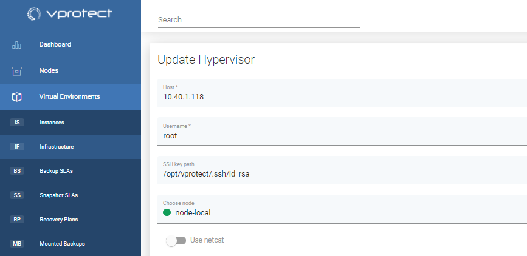

# SSH public key authentication

## General

Instead of using password authentication - anywhere where you're able to provide SSH credentials \(hypervisors, VMs applications etc\) you also have the public key alternative.\*\*.  
By default, vProtect uses the `/opt/vprotect/.ssh/id_rsa` path, however you also can override it with your own path\*.  
_**\*\(this needs to be owned by `vprotect` user and make sure it has the `0400` permission set.  
\*\*You don't have to pass a passphrase, you can leave this parameter blank.**_

_**Note:**_  
vProtect does not support keys other than "RSA"

### **Example:**

1. Generate a key or use yours and store it as `/opt/vprotect/.ssh/id_rsa` \(make sure that the `vprotect` user and group own the file\)
   * example key generation:

     ```text
     [root@vProtect3 vprotect]# sudo -u vprotect ssh-keygen -t rsa -m PEM
     Generating public/private rsa key pair.
     Enter file in which to save the key (/opt/vprotect/.ssh/id_rsa): 
     Enter passphrase (empty for no passphrase): 
     Enter same passphrase again: 
     Your identification has been saved in /opt/vprotect/.ssh/id_rsa.
     Your public key has been saved in /opt/vprotect/.ssh/id_rsa.pub.
     The key fingerprint is:
     SHA256:86HSLKYwl7maDR7U1oIH1Y6VDtRFNJgHgfdjikg3VnQ vprotect@vProtect3
     The key's randomart image is:
     +---[RSA 2048]----+
     |   .o=+XE        |
     |   .o X...       |
     |  .  O o         |
     |  .+=.o +        |
     | .o+=o.oS..      |
     | ..o.+.o + .     |
     |  = + + + .      |
     | . O + o         |
     |  +.+            |
     +----[SHA256]-----+
     ```
2. use `ssh-copy-id` to upload your public key \(as `vprotect` user\) to the KVM host:

   ```text
   sudo -u vprotect ssh-copy-id -i /opt/vprotect/.ssh/id_rsa.pub root@HYPERVISOR
   ```

3. Check if you're able to log in to the hypervisor using the local `vprotect` user without being asked for the password:

   ```text
   [root@vProtect3]# sudo -u vprotect ssh -i /opt/vprotect/.ssh/id_rsa root@dkvm
   Last failed login: Mon Jan 29 17:53:01 CET 2018 from 10.50.1.107 on ssh:notty
   There was 1 failed login attempt since the last successful login.
   Last login: Mon Jan 29 17:52:39 2018 from 10.50.1.107
   [root@dKVM ~]# logout
   ```

4. Now you should be able to index VMs regardless of the password set for the hypervisor \(the key should be used instead\)
5. Provide path to key \(default: /opt/vprotect/.ssh/id\_rsa\) in vProtect dashboard



