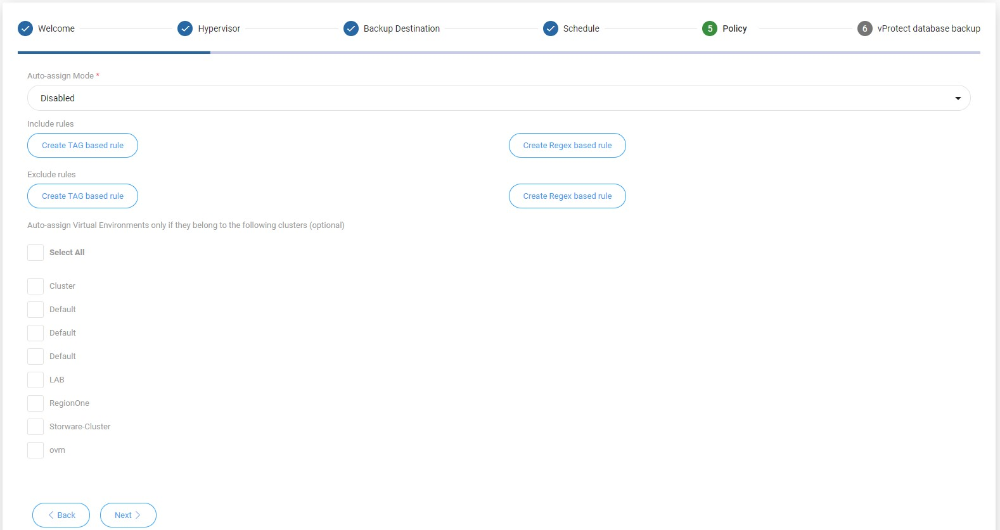

# Initial Configuration

## Node

1. Setup backup destinations \(examples\):
   * [Filesystem](backup-destinations/filesystem/)
   * [Virtual Data Optimizer \(VDO\)](backup-destinations/filesystem/virtual-data-optimizer-vdo.md)
2. For backup strategies involving **disk attachment** mode - follow these steps:[ LVM setup on vProtect Node for disk attachment backup mode](common-tasks/lvm-setup-on-vprotect-node-for-disk-attachment-backup-mode.md).

## Server

1. Upload your license key:
   * if you don't have it you can request to Storware team.
   * log in to the web UI and go to the `Settings -> License` and upload your `license.key` file.
2. It is **highly recommended** to setup vProtect DB backup - database is key to restore your vProtect environment and later all of the backups that you need.
3. Admin account setup:
   * for audit purposes it is recommended to add individual admin accounts using `Users` section \(accessible through `Users` menu item\).
   * **Note:** make sure to set the correct **time zone** for each user - default admin account has **UTC** by default.

## Configuration Wizard

* The configuration wizard can be accessed from the main dashboard by clicking the "configuration wizard" button on the right.

### Welcome page - nodes

* At the welcome page you should see vProtect nodes summary. You need at least one fully running node to continue. If you meet this requirement, please click on next button.

### Add hypervisor

* In Hypervisor section you will start from selecting hypervisor manager or hypervisor that you want to add. You can repeat this step if you have many types of virtualization providers.

* For Citrix hypervisor \(as an example\) you have to fill below parameters

* Choose node

Select backup strategy for your hypervisor

* Optionally you can add an additional NIC for transfer purposes

* At the end, you will see popup window that allows you to run inventory synchronization. After that you should see all virtual machines from that hypervisor.

### Add backup destination

* In the next section you can add a backup destination. In this case you can also repeat the whole process, so you can add multiple providers by the wizard.
* Choose a backup destination \(we use filesystem as an example\)

* First, enter a name for your backup destination

* You can now customize retention. Each backup destination has its own retention settings. Whichever condition is met first \(either number of versions has been reached or backup is older than given limit\), it is removed from backup destination.

* Choose, if you want to use deduplication based on [Virtual Data Optimizer \(VDO\)](backup-destinations/filesystem/virtual-data-optimizer-vdo.md)

* Setup a storage path, where your data should be stored

* Optionally you can enable encryption \(AES-256 algorithm\)

* configuration for pre/post execution command. If you use filesystem with [VDO](backup-destinations/filesystem/virtual-data-optimizer-vdo.md) or [Dell EMC Data Domain](backup-destinations/deduplication-appliances/dell-emc-data-domain.md) integration of standard filesystem, please skip this step. 

* Decide, if you want to setup this backup destination as a default one. 

* Finalize a step by going to a next section or  add another backup destination 

### Add schedule

* Choose a name for a schedule and define a type:
  * Full
  * Incremental 

* Define a execution type:
  * time
  * interval
* Define a start window length 
* Choose time of day for backup

* Choose 
  * days \(required\). 
  * day of week occurrence \(optionally\)
  * selected months \(optionally\)

* Finalize a step by going to a next section or  add another schedule 

### Add policy

* Choose a name for a policy, auto remove non-present virtual environments checkbox and priority

* Choose if you want to use auto assign mode based on tags and regular expressions

* Manually add VMs

* Choose a backup destination target for this policy

* Setup a threshold - fail rest of backup tasks if more than X % of EXPORT tasks already failed
* Setup a threshold - fail rest of backup tasks if more than X % of STORE tasks already failed

* Finalize a step by going to a next section or  add another policy 

### Add internal DB backup

* Choose which node should perform a DB backup

* Choose backup destination for DB backup

Choose when a DB backup should be run \(daily basis\)

* Finalize a configuration or run backup manually \(on demand\)

* you are ready to go! 

