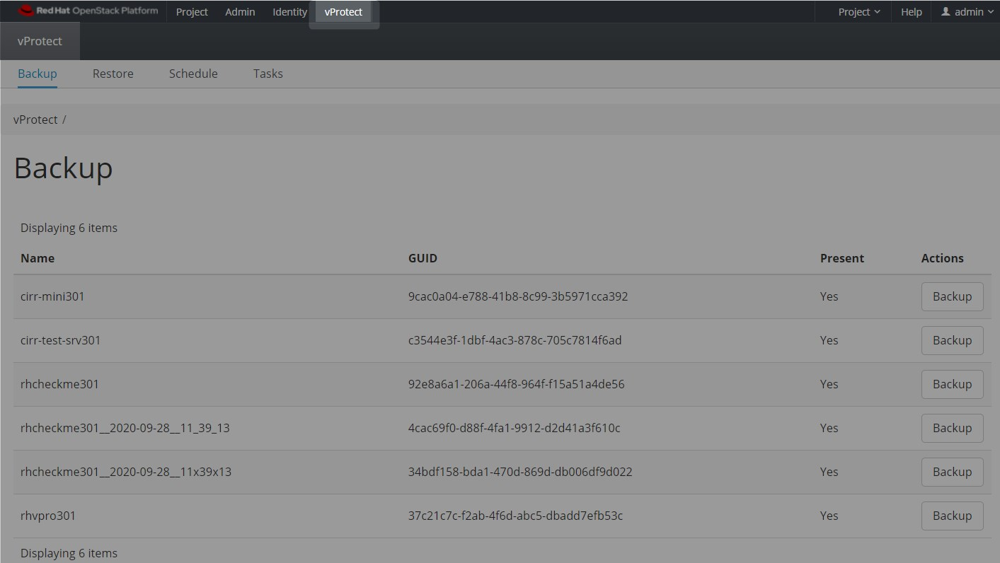
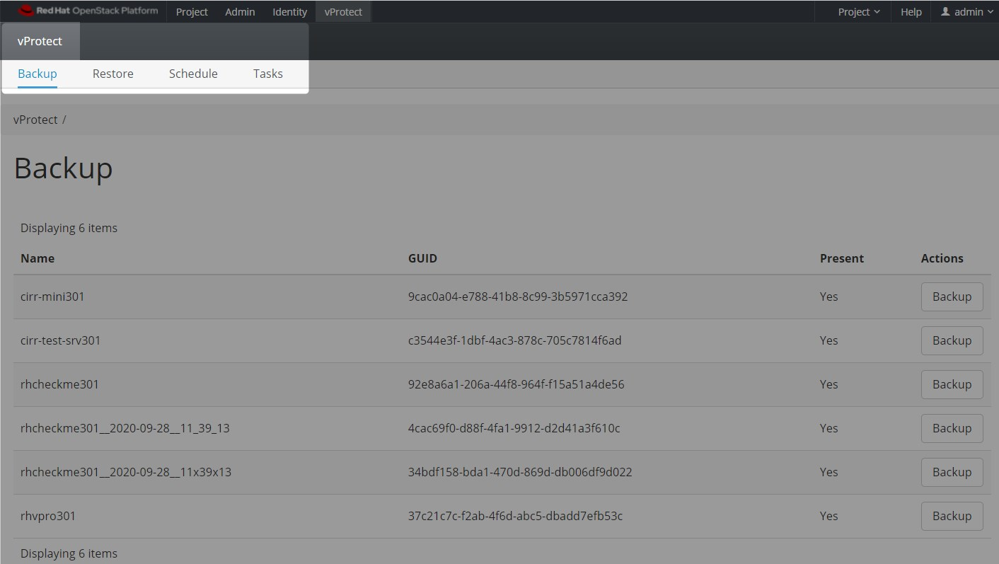
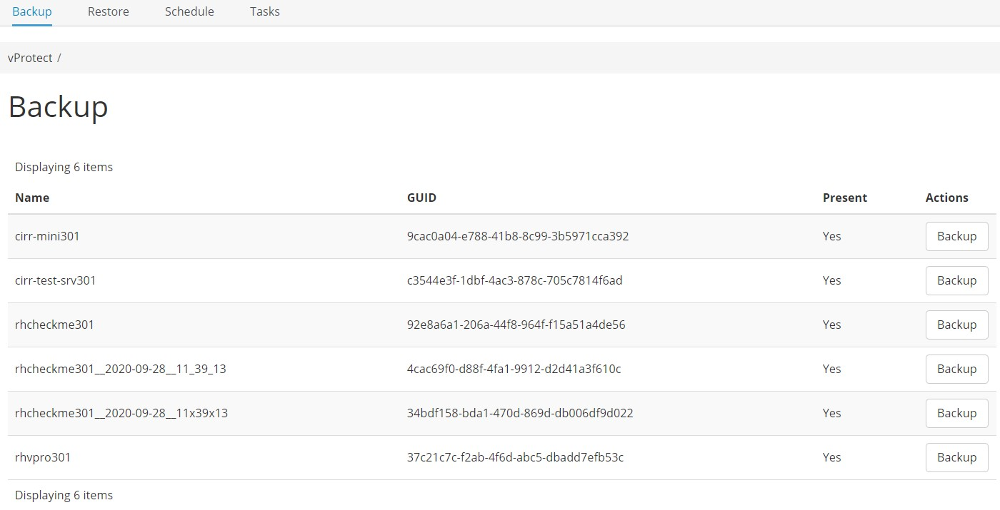
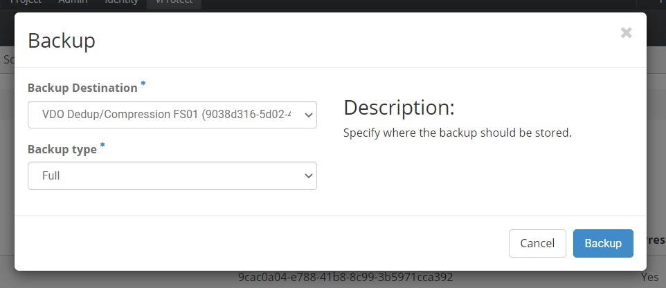
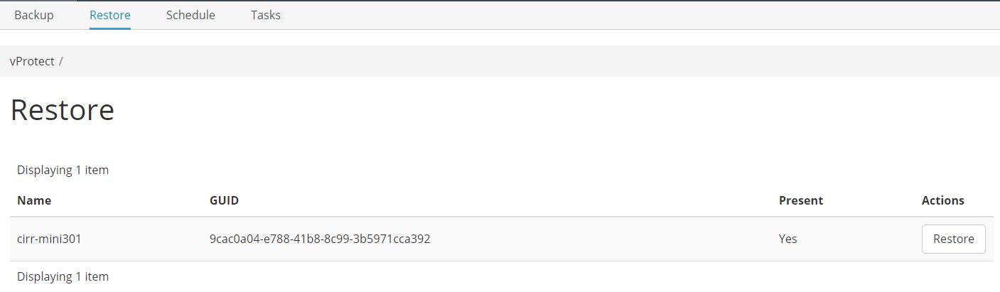
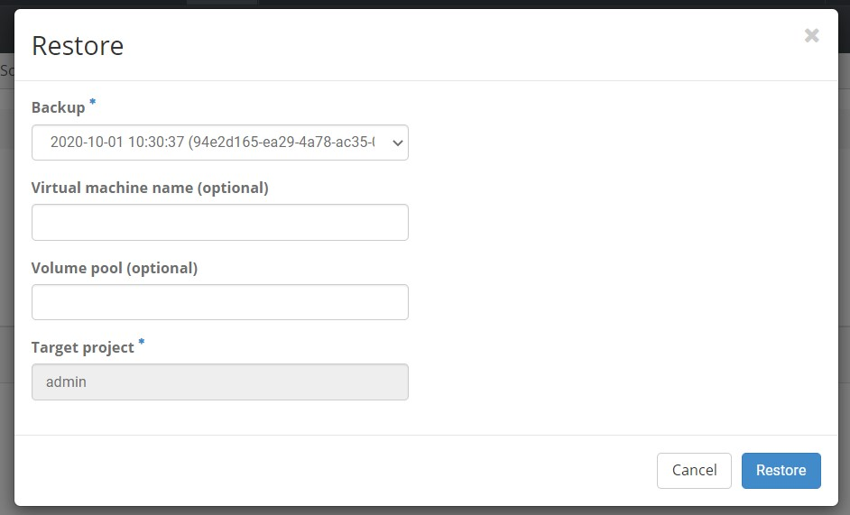
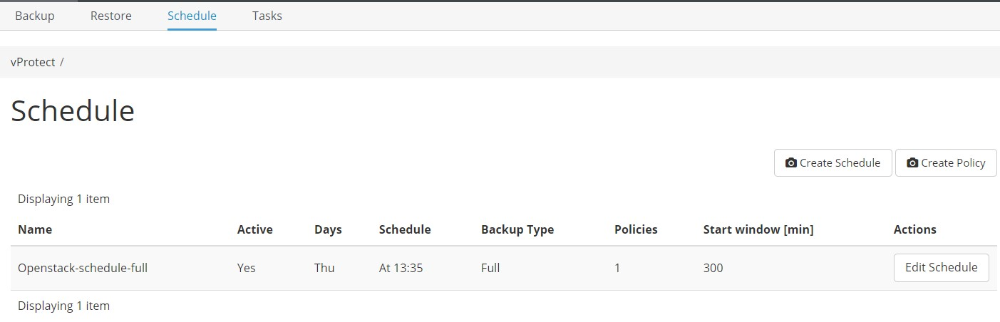
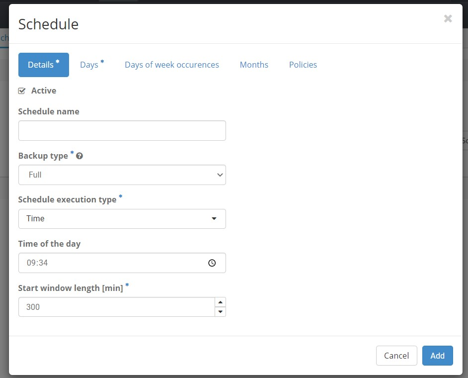
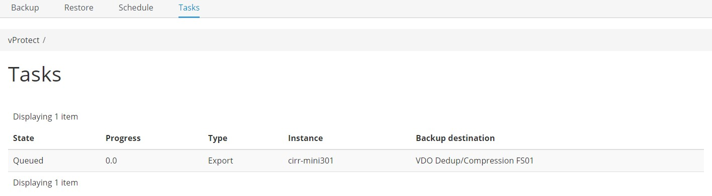

# OpenStack UI Plugin

## General

Integration with the Openstack interface is our second plugin alongside the oVirt/RHV virtualization family. Thanks to it, you can perform most of the basic operations without logging into the vProtect dashboard.

After installation \(which is described at the end of this article\) you will see a new tab "vProtect" in the OpenStack menu.

### Dashboard

The dashboard consists of several tabs that allow you to perform basic actions such as backup, restore or create a new schedule.

### Backup

This tab shows all inventoried instances in your OpenStack environment.

Besides, you can also perform basic backup operations.

### Restore

This tab displays all instances in the OpenStack environment that can be restored.

Restore window:

### Schedule

As the name suggests, this tab allows you to create schedules, but not only.

Thanks to it, we will also create the policies necessary for their operation.

### Tasks

Basic information about current tasks performed by vProtect.

## OpenStack integration setup

You can find the add-on in the [GitHub repository](https://github.com/Storware/ovirt-engine-ui-vprotect-extensions/releases). Extract the provided archive on to your Horizon host and execute `python install.py VPROTECT_API_URL USER PASSWORD`

**Example:** `python install.py http://localhost:8080/api admin vPr0tect`.

**Note:** you need to restart your Horizon HTTP server after this

The above-mentioned script will copy the plug-in files to the following folders:

* `/usr/share/openstack-dashboard/openstack_dashboard/dashboards/vprotect` - plugin files
* `/usr/share/openstack-dashboard/openstack_dashboard/enabled` - file to enable plugin

In order to **uninstall** it, remove the `vprotect` subfolder and `enabled/_50_vprotect.py` file and restart your Horizon HTTP server.

