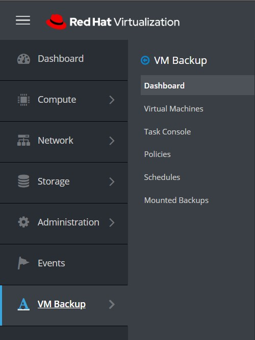
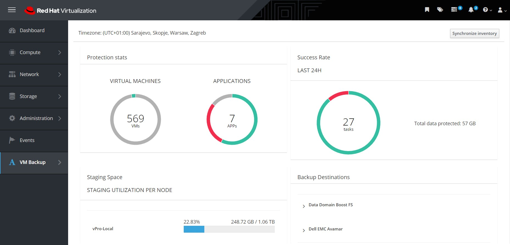

# Red Hat Virtualization UI Plugin

## General

Integration with the Red Hat Virtualization interface allows administrators to perform most of the basic operations without logging into the vProtect dashboard.

After installation \(which is described at the end of this article\) you will see a new tab "VM Backups" in the RHV menu.



### Dashboard

As usual, it contains a short summary of the environment along with a handful of statistics.



You can also see the data summary of the backup destination


### Virtual Machines

This tab shows all inventoried virtual machines in your RHV environment. Besides, you can also perform a basic backup or restore operations.


But that's not all, you can also go into the details of the virtual machine by clicking on its name:


Backup window view:


### Task console

Basic information about current tasks performed by vProtect.


### Policies

Allows you to create policies for VM's backups and snapshot. It basically has the same functionalities as vProtect WebUI.


### Schedules

As with the policies tab, it allows you to create schedules for the created rules.


### Mounted Backups

Finally, you can also browse your mounted backups from the RHV dashboard. You only need to enter the backup details using the menu on the right.


From here we can see the basic information about the backup and start browsing the files using the "Browse" button on the right.


Just select a folder or file and then press the "download selected" button to have the files on your computer.


## Installation

1. You can find add-on in the [GitHub repository](https://github.com/Storware/ovirt-engine-ui-vprotect-extensions). Follow instructions in the REAMDE to build or download plugin. Then extract the provided archive on your RHV manager.
2. In file `vprotect.json` edit lines in the config part:
   * `vProtectURL` - URL to vProtect API
   * `username` - name of the administrator in vProtect
   * `password` - administrator password in vProtect

**Example**:

```text
   {
      "name": "vprotect",
      "url": "plugin/vprotect/plugin.html",
      "resourcePath": "vprotect-resources",
      "lazyLoad": false,

      "config": {
          "vProtectURL": "http://10.40.0.55:8080/api",
          "username": "admin",
          "password": "vPr0tect"
       }
   }
```

1. Put `vprotect.json` file and `vprotect-resources` directory in the `/usr/share/ovirt-engine/ui-plugins` directory in the RHV engine.

