# OpenShift Operator Installation

vProtect can also be installed in OpenShift environments using OperatorHub with just a few easy steps. Once installed, operator can be used to create deployment with pods for: vProtect Server, vProtect Node, MariaDB and operator's sdeployment pod. Operaor also allows you to specify different storage configuration \(using persistent volume\) or external backup providers \(only file or object based storage are supported in the operator\).

**Note:**

* vProtect Operator is intended to be used with OpenShift only - if you intend to protect other Virtualization Plaforms - you may nee do deploy vProtect using other methods on a VM or physical server
* some of the features may not be available because of container restrictions \(compared to VM deployment\)

vProtect Operator will be installed from OperatorHub available in Openshift GUI

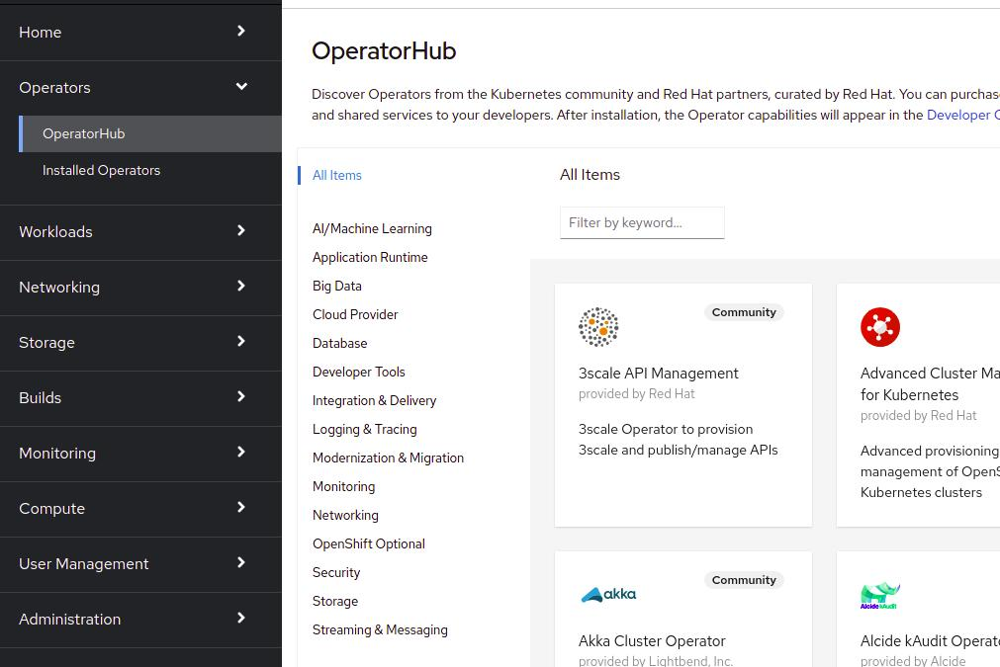

Type "vprotect" in search field

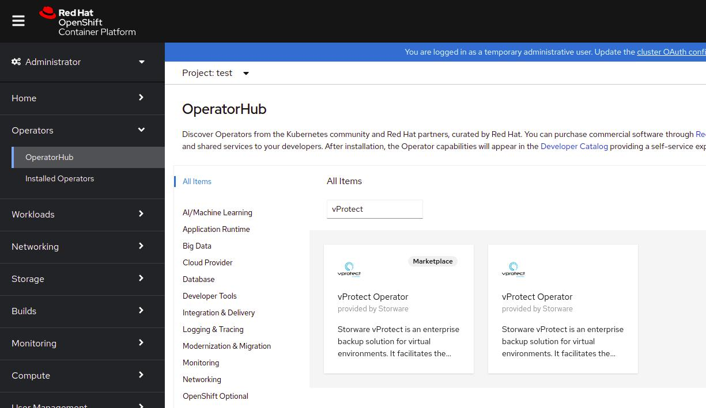

Choose operator without "marketplace" label and click **Install** button

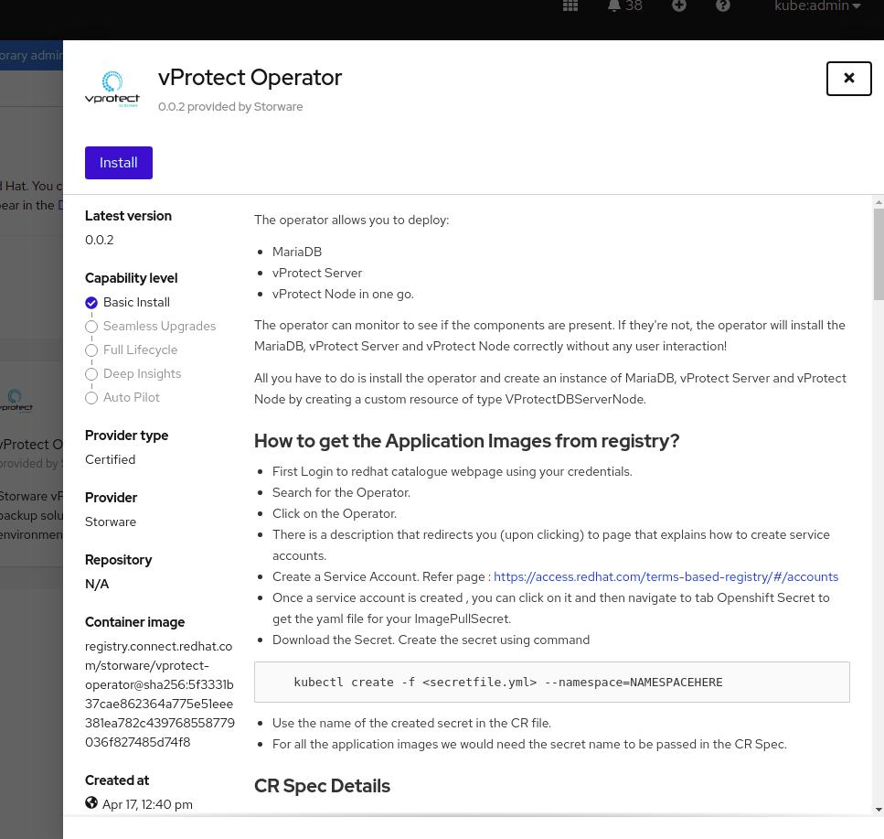

Operator will be successfully installed

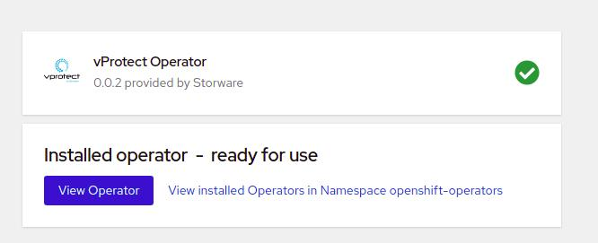

Go to Storage -&gt; StorageClasses tab and check available storage classes. In this case it is **ovirt-csi-sc**

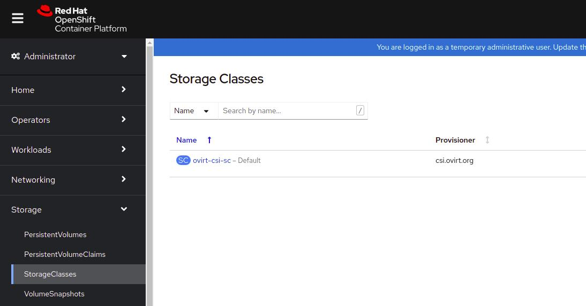

Choose vProtect operator from list of installed operators and go to **YAML** tab

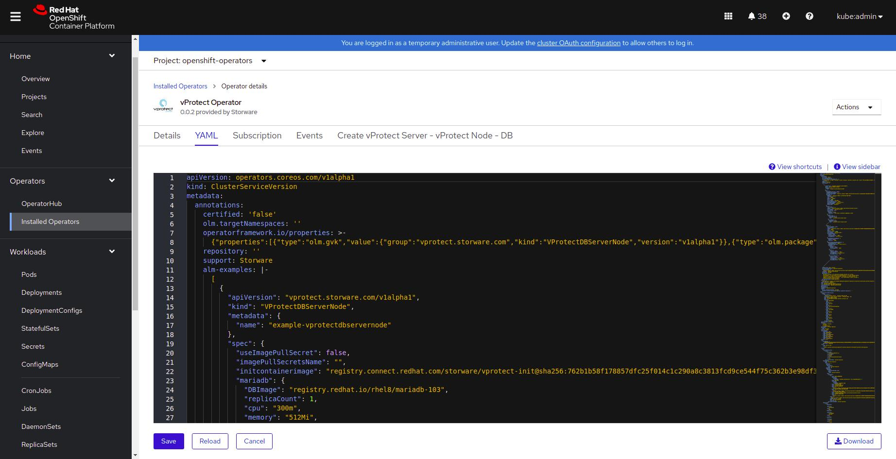

We need to edit below fields in yaml with values from storage classes and valid vprotect server url

```text
"storageClassName": " ovirt-csi-sc ",
"storageClass": "ovirt-csi-sc"
"stagingStorageClass": "ovirt-csi-sc"
"server": {
           ...
           "image": "registry.connect.redhat.com/storware/vprotect-server",
           ...
           },
           spec:
             containers:
             ...
                - name: RELATED_IMAGE_SERVER
                  value: >- registry.connect.redhat.com/storware/vprotect-server
               ...
```

Example valid [_yaml file_](https://storware-my.sharepoint.com/:u:/g/personal/a_spinek_storware_eu/ESap14S4R4xMvRr6HM44EjYB8eO3VWhog9WnD9gOiUESUg?e=qLYbDj)

After changes click Save.

Go to **Create vProtect Server - vProtect Node - DB** tab and click **Create vProtectDBServerNode** button.

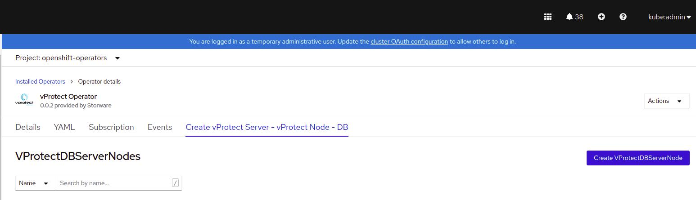

Provide your deployment name and click **Create** button

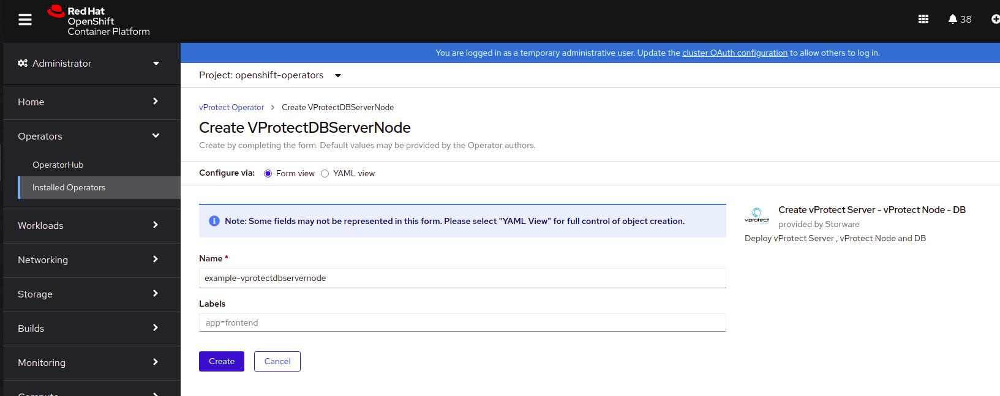

You can check progress in Workloads -&gt; Pods tab. After installation every pod should be in running state.

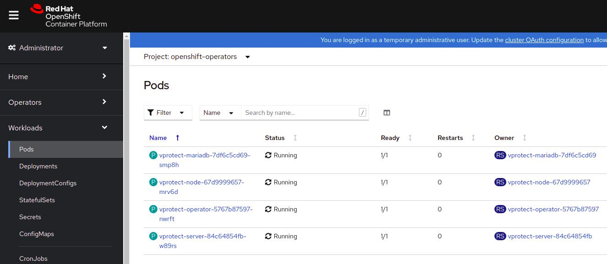

Go to Networking -&gt; Routes tab and click **Create Route** button.

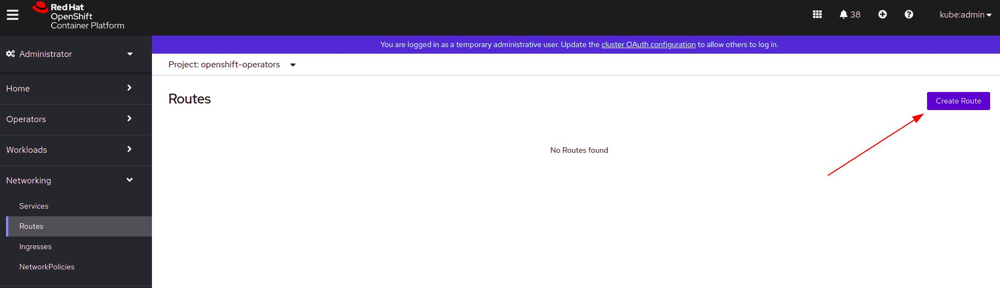

Provide whatever url you want vProtect to be accessible from. Choose **vprotect-server** as a **Service** and **8080 -&gt; 8080** or **8181 -&gt; 8181** as a **Target Port**

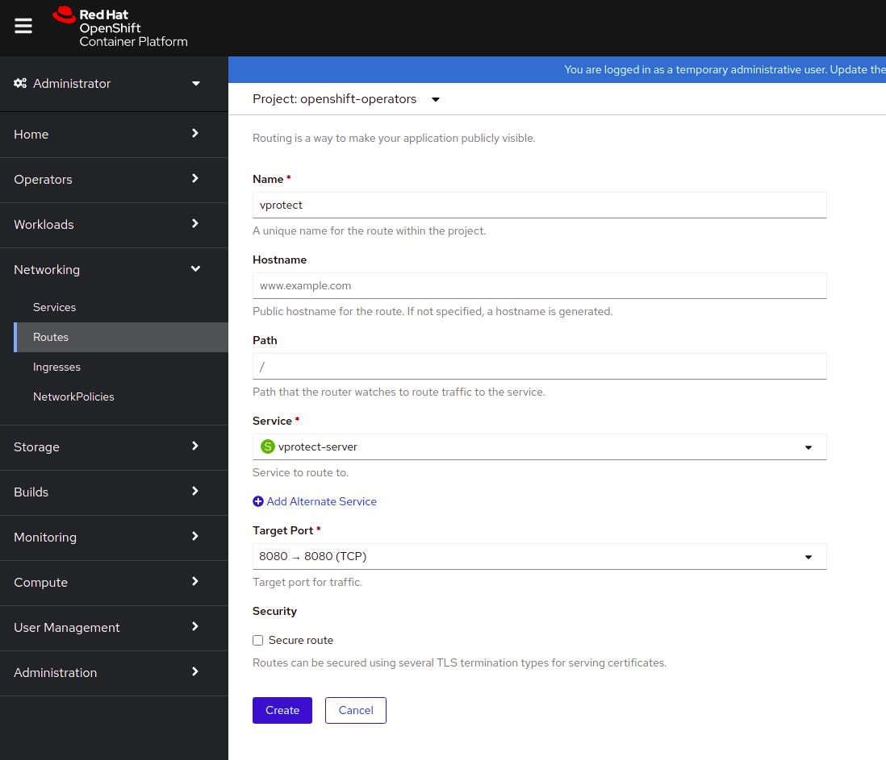

To check effective URL to vProtect press newly created route and read **Location** field

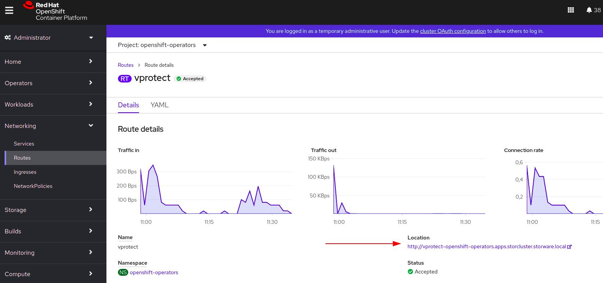

By default, vProtect console has one admin account - `admin` with password `vPr0tect` \(with zero\)

