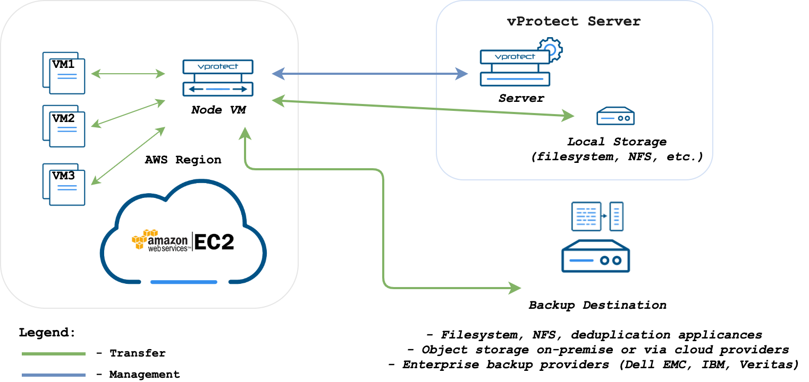
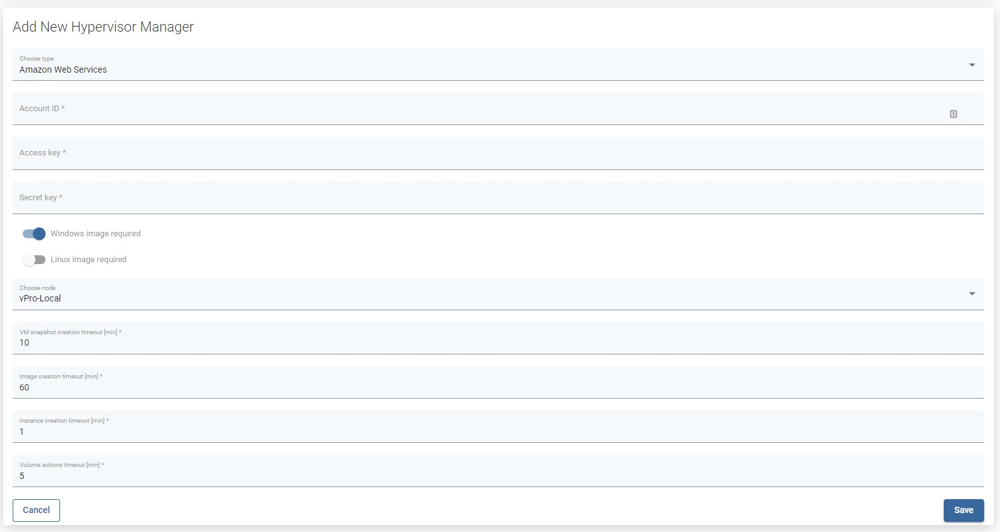

# AWS EC2

vProtect supports the AWS EC2 cloud platform by using a VM called “Proxy VM”. The node invokes commands on the AWS to snapshot and attach EBS drives of a specific VM to itself \(Proxy VM\). The proxy VM is able to read the data from the attached disk snapshots and forward them to the backup provider.

This means that you need to create an EC2 instance \(Proxy VM\) in each region. Keep in mind that if you don't want to transfer data between AZ during the backup you may want to deploy Proxy VMs in each AZ.

The vProtect Server can be deployed anywhere, but keep in mind that Nodes need to be able to call the server over HTTP\(S\) on the port you have specified.

The AWS backup strategy allows you to exclude drives from backup which you don’t need. Remember that you need to install 1 Proxy VM per AWS region so that drives that the Node tries to attach are reachable.

All backup destinations can be used, but keep in mind that you may be charged for transferring data between regions, AZs and external backup providers.

vProtect Node has access to instances only in the **region where it is hosted**.

vProtect Node requires the **account ID,** **access key** and **secret** **key** to connect to the AWS account.



## Typical use scenarios <a id="typical-use-cases"></a>

There are several scenarios for AWS which may be suitable for your case:

* **Backup EC2 to S3** - in this case after dumping backup, vProtect can push them to the S3 bucket. You may consider using a VPC endpoint to boost your store operation performance.
* **Backup EC2 to EBS volume on the proxy** - you can use PowerProtect DD to deduplicate data and optimize your storage consumption significantly. Keep in mind that you may want to protect your EBS volume using EBS snapshots as well.
* **Backup EC2 to your local backup provider** - if you already have a central enterprise backup solution, you may want to use it as a backup provider for EC2 instances running in AWS. You should consider using Direct connect to have a higher bandwidth available.
* **Backup EC2 to your other cloud provider** - If you're using multiple clouds, you also may consider storing data in GCS or Azure backup providers.

**Note**: In all cases, depending on your target, you may be charged for data transfers.

## Setup considerations <a id="setup-considerations"></a>

It is assumed that you have working experience with AWS EC2 to be able to deploy vProtect components. You also need to have an IAM user with permissions that allow you to deploy an instance and generate access/secret keys for vProtect.

Remember to use **CentOS 8 AMI** as a base image - both for the Server and Nodes. For a typical installation, we recommend 2 virtual processors and 4 GB of RAM. This means that **t3.medium** or **m5.large** should cover general use cases. For better performance, however, we recommend using storage optimized instances such as **i3.large** or bigger, where I/O intensive operations should perform better.

Both vProtect components are assumed to be deployed without HA \(more precisely, all the nodes or server will probably be in separate AZs, and only need to communicate over HTTP\). There is no requirement for multi-AZ deployment for now. While the Node is stateless and can be lost without data loss, the Server needs DB to be protected. vProtect provides a built-in automatic DB backup mechanism, which can be used to protect backup metadata. Please refer to the [Disaster recovery](../../../administration/disaster-recovery.md) section for more details.

From a networking perspective, vProtect requires communicating with AWS EC2 API, but it is still recommended to put in a private subnet and allow communication over a NAT Gateway.


You add AWS EC2 as a Hypervisor Manager. You need to provide the account ID and access/secret keys of a user that has permissions to handle snapshot, AMI and EBS volume operations and EC2 instance creation.

On the same screen, you also specify if the AMIs of root volumes should be created during the backup process. For Windows instances, we recommend also keeping an AMI image with each backup to have the option to restore the original root volume as well. You can also skip AMI creation, but this means that during restore you need to specify the appropriate AMI ID that you want to boot from.

## Permissions

Here are the IAM permissions that vProtect needs to have for backup/restore operations.

```text
{
  "Version": "2012-10-17",
  "Statement": [
    {
      "Sid": "Stmt1565003475859",
      "Action": [
        "ec2:AttachNetworkInterface",
        "ec2:AttachVolume",
        "ec2:CreateImage",
        "ec2:CreateSecurityGroup",
        "ec2:CreateSnapshot",
        "ec2:CreateTags",
        "ec2:CreateVolume",
        "ec2:DeleteSnapshot",
        "ec2:DeleteVolume",
        "ec2:DeregisterImage",
        "ec2:DescribeAvailabilityZones",
        "ec2:DescribeImages",
        "ec2:DescribeInstances",
        "ec2:DescribeSecurityGroups",
        "ec2:DescribeSnapshots",
        "ec2:DescribeVolumes",
        "ec2:DetachVolume",
        "ec2:RegisterImage",
        "ec2:RunInstances",
        "ec2:StopInstances",
        "ec2:TerminateInstances"
      ],
      "Effect": "Allow",
      "Resource": [
        "arn:aws:ec2:*:*:instance/*",
        "arn:aws:ec2:*:*:volume/*",
        "arn:aws:ec2:*:*:snapshot/*",
        "arn:aws:ec2:*:*:image/*",
        "arn:aws:ec2:*:*:network-interface/*",
        "arn:aws:ec2:*:*:security-group/*"
      ]
    }
  ]
}
```

## Adding a hypervisor manager

To properly configure your AWS account, go to vProtect -&gt; Virtual Environments -&gt; Infrastructure -&gt; add hypervisor manager

Enter parameters such as:

* Account ID 



* Access key 
* Secret Key 
* Enable/disable Windows, Linux image 



**Note:** When vProtect creates backup, some operating systems, such as Windows, may require an AMI for later restores in order to keep your OS settings. With this option, vProtect will keep the AMI necessary for future restores in your AWS account. Without this image, a new instance will have to be started with a fresh root device and additional volumes attached, which may not contain your OS-related settings, licenses or data that were stored on the root device.

## Backup modes

These settings regarding Windows or Linux images are required to define the way backups and restores are done. AWS supports 2 ways:

1. Using AMI and AWS snapshots:
   * During Export or Snapshot tasks an AMI is created for the root volume, other volumes are snapshotted. 
   * The AMI is stored in AWS until vProtect snapshot or backup removal is initiated.
   * During Restore, a new instance is launched from a previously exported AMI, and imported non-root volumes are attached.
2. Using AWS snapshots:
   * During Export or Snapshot tasks, all volumes are snapshotted.
   * During Restore, an AMI is created from the imported root volume, a new instance is launched and imported non-root volumes are attached. The AMI is then removed.

In both cases, volume snapshots are kept in AWS only if the vProtect Snapshot task is completed.

**Note:** A Windows AMI created from snapshot is not launchable, hence it is recommended to **enable using AMI for the Windows platform**.

## Restore

It is possible to specify another AMI for attaching non-root volumes during restore. You can also specify an availability zone \(within the region of the vProtect Node\) for a new instance.

## Costs

From the AWS perspective, you need to take inot account several additional costs that may be incurred:

* EC2 instance costs for the vProtect Server and Nodes:
  * depends on the number of nodes \(assume at least one node per region\)
  * to reduce costs we recommend to use reserved instances for production use
  * [https://aws.amazon.com/ec2/pricing/](https://aws.amazon.com/ec2/pricing/)
* Backup destination and staging space storage on EBS:
  * staging space is necessary and we recommend it to be at least the size of the biggest VM multiplied by the number of export and store threads
  * if you want to store backups on EBS you also need to have additional storage
  * you can have both using the same EBS volume
  * we encourage you to use deduplication, as it may even result in over 95% of storage savings
  * [https://aws.amazon.com/ebs/pricing/](https://aws.amazon.com/ebs/pricing/)
* Data transfer costs:
  * if you upload data to external backup providers, or if a node needs to transfer a lot of data between AZs - this can be reduced by deploying one node per AZ
  * [https://aws.amazon.com/ec2/pricing/on-demand/\#Data\_Transfer](https://aws.amazon.com/ec2/pricing/on-demand/#Data_Transfer)

