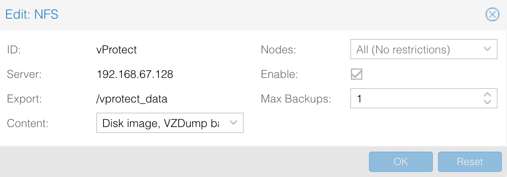

# Proxmox VE

Proxmox environments require backup storage to be defined on each server. This storage must be a location accessible from vProtect Node \(the simplest setup, when you use only 1 node, is to create NFS share for the staging path on vProtect Node\).

1. Create storage from NFS share \(Content-type: VZDump\)



* The export share must be set to use the UID and GID of the `vprotect` user.
* Example export configuration in `/etc/exports` to the selected hypervisor in the RHV cluster:

  ```text
  /vprotect_data    PROXMOX_HOSTS(fsid=6,rw,sync,insecure,all_squash,anonuid=993,anongid=990)
  ```

  where `anonuid=993` and `anongid=990` should have the correct UID and GID returned by command:

  ```text
  [root@vProtect3 ~]# id vprotect
  uid=993(vprotect) gid=990(vprotect) groups=990(vprotect)
  ```

* Both import and export operations will be done using these NFS shares – restore will be done directly to this storage domain, so you can easily import backup into the Proxmox environment
  * Backups must be restored to the export path \(the node automatically changes the names to the original paths that are recognized by Proxmox\).
* The name for storage must be provided later in the node configuration \(`Hypervisor -> Proxmox` \)section.


## File-level restore support for VMA images

1. Prepare the VMA extractor on vProtect Node - you have 2 options:
   * Build a VMA extractor like this \(requires Internet on the **node**\):

     ```text
     cd /opt/vprotect/scripts/vma
     ./setup_vma.sh
     ```
2. * Download the VMA extractor from the Storware FTP \(in the Add-ons directory\) and install it.

     ```text
     cd /opt/vprotect/scripts/vma
     ./setup_vma.sh PATH_TO_VMA_ARCHIVE
     ```

## Public key authentication

The details are described in the [SSH public key authentication](../../common-tasks/ssh-public-key-authentication.md) section.

