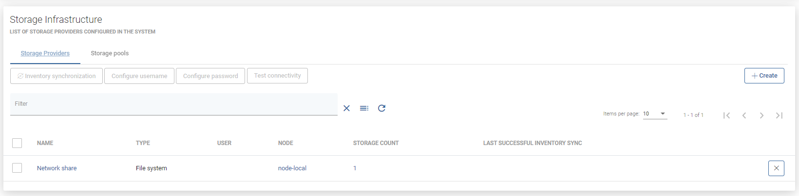

# Nutanix Files

## General

Nutanix Files offers a file system storage in the form of network shares \(SMB or NFS\). With vProtect, you can easily back up and recover these shares.

**Note:**

* there must be an account defined in both Prism Central and File Server with the same credentials

  each File Server is considered as a separate Storage Provider

* vProtect tracks changes for each file system change using the Nutanix CFT mechanism
  * this shortens backup times because it does not need to perform a metadata scan across your file server, which could contain millions of files and directories.
* only regular files, symlinks and directories are backed up
* for file systems, vProtect currently builds images for each backup before uploading data to the specific backup provider so that it doesn't have to upload objects one-by-one - these images will be merged automatically in restore tasks

In general, the process looks as follows:

* the user adds a new storage provider \(nutanix files\)
* inventory synchronization retrieves all the information about storage \(of two types: SMB and NFS\)
* the user can then do a full backup \(storage is mounted and all files are extracted from it\)
* incremental backup uses CFT from the API, and based on this list vProtect only downloads changed files.

## Example

Please complete the following steps to add the Nutanix Files storage provider:

Go to `Storage` -&gt; `Infrastructure` and click on `Create`

In the form, provide:

* `Nutanix Files` as the type 
* The File Server URL in the `host` field \(i.e. `https://FILE_SERVER:9440`\)
* The URL to the Prism Element Host \(i.e. `https://PRISM_ELEMENT:9440`\)
* The login and password
  * The `admin` account **cannot** be used
  * The same credentials will be used to access Prism Element and File Server
  * In Prism Element there is a dedicated account with a Cluster Admin role
  * Create an API account for the file server \(e.g. in Prism Element, go to the File Server tab, select Manage Roles, add an API user and add the user to the file server administration group\)
* the node responsible for backup operations

Click `Save` - now you can run inventory synchronization to detect file systems \(storage instances\) - they will be visible in `Storage` -&gt; `Instances` view

Now you can assign backup SLAs in `Storage` -&gt; `Backup SLAs` \([Backup SLAs](../../../administration/applications/backup-slas.md)\) to schedule periodic backups of these shares. You are also able to mount backups to restore individual files \([File-level Restore \(Mounted Backup\)](../../../administration/storage-providers/file-level-restore-mounted-backup.md)\).

