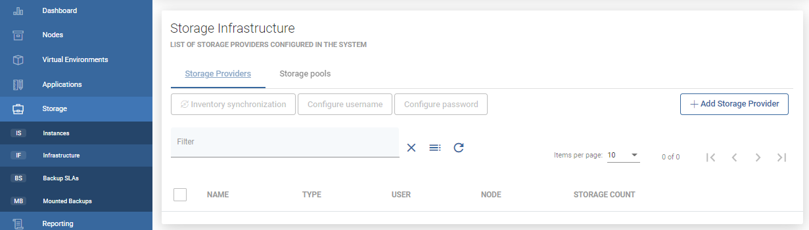
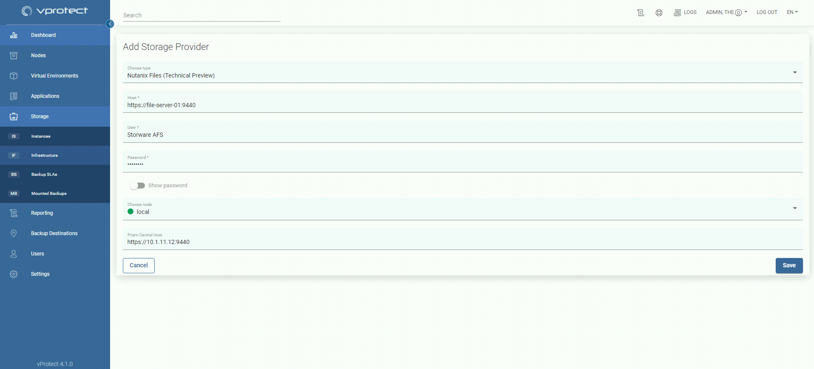
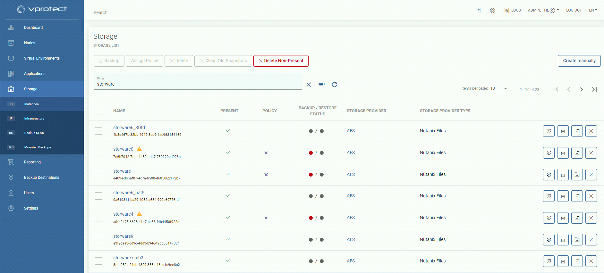

# Nutanix Files

## General

If you are here because of a Nutanix File backup, you probably know the shortcut CFT \(changed file tracking\). This is an API function shared with backup providers such as Storware. This API speeds backup times because it does not perform a metadata scan across your file server, which could contain millions of files and directories.

In general, the process is as follows:

* User adds a new storage provider \(nutanix files\)
* Inventory sync retrieves all information about storage \(of two types: SMB and NFS\)
* Then the user can do a full backup \(storage is mounted and all files are extracted from it\)
* Incremental backup loads CFT from the API and based on this list vprotect only downloads changed files.
* All backups are merged during the restore.
* Mount and import to Nutanix Files is possible

  **Note:**

* Only regular files, symlinks and directories are backed up
* Prism and nutanix files must have the same credentials

## Example

Please complete the following steps to add the Nutanix Files storage provider:

Go to `Storage` -&gt; `Infrastructure` and add click `Add Storage Provider`

Choose `Nutanix Files` as a type and provide URL \(file server host\), login, password and select node responsible for backup operations. Finally, provide the URL to Prism Central Host

Click `Save` - now you can define file systems in the `Storage` -&gt; `Instances` view

