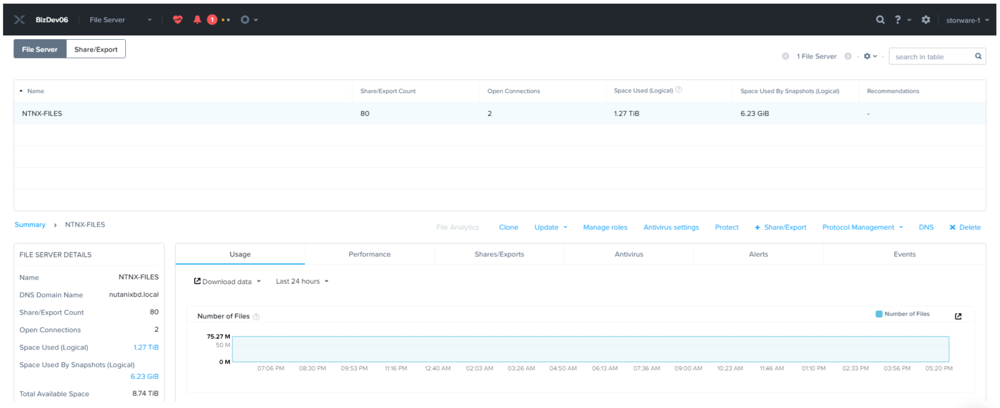
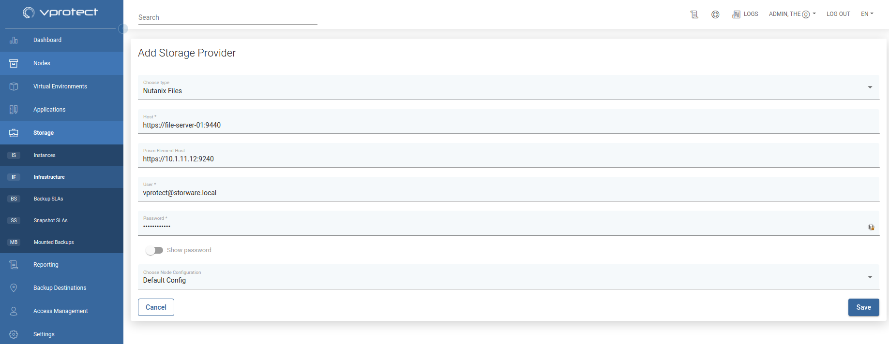

# Nutanix Files

## General

Nutanix Files offers file system storage in a form of network shares \(SMB or NFS\). With vProtect, you can easily backup and recover these shares.

**Note:**

* there must be an account defined in both Prism Central and File Server with the same credentials

  each File Server is considered as a separate Storage Provider

* vProtect tracks changes for each file system changes using Nutanix CFT mechanism
  * this shortens backup times because it does not need to perform a metadata scan across your file server, which could contain millions of files and directories.
* only regular files, symlinks and directories are backed up
* currently, for file systems, vProtect builds images for each backup before uploading data to the specific backup provider so that it doesn't have to upload objects one-by-one - these images will be merged automatically in restore tasks

In general, the process looks as follows:

* user adds a new storage provider \(nutanix files\)
* inventory synchronization retrieves all information about storage \(of two types: SMB and NFS\)
* then the user can do a full backup \(storage is mounted and all files are extracted from it\)
* incremental backup uses CFT from the API and based on this list vProtect only downloads changed files.

## Example

Please complete the following steps to add the Nutanix Files storage provider:

Go to `Storage` -&gt; `Infrastructure` and add click on `Add Storage Provider`

In the form provide:

* `Nutanix Files` as a type 
* File Server URL in `host` field \(i.e. `https://FILE_SERVER:9440`\)
* URL to Prism Element Host \(i.e. `https://PRISM_ELEMENT:9440`\)
* login and password
  * `admin` account **cannot** be used
  * the same credentials will be used to access Prism Element and File Server\)
  * in Prism Element dedicated account with Cluster Admin role
  * create API account for File Server \(use `Manage roles` link and create an account\)
* the node responsible for backup operations

Click `Save` - now you can run inventory synchronization to detect file systems \(storage instances\) - they will be visible in `Storage` -&gt; `Instances` view

Now you can assign backup SLAs in `Storage` -&gt; `Backup SLAs` \([Backup SLAs](../../../administration/applications/backup-slas.md)\) to schedule periodic backups of these shares. You also are able to mount backups to restore individual files \([File-level Restore \(Mounted Backup\)](../../../administration/storage-providers/file-level-restore-mounted-backup.md)\).

