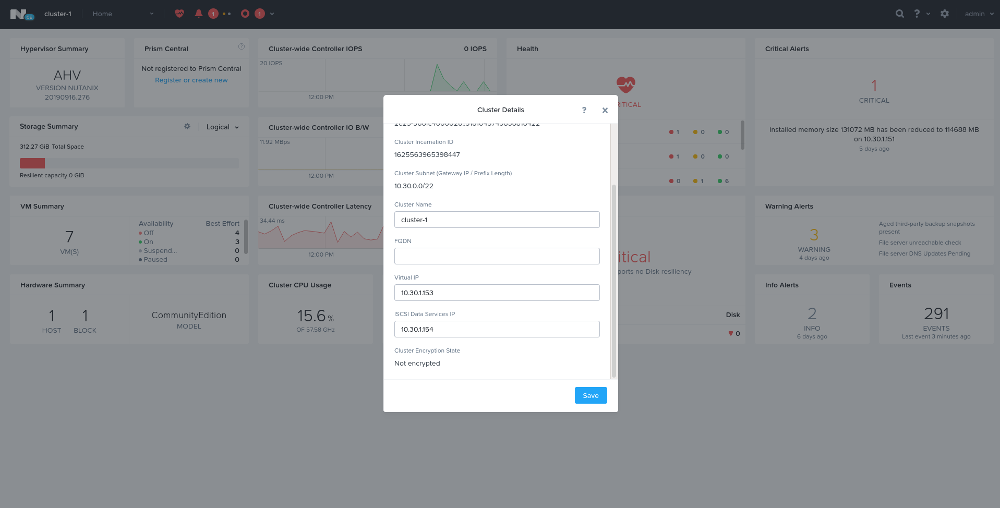
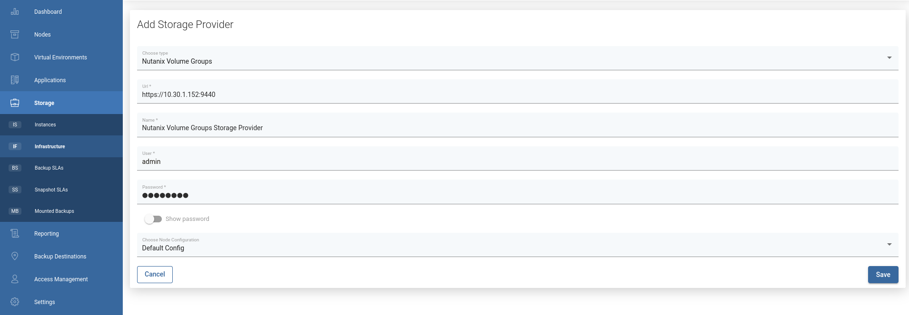
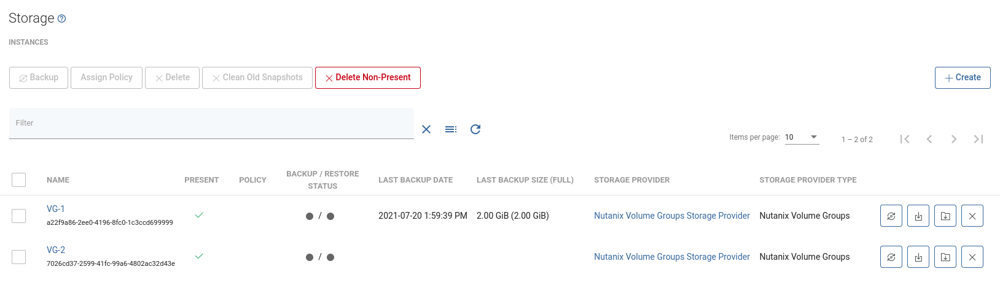

# Nutanix Volume Groups

## General

vProtect supports volume groups for Nutanix platform. Disk snapshots are being attached to host with vProtect Node using iSCSI. Thanks to this backups and restores can be performed remotely without Proxy VM.

This storage provider also allows excluding disks for backups.

In general, export process looks as follows:
* Snapshot of the volume group is taken
* Temporary volume group with disk snapshots is created
* Disks from the temporary volume group are attached to vProtect Node host using iSCSI
* Disks content is exported to RAW files
* Disks are then detached and temporary volume group is deleted

In general, restore process looks as follows:
* New volume group is created with yet empty disks
* Disks from new volume group are attached to vProtect Node host using iSCSI
* Content from RAW files of backup is imported to attached disks
* Disks are detached from vProtect Node host

**Note:**

* iSCSI uses `iSCSI Data Services IP` defined on Nutanix platform to discover targets, which means that exception will be thrown if this value is missing.

## Example

Please complete the following steps to add the Nutanix Volume Groups storage provider:

Go to `Storage` -&gt; `Infrastructure` and add click on `Create`

In the form provide:

* `Nutanix Volume Groups` as a type
* URL to Prism Element Host \(i.e. `https://PRISM_ELEMENT:9440`\)
* Name of the storage provider
* Login and password
* The node configuration responsible for backup operations

Click `Save` - now you can run inventory synchronization to detect volume groups - they will be visible in `Storage` -&gt; `Instances` view

Now you can create a backup task for chosen volume group.