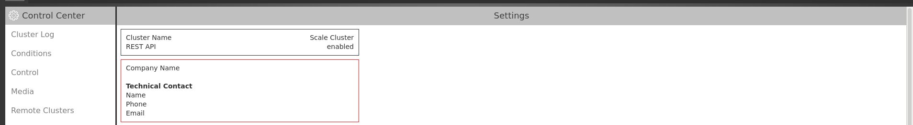
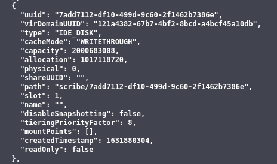
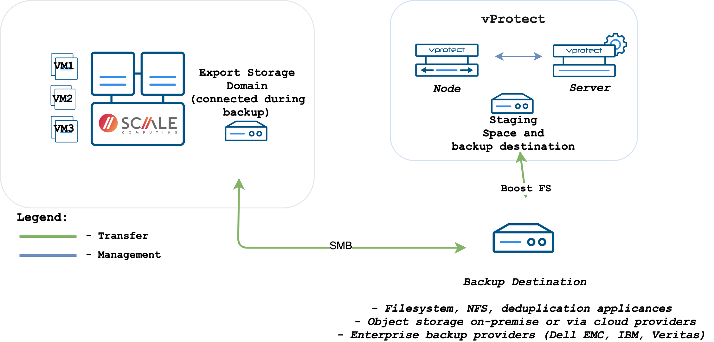
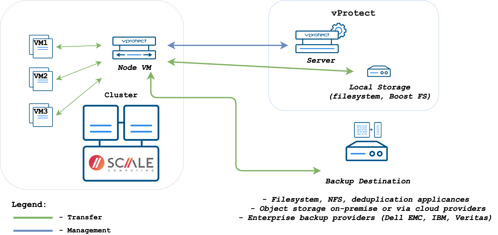

# HC3 Scale Computing

vProtect supports backup for HC3 Scale Computing:

* Export storage domain:
    * no incremental backup
    * backup files are transferred to the SMB file share created on the node host \(no Proxy VM required\)
* Disk attachment:
    * incremental backup available
    * a proxy VM is required - used for the disk attachment process.

## General

All the operations are using REST API to communicate with the HC3 cluster. Because of this, the cluster intended to be used
by vProtect has to have the REST API enabled in the settings.

Before taking a snapshot, current state of the _disableSnapshotting_ flag of every disk in the virtual machine is checked.
If even one of the disk has disabled snapshotting, the snapshot task ends with the error. All disks with disabled snapshotting
are listed in the error message.

## Backup Strategies

### Export Storage Domain Strategy

Export storage domain strategy performs the export using a Samba server running on node machine. This strategy does not require a proxy VM.

In general, the export process is as follows:

* A snapshot of the virtual machine is taken
* Samba server is started on the node machine and export share is added
* Export of the VM to created SMB share is ordered
* Export share is removed and Samba server is stopped
* Metadata of the excluded disks is exported

In general, the restore process is as follows:

* Samba server is started on the node machine and import share is added
* Import of the VM to created SMB share is ordered
* Empty disks for excluded disks are added to the restored VM
* Import share is removed and Samba server is stopped

### Disk Attachment Strategy

Disk attachment strategy performs the export using proxy VM running on the HC3 cluster.

In general, the export process is as follows:

* A snapshot of the virtual machine is taken
* The disks from the taken snapshot that were not excluded are attached to the proxy VM
* If full export is being performed, then the whole content of the attached disks is saved to the backup files. If incremental export is being
  performed, then the list of changed blocks is first retrieved and then only the content of these blocks is saved.
* The disks are detached from the proxy VM

In general, the restore process is as follows:

* A new virtual machine is created using exported metadata
* Empty disks are attached to the proxy VM.
* Content of the exported disk files is written to the attached disks
* The restored disks are then reattached from the proxy VM to the restored VM
* List of boot devices for the restored VM is set

## Example

Please complete the following steps to add the HC3 Scale Computing Hypervisor Manager:

Go to `Virtual Environments` -&gt; `Infrastructure` and click on `Create`

In the form provide:

* `HC3 Scale Computing` as a type
* The URL to the HC3 Cluster \(i.e. `https://HC3_CLUSTER_HOST`\)
* The login and password
* Import/Export mode
* The node configuration responsible for backup operations