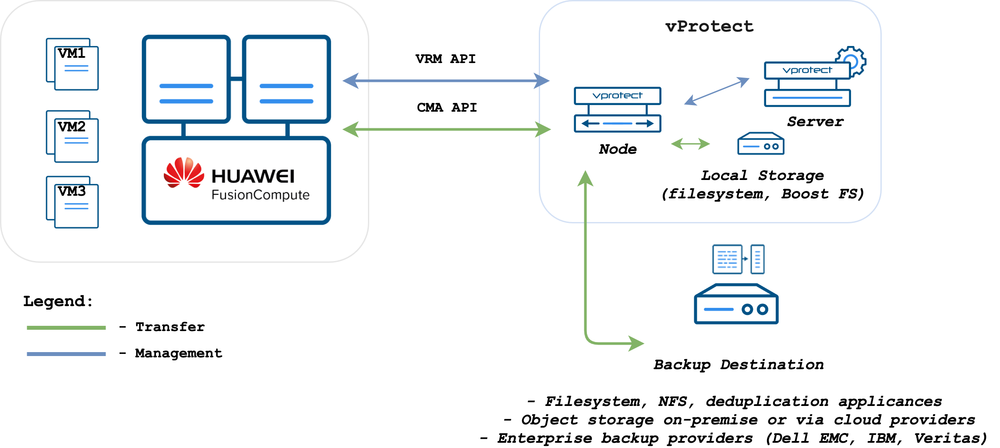
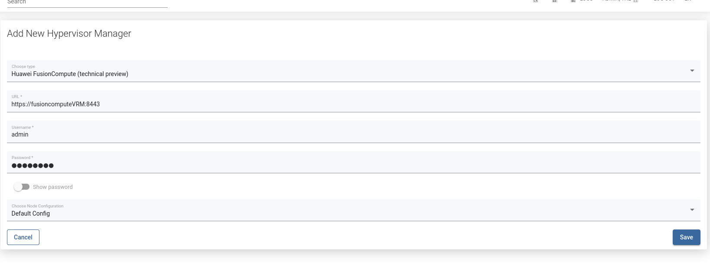
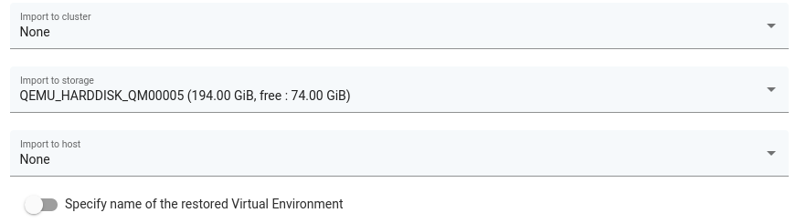

# Huawei FusionCompute

* Supported version: 8.x . 
* Node can be installed outside of the environment. But not behind a NAT.
* Incremental backup is using CBT functionality of VRM. This means that currently incremental backup can be performed only on vms with installed VMTools(You can find instructions on how to install VMTools on VRM's Help page).  

### Creating FusionCompute HypervisorManager

* fill in url field:
    * https
    * address of VRM server, hostname or ip, with port (default is 8443)
* fill in admin's username and password for VRM.

### Backup and Restore

* Backup and restore use LANSSL transfer mode for communication with CNAs. 
* Requires Connection to each Hypervisor (data transfer during backup/restore process will be performed directly between the node and CNA/Hypervisor on which vm is running).

#### Backup process

* Snapshot of the VM is performed. (type 'normal' when vm is without VMTools or type 'CBTbackup' if vm has VMTools installed)
* metadata of vm is backed up in json format
* Each disk is then backed up sequentially, using LANSSL transfer mode. During this process Node communicates with specifc CNA directly. 
* if incremental backup is performed: additionally CBT map for each disk is backed up.
* last snasphot is kept on the hvm for incremental backup

#### Restore process
* Node sends request to VRM to create new VM based on metadata stored during backup process. VRM automatically creates required disks.
* For each disk, Node sends data using LANSSL transfer mode directly to CNA, restoring backed up content. 

#### Restore settings

*Restore to hypervisor manager
  * select storage to which disks will be restored
  * cluster and host selection:
    * if host is selected then vm will be restored to that host and bound to it.
    * if host is set to None, then cluster must be selected and vm will be restored to that cluster
  * You can specify name for the restored vm

