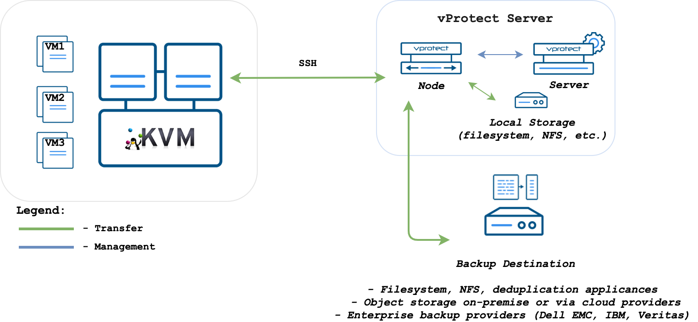

# KVM/Xen

vProtect accesses KVM/Xen \(stand-alone libvirt\) hosts over SSH. Node can be installed outside of the environment.

#### Backup Process

* direct access to the hypervisor over SSH
* crash-consistent snapshot taken directly using virsh \(QCOW2/RAW file\), lvcreate \(LVM\), rbd snapshot for Ceph \(separate call for each storage backend\) For QCOW2/RAW file, virsh snapshot-create-as is used when VM is running - otherwise, qemu-img create is used
* optional application consistency using pre/post snapshot command execution
* QCOW2/RAW-file/LVM data exported over SSH \(optionally with netcat\)
* Ceph RBD data exported using rbd export or RBD-NBD when incremental is used If last stored snapshot is not missing, snapshot diffs are downloaded using rbd diff, then changes are written to inc file and diff file. If it is missing, export is treated as full and then rbd export is used.
* libvirt XML metadata saved • last snapshot kept on the hypervisor for the next incremental backup \(if at least one schedule assigned to the VM has backup type set to incremental\)
* restore recreates files/volumes according to their backend \(same transfer mechanism as used in backup\) and then defines VM on the hypervisor

KVM/Xen \(libvirt\) environments require to have the correct entry in known\_hosts on the **node**:

* it must be `known_hosts` file that belongs to `vprotect` user
* the algorithm must be set to `ssh-rsa`
* make sure to have in your Node Configuration `known_hosts` file-path set to the location that is accessible for `vprotect` user - default `/opt/vprotect/.ssh/known_hosts`
* if your user/group used on the KVM host is other than `qemu:qemu` then please provide them in hypervisor details form when you add/update the hypervisor

## KVM - VG scanning

**Used with LVM-based VMs only.** In order to allow VG scanning please make sure to have your LVM packages up to date **on hypervisor**. LVM reporting was one of the features added in RHEL/CentOS 7.3 and is used by vProtect to collect information about VGs.

## KVM - full libvirt installation

CentOS-based KVM hypervisors may not have full libvirt available, specifically libvirt's `blockcommit` operation. If you need to change libvirt to the full version, please make sure to follow the steps in this section: [Full versions of libvirt/qemu packages installation](../../common-tasks/full-versions-of-libvirt-qemu-packages-installation.md).

## Public key authentication

If you prefer to authenticate by using public keys instead of a password, follow the steps described in [SSH public key authentication](../../common-tasks/ssh-public-key-authentication.md) section.

