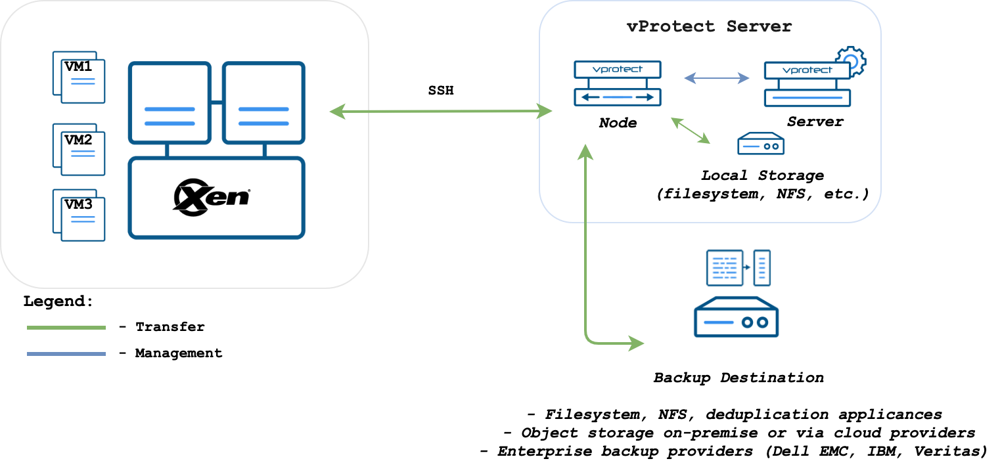

# KVM/Xen

vProtect accesses KVM/Xen \(stand-alone libvirt\) hosts over SSH. Node can be installed outside of the environment.

KVM/Xen \(libvirt\) environments require to have the correct entry in known\_hosts on the **node**:

* it must be `known_hosts` file that belongs to `vprotect` user
* the algorithm must be set to `ssh-rsa`
* make sure to have in your Node Configuration `known_hosts` file-path set to the location that is accessible for `vprotect` user - default `/opt/vprotect/.ssh/known_hosts`
* if your user/group used on KVM host is other than `qemu:qemu` then please provide them in hypervisor details form when you add/update hypervisor

## KVM - VG scanning

**Used with LVM-based VMs only.** In order to allow VG scanning please make sure to have your LVM packages up to date **on hypervisor**. LVM reporting was one of the features added in RHEL/CentOS 7.3 and is used by vProtect to collect information about VGs.

## KVM - full libvirt installation

CentOS-based KVM hypervisors may not have full libvirt available, specifically libvirt's `blockcommit` operation. If you need to change libvirt to the full version, please make sure to follow steps in this section: [Full versions of libvirt/qemu packages installation](../../common-tasks/full-versions-of-libvirt-qemu-packages-installation.md).

## Public key authentication

If you prefer to authenticate by using public keys instead of password, follow steps described in [SSH public key authentication](../../common-tasks/ssh-public-key-authentication.md) section.

