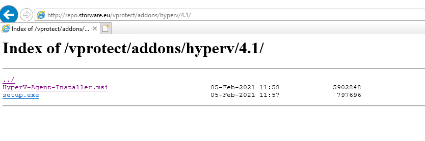
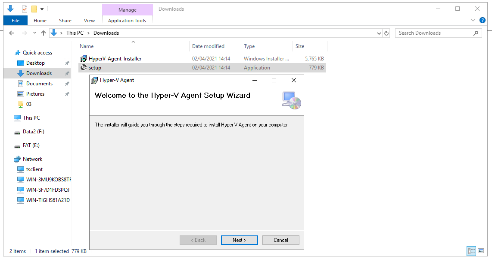
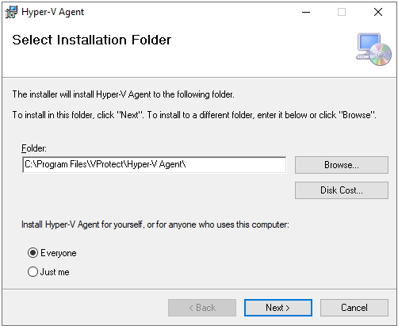
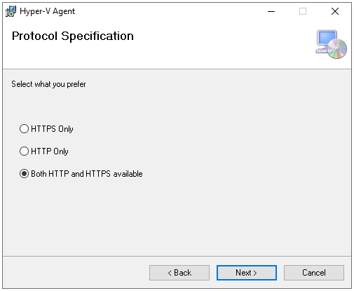
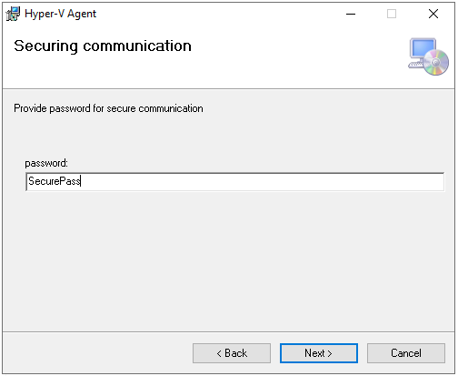
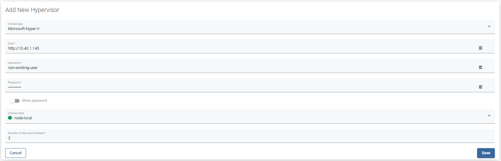

# Microsoft Hyper-V

## General

Microsoft Hyper-V is the only hypervisor that requires the installation of an agent. The process is very simple, the rest of the configuration is similar to other suppliers. With RCT \(also known as CBT in other virtualization platforms\) both full and incremental backups are supported for this hypervisor.

For Microsoft Windows Server 2016 or later versions, the resilient change tracking \(RCT\) feature is used by default to back up virtual machines \(VMs\).  
RCT makes it possible to detect changes that happened at specific points in time as opposed to scanning the entire disk for any possible changes. Using RCT, it is possible to accelerate incremental backups by as much as 50% \(compared to technologies available in Windows Server 2012\).  
The changes are tracked at the data block level. Only blocks that have changed since the last backup operation are candidates for the next incremental backup.

RCT reduces the risk of loss of information by storing bitmaps using a more resilient strategy. RCT implemented in Hyper-V accomplishes this by generating three different bitmaps – one in the memory, and the other two on the disk. Disk backups are available when a power outage or migration occurs. The usual memory backup is granular and accessible when VM is running. To be specific, the RCT file is utilized when the server is running normally. However, when VM is moved to a different host or a power failure occurs, the bitmap stored in memory is no longer available. In such cases, the Modified Region Table \(MRT\) file is utilized. The MRT file is more granular and contains all information on changes that were committed to the disk. The files are attached to VHD \(X\) and may be moved along with the machine. In effect, RCT not just reduces backup time but also offers greater resilience through enhanced block tracking mechanisms when compared to most other backup solutions designed for virtual environments.


**Note:** 

* Agent installation requires .NET Framework 4.7.2 or higher
* vProtect supports backup for Hyper-V 2016 and newer versions \(also non-GUI\)
* VM backup operations with RCT require the Hyper-V VM to be Version 6.2 or later
* Hyper-V 2016 does not support the disk exclusion feature during export operation \(because of WMI Framework version 14393\). Therefore, the disk of the virtual machine will be cloned to the export directory and deleted later in the execution.
* Instead of using accounts for authentication, in the case of Hyper-V, we only use the password provided during the agent installation. So for the username in the vProtect dashboard, you can use even a non-existent name.
* This platform requires a vProtect license issued after September 2021

To add a Hyper-V hypervisor host to vProtect, use a URL similar to the following:

```text
http://10.40.1.146
or
https://10.40.1.146
```

## Example

How to start backup for Hyper-V platform:

* From our repository [http://repo.storware.eu/vprotect/addons/hyperv/](http://repo.storware.eu/vprotect/addons/hyperv/) download:
  * **HyperV-Agent-Installer.msi**
  * **setup.exe**.



* Put installation files to Hyper-v host.
* Run installation from **setup.exe** file. 
* Click **Next** to proceed with the installation.



* Type path to install Hyper-V Agent. And accept it by click **Next**.



* Chose Protocol to communicate between agent and vProtect node. And accept it by click **Next**.



* Provide a password for secure communication \(you will need it to add Hyper-V to vProtect\). And accept it by click **Next**.



* Click **Next** to start installation.
* If Windows UAC prompts you about installation, accept it by choosing **Yes**.
* Click **Finish** to end installation.
* Go to vProtect WebUI &gt; Virtual Environments &gt; Infrastructure &gt; Hypervisors click on button +Add Hypervisor.
* In the "Add New Hypervisor" window fill all fields:
  * Host address in URL form \(eg. http://10.40.1.150\)
  * username - we don't use this parameter at the moment, you can type anything.
  * password - use the same what you set in the installation agent process.
  * Number of disk export threads - parameter that can help with data transfer speed. _We recommend starting backups with the default value of 2 and making any changes based on the observation of the environment._ 



* Click **Save** to finish adding your Hyper-v host. Repeat all steps for all Hyper-v hosts.

