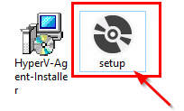

# Microsoft Hyper-V

Microsoft Hyper-v is the only hypervisor that requires the installation of an agent. The process is very simple, the rest of the configuration is similar to other suppliers.

**Note** Installation requires .NET Framework 4.7.2 or higher  
**Note** WMI Framework version 14393.\* \(available on Windows Server 2016 Long-Term Servicing Channel\) does not support the disk exclusion feature during export operation. Therefore, the disk of the virtual machine will be cloned to the export directory and deleted later in the execution.

1. From our repository [http://repo.storware.eu/vprotect/addons/hyperv/](http://repo.storware.eu/vprotect/addons/hyperv/) download:
   1. **HyperV-Agent-Installer.msi**
   2. **setup.exe**.
2. Put installation files to Hyper-v host.
3. Run installation from **setup.exe**. 
4. Click **Next** to proceed with the installation.
5. Type path to install Hyper-V Agent. And accept it by click **Next**.
6. Chose Protocol to communicate between agent and vProtect node. And accept it by click **Next**.
7. Provide a password for secure communication \(you will need it to add Hyper-V to vProtect\). And accept it by click **Next**.
8. Click **Next** to start installation.
9. If Windows UAC prompts you about installation, accept it by choosing **Yes**.
10. Click **Finish** to end installation.
11. Go to **vProtect WebUI** &gt; **Virtual Environments** &gt; **Infrastructure &gt; Hypervisors** click on button **+Add Hypervisor**.
12. In the "Add New Hypervisor" window fill all fields:
    * URL for https have port 50882, for http use port 50881.
    * username - we don't use this parameter at the moment, you can type anything.
    * password - use the same what you set in the installation agent process. 
13. Click **Save** to finish adding your Hyper-v host. Repeat all steps for all Hyper-v hosts.

