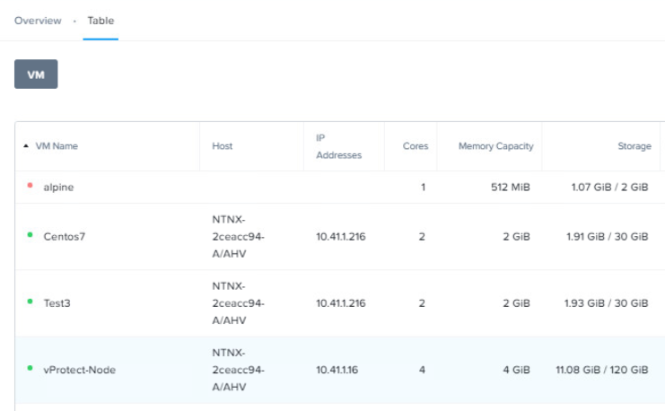
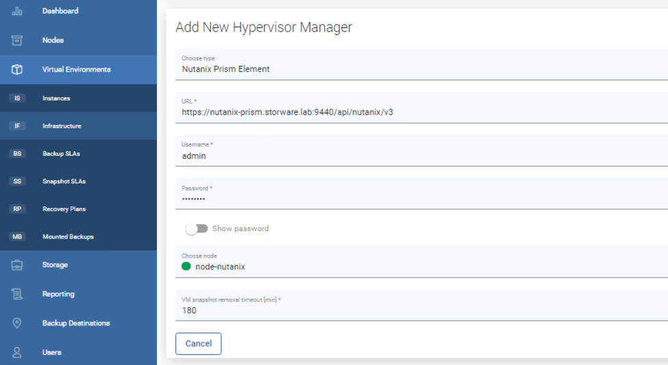
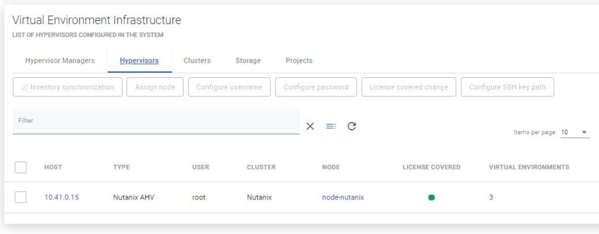
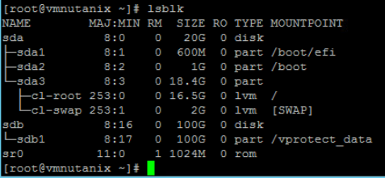
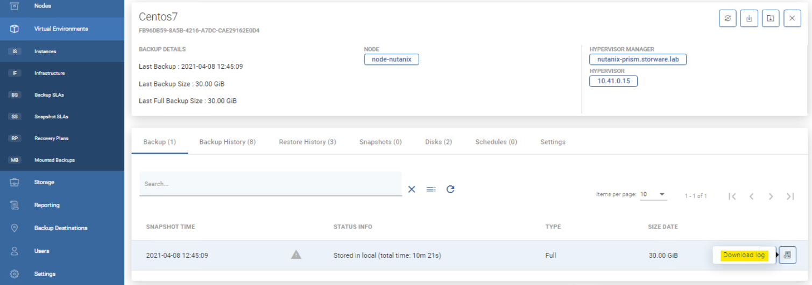

# Nutanix Acropolis Hypervisor \(AHV\)

## General

vProtect supports the Nutanix AHV platform by using a VM called “Proxy VM”. The node invokes commands on your hypervisor manager to snapshot and attach drives of a specific VM to itself \(Proxy VM\). The proxy VM is able to read the data from the attached disk snapshots and forward them to the backup provider.

This strategy allows you to exclude drives from backup that you do not need. Remember that you need to install at least 1 Proxy VM per cluster so that the drives the node tries to attach are reachable.


#### **Backup Process**

* crash-consistent snapshot using hypervisor's API
* optionally application-consistent snapshot can be done if enabled and guest tools installed inside - the type of snapshot is selected based on is QuiesceBeforeSnapshot setting and passed as part of snap request. The created snapshot might end up being of a different type \(depending on the \_\*\*\_presence of tools
* optional application consistency using pre/post snapshot command execution
* metadata exported from API
* snapshot disks are mounted one by one to the Proxy VM
* data read directly on the Proxy VM
* incremental backups using CBT API - only changed blocks are read from the attached disk
* last snapshot kept on the hypervisor for the next incremental backup \(if at least one schedule assigned to the VM has backup type set to incremental\)
* restore creates empty disks on the Proxy VM, imports merged data then recreates VM and reattaches volumes to the target VM

### General explanation of "Dynamically attached disks slot offset" parameter for vProtect Node proxy VM

Our best practice is to use a proxy machine with one disk device for the purposes of the operating system if you are using the "Disk attachment" backup strategy. Due to the simplification of the configuration of the environment, and we also do not achieve any benefits for this element of the environment.

Our experience shows that after adding a new node to the environment, is good to perform a test backup and check the logs from which disk device vProtect node want to start the backup. Depending on the proxy virtual machine configuration, vProtect will select the appropriate disk or you need to manually set the offset parameter. Rather, we do not encounter this type of situation when a virtual machine has only one disk device.

### Recommendations on how to set up the environment for vProtect

* As the backup strategy for the Nutanix environment depends on attaching and detaching disk devices to Proxy VM, we recommend simplifying the hardware configuration of this machine. If your backup destination allows to have staging space on the same storage as the backup destination, one disk device should be sufficient for the proxy virtual machine's operating system purposes. 
* If it is not possible to have only one disk device for Proxy VM, please read the [Example](nutanix-acropolis-ahv.md#example) section. We explained what you need to do to make sure your vProtect backups are good. 
* If your backup destination requires that Proxy VM need to have staging space on a local disk device, then Staging space must be on a volume coming from container storage. Otherwise, vProtect may select the wrong device during backup. 
* Our recommendation is also to configure LVM filters on Proxy VM. You need to add all OS disks and partitions, please follow these steps: [LVM setup on vProtect Node for disk attachment backup mode](../../common-tasks/lvm-setup-on-vprotect-node-for-disk-attachment-backup-mode.md)

### Things to Know About "How to Add Nutanix Hypervisor Manager to vProtect"

* When adding Nutanix hypervisor managers use a URL similar to the following:

```text
https://PRISM_HOST:9440/api/nutanix/v3
```

* Nutanix environments require the vProtect node to be installed in one of the VMs residing on the Nutanix cluster. vProtect should automatically detect the VM with the vProtect node during the inventory synchronization operation. 
* vProtect requires that there be a user with "cluster admin" privileges on Prism, to process the backup/restore job. 
* You can specify either a Prism Element or a Prism Central as hypervisor manager. If Prism Central is specified credentials for Prism Central and each Prism Element must be the same. 
* Hypervisor tags are supported only with Prism Central 
* Volume groups attached to the VMs are not affected by snapshot, hence neither backup nor snapshot revert on such volumes is going to include them.

#### You can deploy more nodes in each cluster and map individual hypervisors to them:

* This should statically load balance jobs based on hypervisor 
* Each node will handle VMs that reside on the particular hypervisor \(which because of data locality may be faster than backup of VMs from other hosts 
* VMs that don't have hypervisor assigned are handled by the node from the hypervisor manager 
* Each node needs to run inventory synchronization to record its Proxy VM UUID on which it is installed

## Example

How to start back up for Nutanix AHV Hypervisor

* Create Proxy VM into Nutanix cluster \(with one of supported OS: [Platform Requirements](../../../planning/platform-requirements.md)\)



* Install vProtect Node \(Example of Node installation thanks to RPM packages: [Install](../../installation-with-rpms.md#prerequisites)\)
* Login to vProtect Dashboard and add hypervisor manager _Remember that if you add prism central all credentials must be the same \(for prism elements and  prism central\)_



* Run inventory synchronization task, after that you should see all Nutanix host under the hypervisor tab



* Like we describe above, we can back up Nutanix VMs thanks to the disk attachment backup strategy. As this is one of the most demanding methods, at this point we recommend that you perform a few easy tests to make sure that the backup you are going to perform is correct. 
* Please connect via SSH to the Proxy VM. Enter "lsblk" to check the disk devices that belonging to the machine. In this example, we have two disk devices: 1. /dev/sda - with three partitions /dev/sda1, /dev/sda2, /dev/sda3 2. /dev/sdb - with one partition /dev/sdb1  This information will be needed for the next steps: configuring the lvm filter and checking if we need to correct the value of the parameter "dynamically disk attachment offset".



* We'll start by configuring the lvm filter. 
  * Global article about LVM:[ \_\_LVM setup manual](../../common-tasks/lvm-setup-on-vprotect-node-for-disk-attachment-backup-mode.md)
  * Remember to reboot VM after changes
  * Remember that the structure of this file is important and you need to put the filter lines back in their original place.  Open in text editor `/etc/lvm/lvm.conf` uncomment and replace the line: `filter = [ "a|.*|" ]` to `filter = [ "a|^/dev/sda|", "a|^/dev/sda1|", "a|^/dev/sda2|", "a|^/dev/sda3|", "a|^/dev/sdb|", "a|^/dev/sdb1|", "r|.|" ]` **and** `global_filter = [ "a|.*|" ]` **to** `global_filter = [ "a|^/dev/sda|", "a|^/dev/sda1|", "a|^/dev/sda2|", "a|^/dev/sda3|", "a|^/dev/sdb|", "a|^/dev/sdb1|", "r|.|" ]` 
* Now we can move on to the "dynamically disk attachment offset" tests. _You need to do this only if Proxy VM has more than one disk device for OS purposes_
  * Switch vProtect Node logs \(Proxy VM\) to Debug mode: [How to Enable Debug mode](../../../troubleshooting/how-switch-vprotect-to-debug-mode.md#vprotect-node)
  * Run a test backup - try to choose a small VM to not wait too long
  * After the backup is complete, download the log file from our dashboard



* As we can see in the logs, we do not need to correct the "offset" value. vProtect wants to start a backup from /dev/sdc, which is correct behaviour because this disk device does not belong to Proxy VM.

```text
[2021-04-08 14:51:40.959] INFO [Thread-47] IProxyVmProvider.waitForDevice:38 
[ffc65c30-8952-4ffa-b5d5-eefcfe01f333] Checking if device '/dev/sdc' is  present...

[2021-04-08 14:51:45.959] DEBUG [Thread-47] CommandExecutor.exec:75 
[ffc65c30-8952-4ffa-b5d5-eefcfe01f333] Exec: [lsblk, -l, /dev/sdc]

[2021-04-08 14:51:45.969] DEBUG [Thread-47] CommandExecutor.exec:102 
[ffc65c30-8952-4ffa-b5d5-eefcfe01f333] [lsblk, -l, /dev/sdc]
Return code: 0
output:
[NAME MAJ:MIN RM SIZE RO TYPE MOUNTPOINT
sdc    8:32   0  20G  0 disk 
sdc1   8:33   0   1G  0 part 
sdc2   8:34   0  19G  0 part 
]
error:
[]

[2021-04-08 14:51:45.970] INFO [Thread-47] IProxyVmProvider.waitForDevice:45 
[ffc65c30-8952-4ffa-b5d5-eefcfe01f333] Device '/dev/sdc' is present

[2021-04-08 14:51:55.991] INFO [Thread-47] NutanixHypervisorManager.exportData:895 
[ffc65c30-8952-4ffa-b5d5-eefcfe01f333] Data export of scsi.0
(917a15a2-5815-4d20-b693-6fb77ea59293)[20 GiB]: '/dev/sdc' -> '/vprotect_data/vProtect-node__fb96db59/scsi.0.raw'...
```

* If you meet with a situation, when vProtect want to back up its own disk device, please read our knowledge base article: [KB10037 How to change "Dynamically attached disks slot offset" parameter](https://storware.atlassian.net/l/c/KJt7rid0)

