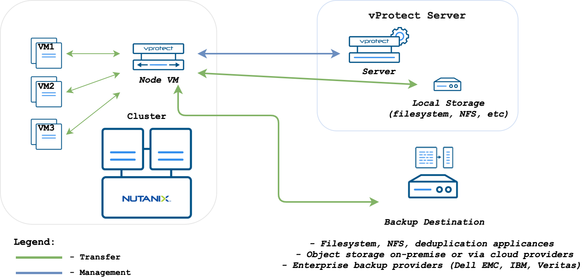

# Nutanix Acropolis Hypervisor \(AHV\)

vProtect supports the Nutanix AHV platform by using a VM called “Proxy VM”. The node invokes commands on your hypervisor manager to snapshot and attach drives of a specific VM to itself \(Proxy VM\). The proxy VM is able to read the data from the attached disk snapshots and forward them to the backup provider.

This strategy allows you to exclude disks that you don't need from your backup. Remember that, you need to install at least 1 Proxy VM per cluster so that the drives that the node tries to attach are reachable.

**Note**:

* staging space must be on a volume coming from container storage. Otherwise, vProtect may select the wrong device during backup.
* Nutanix environments require the vProtect node to be installed in one of the VMs residing on the Nutanix cluster. vProtect should automatically detect the VM with the vProtect node during the index operation.
* vProtect requires that there be a user with "cluster admin" privileges on Prism, to process the backup/restore job.

You can deploy more nodes in each cluster and map individual hypervisors to them:

* this should statically load balance jobs based on hypervisor
* each node will handle VMs that reside on the particular hypervisor \(which because of data locality may be faster than backup of VMs from other hosts
* VMs that don't have hypervisor assigned are handled by the node from the hypervisor manager
* each node needs to run inventory synchronization to record its Proxy VM UUID on which it is installed



#### **Backup Process**

* crash-consistent snapshot using hypervisor's API
* optionally application-consistent snapshot can be done if enabled and guest tools installed inside - the type of snapshot is selected based on is QuiesceBeforeSnapshot setting and passed as part of snap request. The created snapshot might end up being of a different type \(depending on the ****presence of tools
* optional application consistency using pre/post snapshot command execution
* metadata exported from API
* snapshot disks are mounted one by one to the Proxy VM
* data read directly on the Proxy VM
* incremental backups using CBT API - only changed blocks are read from the attached disk
* last snapshot kept on the hypervisor for the next incremental backup \(if at least one schedule assigned to the VM has backup type set to incremental\)
* restore creates empty disks on the Proxy VM, imports merged data then recreates VM and reattaches volumes to the target VM

Follow these steps: [LVM setup on vProtect Node for disk attachment backup mode](../../common-tasks/lvm-setup-on-vprotect-node-for-disk-attachment-backup-mode.md)

When adding Nutanix hypervisor managers use a URL similar to the following:

```text
https://PRISM_HOST:9440/api/nutanix/v3
```

Then index your HV manager and verify if hypervisors and VMs are detected.

**Note**: 

* you can specify either a Prism Element or a Prism Central as hypervisor manager. If Prism Central is specified credentials for Prism Central and each Prism Element must be the same.
* hypervisor tags are supported only with Prism Central
* volume groups attached to the VMs are not affected by snapshot, hence neither backup nor snapshot revert on such volumes is going to include them.
* staging space must be on a volume coming from container storage. Otherwise, vProtect may select the wrong device during backup.

