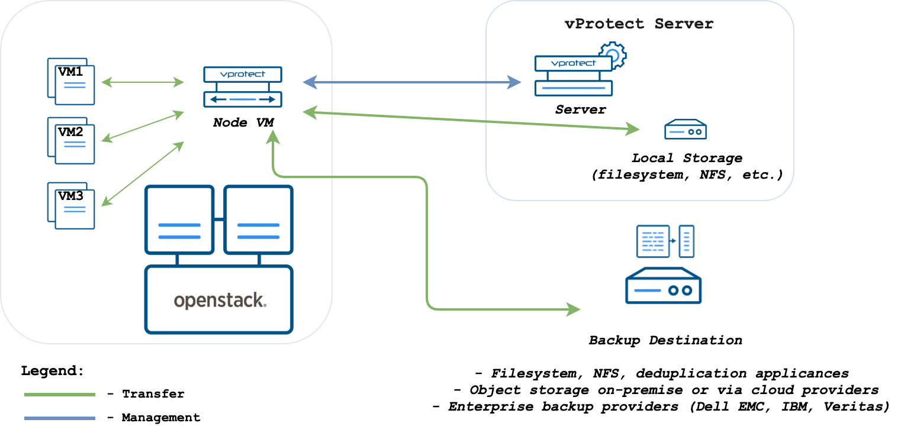
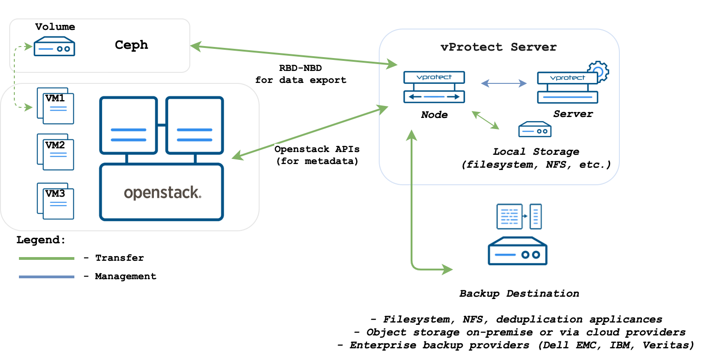
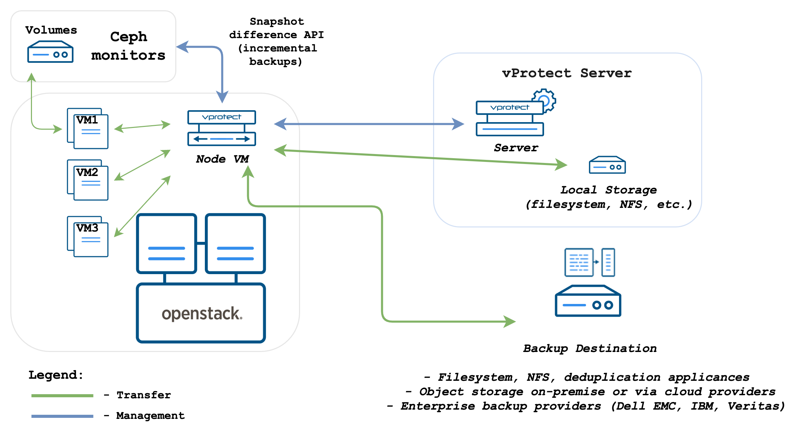
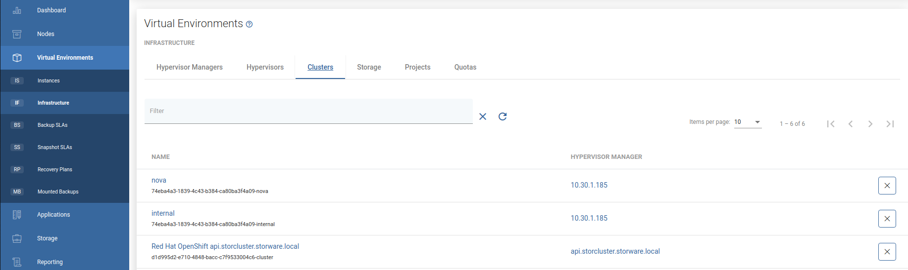
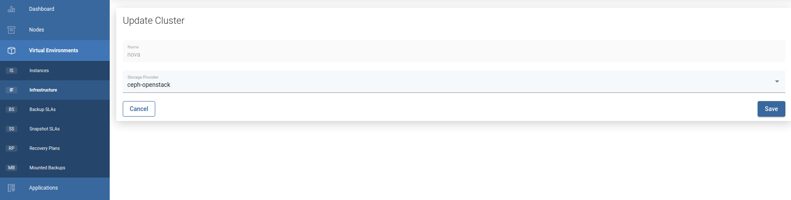

# OpenStack

vProtect supports backup for OpenStack:

* Disk image transfer - for KVM hypervisors with VMs using QCOW2
* Volumes or Ceph-based storage:
  * supports incremental backup
  * disk images are transferred directly from API \(no Proxy VM required\)
* Disk attachment through Cinder:
  * supports all hypervisors and storages
  * no incremental backup
  * proxy VM is required - used for the disk attachment process.

## Backup Strategies

### Libvirt strategy

vProtect supports OpenStack environments that use KVM hypervisors and VMs running on QCOW2 or RAW files. vProtect communicates with OpenStack APIs such as Nova and Glance to collect metadata and for the import of the restored process. However, the actual backup is done over SSH directly from the hypervisor. The process is exactly the same as in [Deployment in the KVM/Xen environment](kvm-xen.md). vProtect Node can be installed anywhere - it just needs to have access to the OpenStack APIs and hypervisor SSH via a network. Both full and incremental backups are supported.


#### Backup Process

* direct access to the hypervisor over SSH
* crash-consistent snapshot taken directly using virsh \(QCOW2/RAW file\), rbd snapshot for Ceph \(separate call for each storage backend\)
* optional application consistency using pre/post snapshot command execution • QCOW2/RAW-file data exported over SSH \(optionally with netcat\)
* Ceph RBD data exported using rbd export or RBD-NBD when incremental is used
* metadata exported from OpenStack APIs \(nova, glance, cinder\)
* last snapshot kept on the hypervisor for the next incremental backup \(if at least one schedule assigned to the VM has backup type set to incremental\)
* restore recreates files/volumes according to their backend \(same transfer mechanism as used in backup\) and then defines VM on the hypervisor

### Disk attachment

vProtect also supports the disk-attachment method using cinder. This should allow you to use cinder-compatible storage and still allow vProtect to create backups. Currently only full backup is supported. vProtect needs to communicate OpenStack service's API to attach drives to the proxy VM with vProtect Node installed.



#### Backup Process

* crash-consistent snapshot using cinder API
* optional application consistency using pre/post snapshot command execution
* metadata exported from API
* volumes created from snapshotted disks are mounted one by one to the Proxy VM
* data read directly on the Proxy VM
* incremental backups are only supported for Ceph RBD - a list of the changed blocks are fetched from the monitors, and only these blocks are read from the attached disk on the Proxy VM
* if an instance is created from the glance image - data is downloaded from glance API instance is created from instance metadata and image is fetched from glance API if exists or uploaded, if image doesn't exist in the glance and was downloaded from glance API
* restore creates empty disks on the Proxy VM, imports merged data then recreates VM using these volumes, optionally uses image from the glance if present in the target environment

### Ceph RBD storage backend

vProtect also supports deployments with Ceph RBD as a storage backend. vProtect communicates directly with Ceph monitors using RBD export/RBD-NBD when used with the Libvirt strategy or - when used with the Disk-attachment method - only during incremental backups \(snapshot difference\).

#### Libvirt strategy



#### Disk attachment strategy



vProtect supports OpenStack with Ceph RBD volumes. Here is an example of a typical \(expected\) section that needs to be added in `cinder.conf` for Ceph in the OpenStack environment:

```text
[rbd]
volume_backend_name = rbd
volume_driver = cinder.volume.drivers.rbd.RBDDriver
rbd_pool = volumes
rbd_ceph_conf = /etc/ceph/ceph.conf
rbd_flatten_volume_from_snapshot = false
rbd_max_clone_depth = 5
rbd_store_chunk_size = 4
rados_connect_timeout = -1
glance_api_version = 2
rbd_user = volumes
rbd_secret_uuid = ce6d1549-4d63-476b-afb6-88f0b196414f
```

A good article on how to set up Ceph with OpenStack can be found [here](https://superuser.openstack.org/articles/ceph-as-storage-for-openstack/).

To set up the Openstack HVM with Ceph RBD volumes in vProtect:

1. Add Ceph storage as described [here](../storage-providers/ceph-rbd.md)
2. Add the hypervisor manager as described [here](openstack.md#adding-hypervisor-managers).
3. Go to Viertual `Environments` -> `Infrastructure` -> `Clusters` and select cluster that is used by Openstack.

4. In `Storage Provider` field select previously added Ceph storage.



  Now you can save and sync the inventory - if Ceph communication works properly you should be able to see Hypervisor Storage entries \(in Hypervisors -&gt; Storage tab\) representing your Ceph storage pools.

## QCOW2 files on NFS storage

**Example:** scenario QCOW2 files residing on NFS

You can configure the NFS volume backend here:

[https://docs.openstack.org/cinder/rocky/admin/blockstorage-nfs-backend.html](https://docs.openstack.org/cinder/rocky/admin/blockstorage-nfs-backend.html)

Make sure the QCOW2 volumes are enabled.

For an NFS backend, it's recommended to set these values in `/etc/cinder/cinder.conf`:

`default_volume_type=nfs    
nfs_sparsed_volumes = true    
nfs_qcow2_volumes = true    
volume_driver = cinder.volume.drivers.nfs.NfsDriver    
enabled_backends = nfs`

## Adding hypervisor managers

When creating the hypervisor manager, provide the following data in the fields:

URL - Keystone API URL, e.g. `http://10.201.32.40:5000/v3`

Username - OpenStack user

Password - password for that user.

**Note: To provide credentials for user in different domain, please enter it following format:**
`domain\username`

When you index the hypervisor manager, **make sure you provide the correct SSH credentials** for each hypervisor that appeared on the Hypervisors tab. You can also use [SSH public key authentication](../../common-tasks/ssh-public-key-authentication.md).

**Note: When restoring the instances, make sure that the provided user is a member of the target tenant.**

## Limitations

* vProtect does not backup and restore keypairs that were created by other OpenStack users than the one used in vProtect. The restored instance will have no keypairs assigned. In such a case, the keypairs have to be backed up and restored manually under the same name before restoring the instance.
* For the libvirt strategy only, QCOW2/RAW files or Ceph RBD are supported as the backend.
* The disk attachment method with Ceph requires access to the monitors from the Proxy VM.