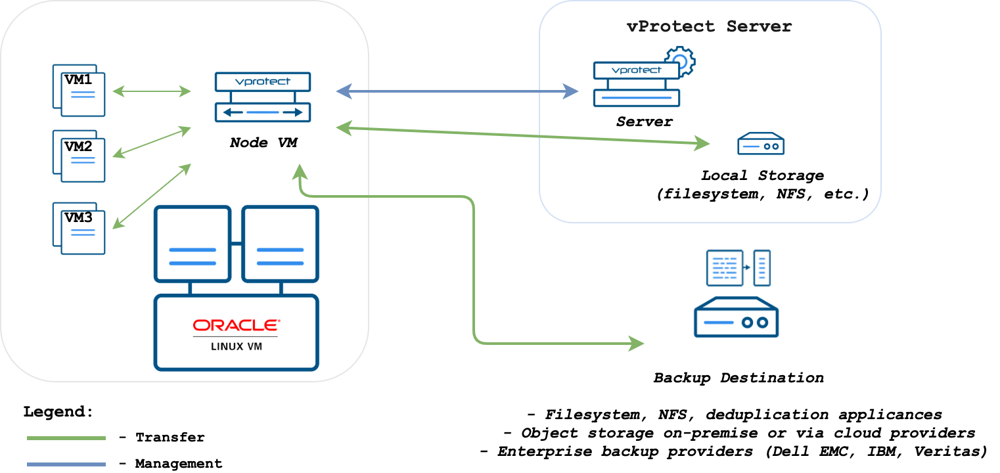
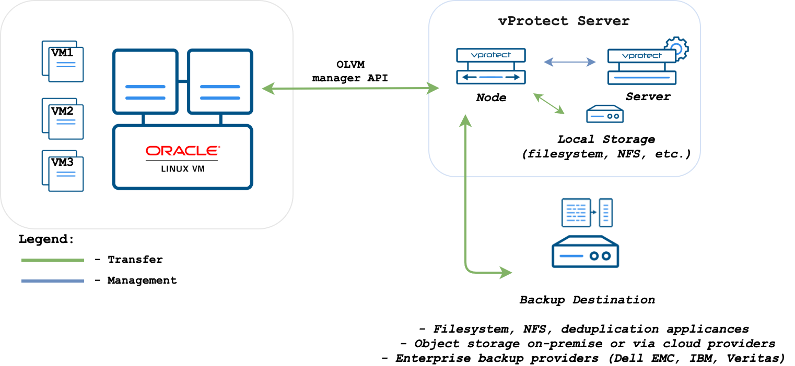
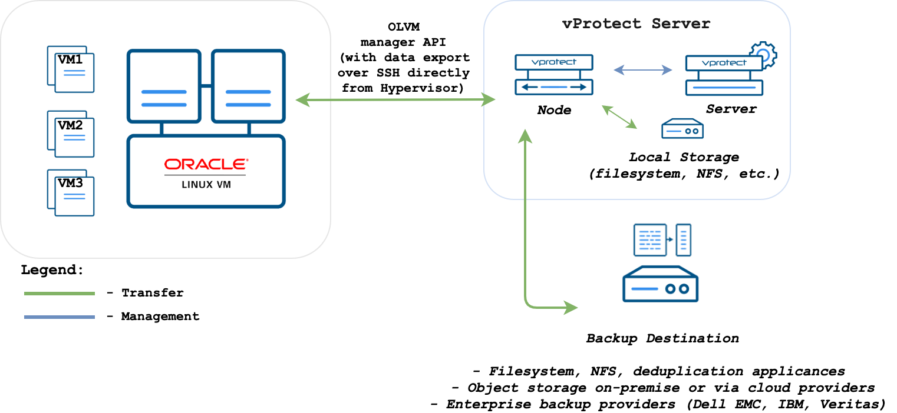
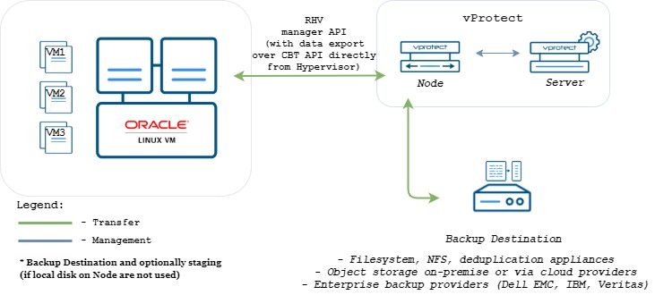

# Oracle Linux Virtualization Manager

## General

For Oracle Linux Virtualization Manager \(OLVM\) 4+ environments you can use API v4 for invoking all backup related tasks.

Import/export mode defines the way the backups and restores are done. OLVM \(with API v4\) supports 3 modes:

1. **Disk attachment**, which exports VM metadata \(in OVF format\) with separate disk files \(in RAW format\) via Proxy VM with the Node installed.
   * supports OLVM 4.0+
   * no incremental backup
   * proxy VM required in each cluster - used for disks attachment process
2. **Disk image transfer**, which exports VM metadata \(in OVF format\) with disk snapshot chains as separate files \(QCOW2 format\):
   * supports OLVM 4.2+/oVirt 4.2.3+
   * supports incremental backup
   * disk images are transferred directly from API \(no Proxy VM required\)
3. **SSH Transfer,** this method assumes that all data transfers are directly from hypervisor - over SSH
4. **Change Block Tracking,** this method backup only blocks with changes and skips zeroed sectors.
   * supports oVirt 4.4+ \(with Libvirt 6+, qemu-kvm 4.2+ and vdsm 4.40+\)
   * supports incremental backup
   * only disks with marked "enable incremental backup" in ovirt will be backuped

When adding OLVM hypervisor managers use a URL similar to the following:

```text
https://OLVM_MGR_HOST/ovirt-engine/api
```

**Note:** username for OLVM environments needs to be provided in **user@domain** format - i.e. **admin@internal**. This user must have all permissions related to manage snapshots, create/remove VMs, operate disks and export data.

## Backup Strategies

OLVM environments can be protected in several ways.

**Note:** Different strategies require a node to be installed either as a VM on the environment that you backup or installed separately.

### Disk attachment with Proxy VM

In this strategy you have a VM called “Proxy VM” that invokes commands on your hypervisor manager to snapshot and attach drives of a specific VM to itself \(Proxy VM\). The proxy VM is able to read the data from the attached disk snapshots and forward them to the backup provider.

This strategy allows you to exclude drives from backup that you do not need. Remember that, you need to install 1 Proxy VM per cluster so that drives that the node tries to attach to are reachable.

Drawback - no incremental backup for now.



**Note**: OLVM API v4 environments require vProtect Node to be installed in one of the VMs residing on the OLVM cluster. vProtect should detect automatically the VM with vProtect during index operation.

Disk attachment mode requires `Virtio-SCSI` to be enabled on the vProtect Node VM:

During the backup/restore operations, disks are transferred by attaching them to the proxy VM. This approach does not require export storage domain to be set up.

Please make sure to follow these steps: [LVM setup on vProtect Node for disk attachment backup mode](../../common-tasks/lvm-setup-on-vprotect-node-for-disk-attachment-backup-mode.md).

### Disk image transfer API

This API appeared in OLVM 4.2 and allowed export of individual snapshots directly from the OLVM manager. So , instead of having to install multiple Proxy VMs, you can have a single external Node installation, which just invokes APIs via OLVM manager.

This strategy supports incremental backups. Assuming you have OLVM 4.2 or newer – just add your manager to vProtect and setup is done. From a network perspective - it requires two additional ports to open 54322 and 54323 and your data to be pulled from the hypervisor manager.

Unfortunately, there are a few problems with the current architecture of this solution. The biggest issue is that all traffic passes via OLVM manager, which may impact transfer rates that you can achieve during the backup process. To put that into perspective – in disk attachment you can basically read data as if it is a local drive, where it could potentially be deduplicated even before transferring it to the backup destination.



Disk image transfer mode exports data directly using OLVM 4.2+ API. There is no need to setup export storage domain or setup LVM. This mode uses snapshot-chains provided by OLVM.

You may need to open communication for additional port **54323** on the OLVM manager - it needs to be accessible from vProtect Node. Also, make sure that your **ovirt-imageio-proxy** services are running and properly configured \(you can verify it by trying to upload images with OLVM UI\).

Follow the steps in this section: [Full versions of libvirt/qemu packages installation](../../common-tasks/full-versions-of-libvirt-qemu-packages-installation.md).

### SSH transfer

This is an enhancement for the disk image transfer API strategy. It allows vProtect to use OLVM API v4.2+ \(HTTPS connection to OLVM manager\) only to collect metadata. Backup is done over SSH directly from the hypervisor \(optionally using netcat for transfer\), import is also using SSH \(without netcat option\). No need to install a node on the OLVM environment. This method can significantly boost backup transfers and supports incremental backups.



This method assumes that all data transfers are directly from the hypervisor - over SSH. This means that after adding OLVM manager and detecting all available hypervisors - **you need to also provide SSH credentials or SSH keys for each of the hypervisors**. You can also use [SSH public key authentication](red-hat-virtualization.md).

### Change Block Tracking

This is a new method which is possible thanks to changes in OLVM 4.4. It uses information about zeroed and changed blocks to reduce data size and make the process faster.



This strategy supports incremental backups.

QCOW2 format is required for incremental backups so disks enabled for the incremental backup will use QCOW2 format instead of raw format.

Also, this strategy doesn't need snapshots in the backup process. Instead of it, every incremental backup uses a checkpoint that is a point in time that was created after the previous backup.

