# Oracle VM

## Deployment in Oracle VM environment

Oracle VM environment requires you to create storage used for VM export. Export storage repository should accessible also by vProtect Node in its staging directory. This implies that storage space doesn't have to be exported by vProtect Node - it can be mounted from an external source. The only requirement is to have it visible from both OVM hosts and Node itself. Keep in mind that ownership of the files on the share should allow both vProtect and OVM to read and write files.


### **Backup Process**

* crash-consistent snapshot is taken by OVM during hot-clone of the VM
* data + metadata exported by the manager to the vProtect staging space \(visible as the export Storage Repository in OVM\)
* full backup only is supported
* OVM exports are limited to 1 task per Storage Repository being used by VM \(this is the ****limitation of OVM\)
* restore is done to the export Storage Repository, the administrator needs to clone the VM using manager UI

**Note:**

* If the virtual machines are running on NFS storage, you must shut down the Oracle virtual machines to perform the backup
* Make sure the NFS share have the vProtect user UID and GID
* Directory under / vprotect\_data needs to be the same name as the OVS server pool name
* Oracle VM needs to disable services \(nfslock , rpcbind**\)**
* Restore of VM is multi-steps
  * Restore to staging space on vNode
  * Move VM from staging space to Oracle protection repository
  * Migrate the VM into the Oracle server pool

Oracle VM environments require storage repositories to be defined for each server pool and must be mounted on the vProtect node.

1. Create repository from NFS share on vProtect node
   * One server pool should have a separate subdirectory in the export path i.e. `/vprotect_data/pool01`, `/vprotect_data/pool2` - each subdirectory is a separate NFS share
   * Export \(staging\) path in the above-mentioned scenario is still `/vprotect_data`, while `pool01` and `pool02` are server pool names
   * Specify mapping between server pool names and storage repository names in hypervisor manager configuration
   * Note that export must be set to use UID and GID of `vprotect` user
   * Example export configuration in `/etc/exports` to the selected hypervisor in the RHV cluster:

     ```text
     /vprotect_data/pool01    10.50.1.101(fsid=6,rw,sync,insecure,
     all_squash,anonuid=993,anongid=990)
     /vprotect_data/pool02    10.50.1.102(fsid=7,rw,sync,insecure,
     all_squash,anonuid=993,anongid=990)
     ```

     where `anonuid=993` and `anongid=990` should have correct UID and GID returned by command:

     ```text
     [root@vProtect3 ~]# id vprotect
     uid=993(vprotect) gid=990(vprotect) groups=990(vprotect)
     ```
2. Both import and export operations will be done using these NFS shares – restore will be done directly to this storage domain, so you can easily import the backup into the Oracle VM environment.
   * Backups must be restored to the export path \(node automatically changes names to the original paths that are recognized by the OVM manager.

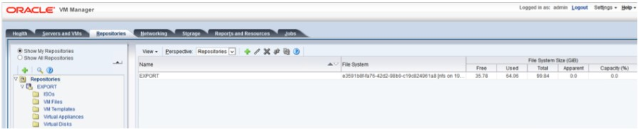

### Example - How to configure OVM protection with PowerProtect DD

* Create DDBoost device

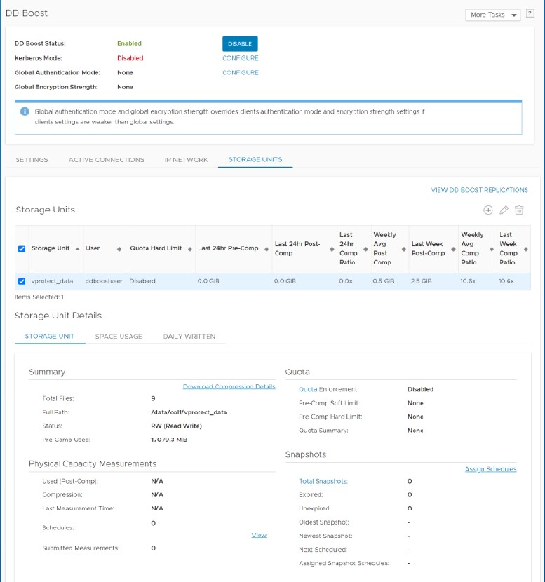

* Create NFS share

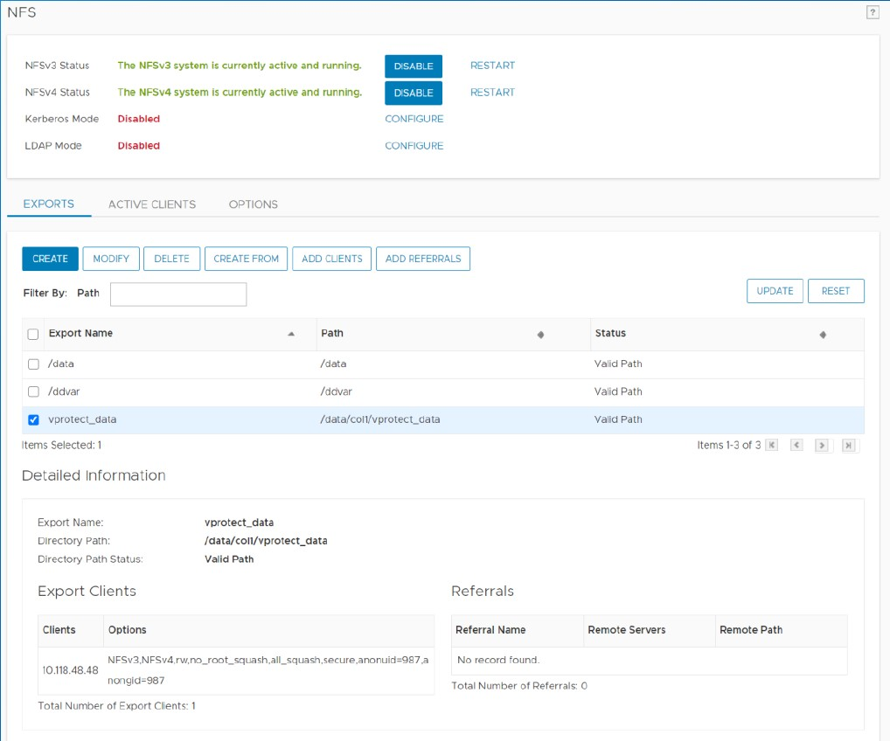

* Mount DDBoost device on vProtect Node

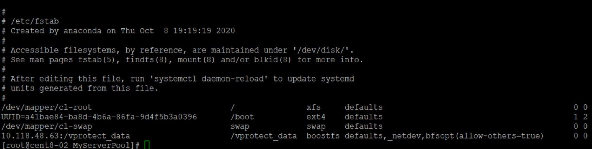

* Create symbolic links for OVM Pool name \(MyServerPool\) to BoostFS mount point command example: ln -s /vprotect\_data /MyServerPool

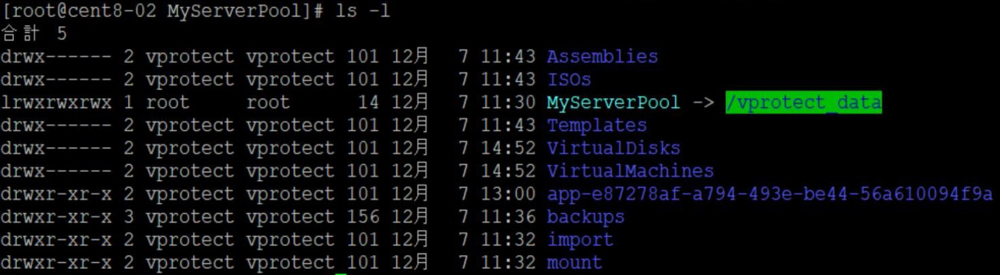

* Create Storage Server for DD NFS Share

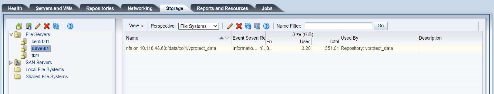

* Create Repository using DD

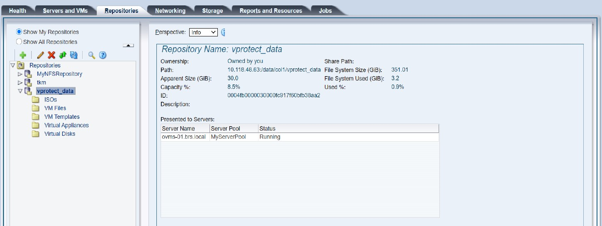

* Add OVM Hypervisor Manager on vProtect _**Note:** You can get the "Storage Repository ID"_  _from the "OVM repositories" menu shown in the previous step_

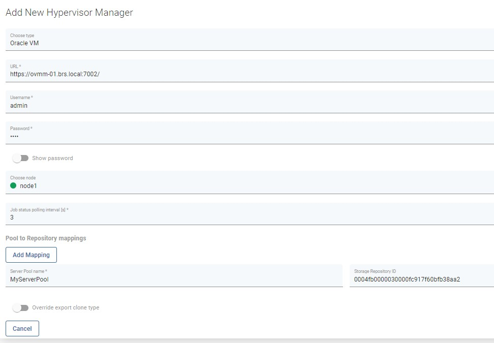

* An example of how "OVM" objects should look after resource synchronization

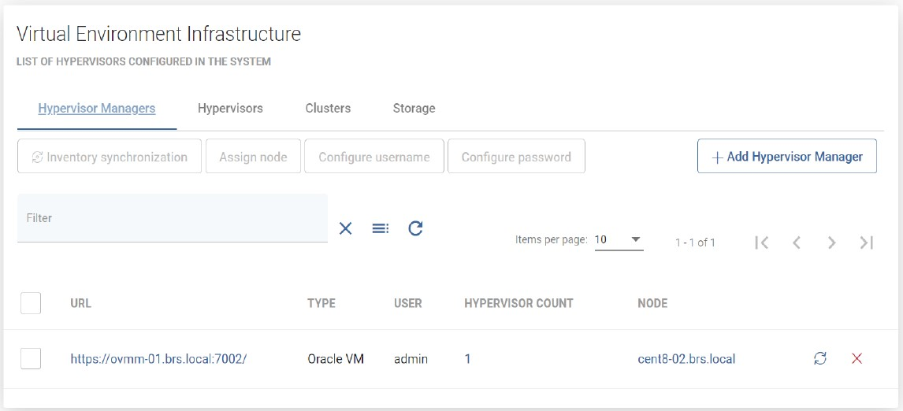

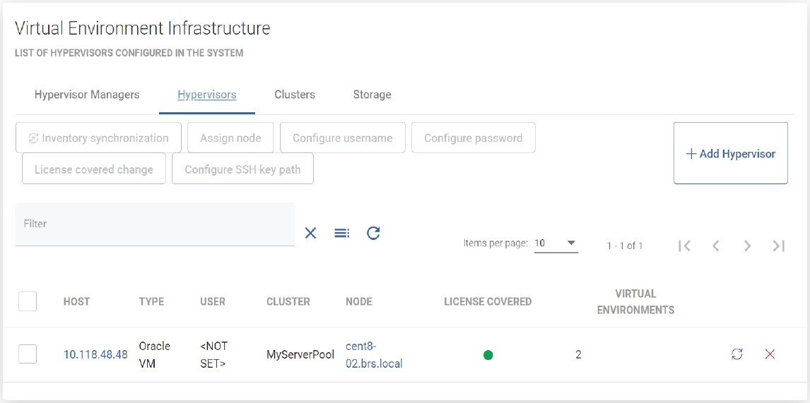

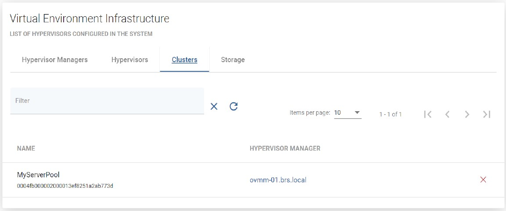

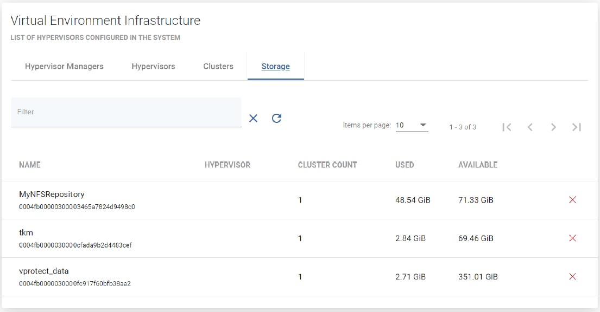

* Example of Backup Destination Configuration


That's it, now you should be able to back up your environment

