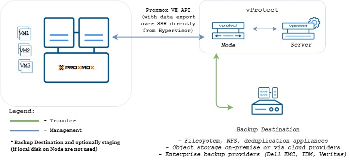
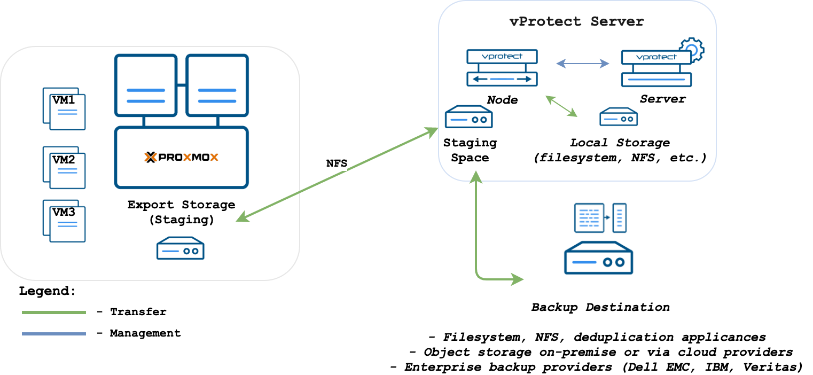

# Proxmox VE

## SSH Transfer

SSH Transfer strategy:

* supports Proxmox 5.0+
* supports only QCOW2 disk images
* supports incremental backups
* supports over iSCSI



Backup is done by transferring QCOW2 disk images over SSH directly from the hypervisor \(optionally using netcat for transfer\). Metadata is backed up only in full backup. This method supports incremental backups where the last snapshot is required for the next incremental backups. Result backup has separate files for each disk + metadata, so you have the option to exclude specific drives as well.

## Export storage repository

Proxmox virtual environment requires you to create storage used for VM export. Export storage should accessible also by vProtect Node in its staging directory. This implies that storage space doesn't have to be exported by vProtect Node - it can be mounted from an external source. The only requirement is to have it visible from both Proxmox VE hosts and Node itself. Keep in mind that ownership of the files on the share should allow both vProtect and Proxmox VE to read and write files.



Proxmox virtual environments require backup storage to be defined on each server. This storage must be location accessible from vProtect Node \(the simplest setup, when you use only 1 node, is to create NFS share for staging path on vProtect Node\)

1. Create storage from NFS share \(Content-type: **only VZDump**\)


* Export share must be set to use UID and GID of `vprotect` user
* Example export configuration in `/etc/exports` to the selected hypervisor in cluster:

  ```text
  /vprotect_data    PROXMOX_HOSTS(fsid=6,rw,sync,insecure,all_squash,
  anonuid=993,anongid=990)
  ```

  where `anonuid=993` and `anongid=990` should have correct UID and GID returned by command:

  ```text
  [root@vProtect3 ~]# id vprotect
  uid=993(vprotect) gid=990(vprotect) groups=990(vprotect)
  ```

* Both import and export operations will be done using these NFS shares – restore will be done directly to this storage domain, so you can easily import the backup into Proxmox VE
  * backups must be restored to the export path \(node automatically changes names to the original paths that are recognized by Proxmox VE.
* Name for storage must be later provided in node configuration \(`Hypervisor -> Proxmox` section\)


## File-level restore support for VMA images

Prepare VMA extractor on vProtect Node - you have 2 options:

* build VMA extractor like this \(requires Internet on the **node**\):

```text
cd /opt/vprotect/scripts/vma
./setup_vma.sh
```

* download VMA extractor from Storware FTP and install it

```text
cd /opt/vprotect/scripts/vma
./setup_vma.sh PATH_TO_VMA_ARCHIVE
```

