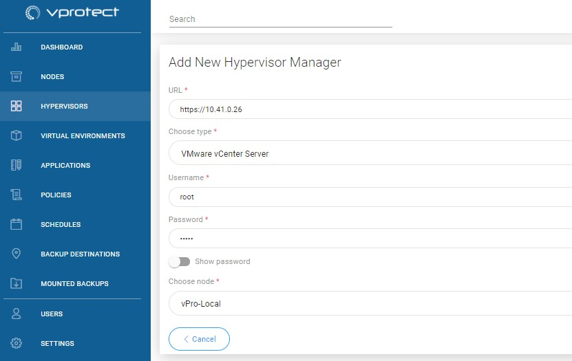
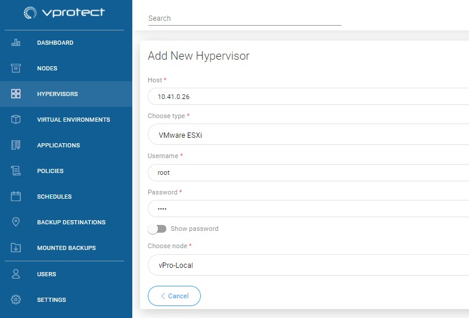

# VMware vSphere/ESXi

vProtect supports one backup solution for VMware vSphere / ESXi. We use the API to communicate with VMware and we can add a single ESXi or vCenter host as a hypervisor manager.

1. Backup user must have following privileges for backup/restore procedure:
   * VirtualMachine &gt; Change Configuration
   * VirtualMachine &gt; Edit Inventory
   * VirtualMachine &gt; Provisioning
   * VirtualMachine &gt; Snapshot management
   * Datastore &gt; Browse datastore
   * Datastore &gt; Update virtual machine files
   * Datastore &gt; Update virtual machine metadata
   * Resource &gt; Assign virtual machine to the resource pool
   * Tasks &gt; Create task
2. You must have open ports 443/TCP 902/TCP from ESX/vCenter to vProtect node to run backup.
3. Add your vCenter as Hypervisor Manager in Web UI - `https://vcenter.hostname.or.ip`

If you have stand-alone ESXi hosts - add all hypervisors separately in Hypervisors tab - provide just their hostnames or IPs and credentials.

