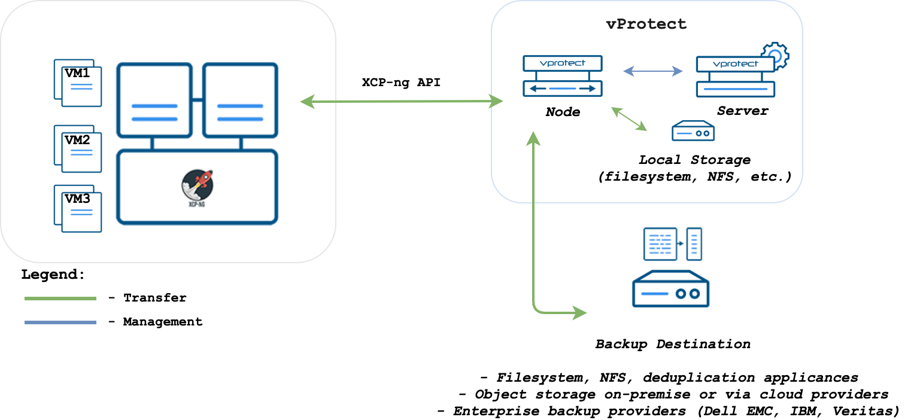
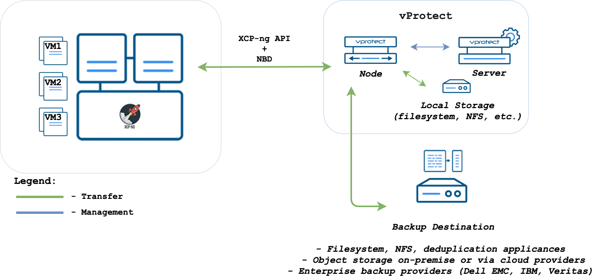

# XCP-ng

## Backup Strategies

### XVA-based

In this strategy, VM is exported as a single XVA bundle containing all of the data. Incremental backup is also supported. Data is transferred directly from XenServer API without the need to setup anything on the hosts.



#### Backup Process

* crash-consistent snapshot using hypervisor's API only for full backups
* optionally quiesced snapshot can be done if enabled and guest tools installed inside - if quiesced snapshot has been failed we are doing regular one
* optional application consistency using pre/post snapshot command execution
* data export directly from the hypervisor using hypervisor's API - both full \(XVA\) and delta \(VHD for each disk\)
* full backup \(XVA\) contains metadata
* snapshot taken with full backup is kept on the hypervisor for the next incremental backup - if at least one schedule assigned to the VM has backup type set to incremental
* incremental backups are cumulative \(all data since last full backup\)
* restore recreates VM from XVA, and then applies changes from each incremental backup using Hypervisor APIs

### Changed-Block Tracking

In this strategy, VM is exported using API \(full backup\) and Network Block Device service \(NBD, incremental backups\) on the hypervisor hosts. The CBT feature in Citrix XenServer 7.3+ may require an additional license \(for XCP-NG, CBT should be free\). Result backup has separate files for each disk + metadata, so you have the option to exclude specific drives as well.

**Note:** For full backups only, you can still use this strategy without CBT enabled on the hypervisor.



#### Backup Process

* crash-consistent snapshot using hypervisor's API
* optionally quiesced snapshot can be done if enabled and guest tools installed inside - if quiesced snapshot has been failed we are doing regular one
* optional application consistency using pre/post snapshot command execution
* CBT enabled during full backup on each disk if it wasn't done earlier
* metadata exported from API
* full backup - each disk exported from API \(RAW format\)
* incremental backup - each disk queried for changed blocks and which are exported over NBD
* last snapshot kept on the hypervisor for the next incremental backup - if at least one schedule assigned to the VM has backup type set to incremental
* restore recreates VM from metadata using API and imports merged chain of data for each disk using API

## Change Block Tracking setup

Citrix Hypervisor/XCP-ng introduced CBT mechanism in XenServer 7.3. In order to enable CBT backups the following requirements must be met:

1. Citrix Hypervisor 7.3 \(XCP-ng 7.4\) or above must be used - note that CBT is a licensed feature
2. NBD server must be enabled on the hypervisor
3. NBD client and NBD module must be installed on vProtect Node \(vprotect should take care of this automatically during installation\)  

### Notes on restore

1. When image-based backups \(XVA\) are used - vProtect restores VMs as templates and renames them appropriately after the restore
2. When separate disk backups are used:
   * if there is already a VM in the infrastructure with the UUID of the VM being restored \(check `present` flag in VM list\) - vProtect restores as a new VM \(MAC addresses will be generated\)
   * otherwise vProtect attempts to restore the original configuration including MAC addresses

### NBD Server setup \(on XenServer\)

1. Get Network UUID that you intend to use for communication with vProtect - run on XenServer shell:

   ```text
   [root@xenserver-cbt ~]# xe network-list 
   uuid ( RO)            : e16b4e34-47d4-9a6e-371b-65beb7252d69
          name-label ( RW): Pool-wide network associated with eth0
    name-description ( RW): 
              bridge ( RO): xenbr0
   ..........
   uuid ( RO)            : 244a2fa7-ae7c-e45c-819a-44cecf51e8fa
          name-label ( RW): Host internal management network
    name-description ( RW): Network on which guests will be assigned a private link-local IP address which can be used to talk XenAPI
              bridge ( RO): xenapi
   ```

   For example: `e16b4e34-47d4-9a6e-371b-65beb7252d69`

2. Enable NBD service on your hypervisor:

   ```text
   xe network-param-add param-name=purpose param-key=nbd 
   uuid=<network-uuid>
   ```

### NBD Client setup \(on vProtect Node\)

**Note:** _This part is done by vProtect automatically during installation. The article may be helpful in case of problems with the NBD module._

vProtect comes with pre-build RPM and modules for CentOS 7 distribution.

1. Go to the NBD directory:

   ```text
   cd /opt/vprotect/scripts/nbd
   ```

2. Use `yum` to install NBD client:

   ```text
   yum -y install nbd-3.16.1-1.el7.centos.x86_64.rpm
   ```

3. If your Linux does not have an NBD module installed, you may try to build one for you \(there is a script for Red-Hat based distributions that downloads kernel, enables NBD module and builds it\) or using the already provided module:
   * you can compile the module by running:

     ```text
     ./compile_nbd_module.sh
     ```

   * if you have Centos 7, you also may use the pre-build module \(for CentOS 7.4.1708 with kernel 3.10.0-693.5.2\) - which is `nbd.ko`
4. Enable the module by invoking the script \(the following command will either use a module in your kernel or copy provided `nbd.ko`\):

   ```text
   ./enable_nbd.sh
   ```

5. Verify that you have `/dev/nbd*` devices available on your vProtect node host:

   ```text
   [root@localhost nbd]# ls /dev/nbd*
   /dev/nbd0  /dev/nbd1  /dev/nbd10  /dev/nbd11  /dev/nbd12  /dev/nbd13  
   /dev/nbd14  /dev/nbd15  /dev/nbd2  /dev/nbd3  /dev/nbd4  /dev/nbd5  
   /dev/nbd6  /dev/nbd7  /dev/nbd8  /dev/nbd9
   ```

6. Restart your vProtect Node:

   ```text
   systemctl restart vprotect-node
   ```

