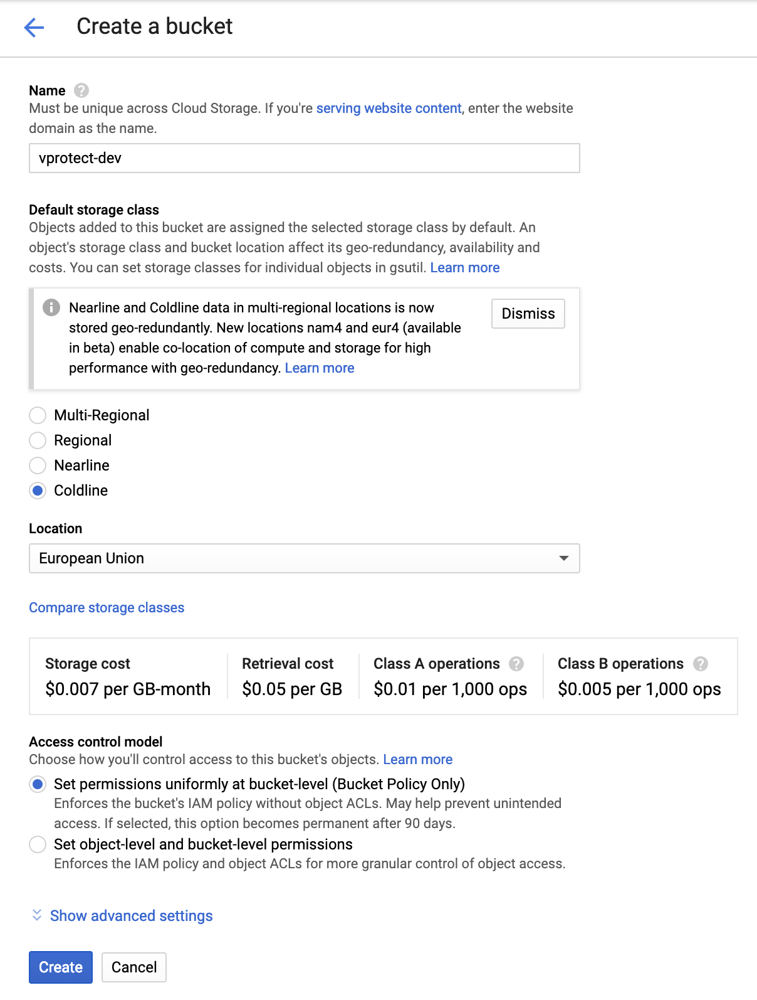
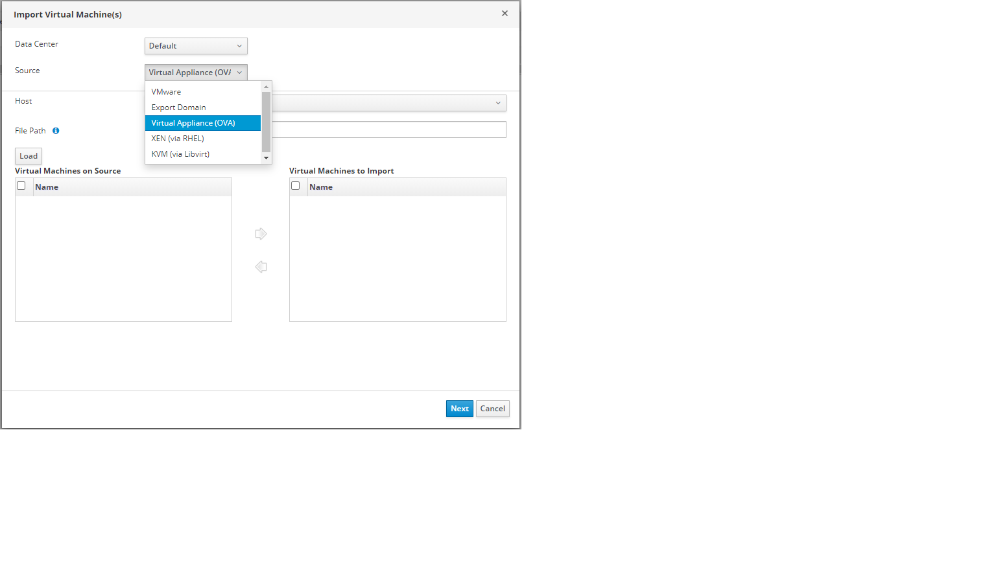
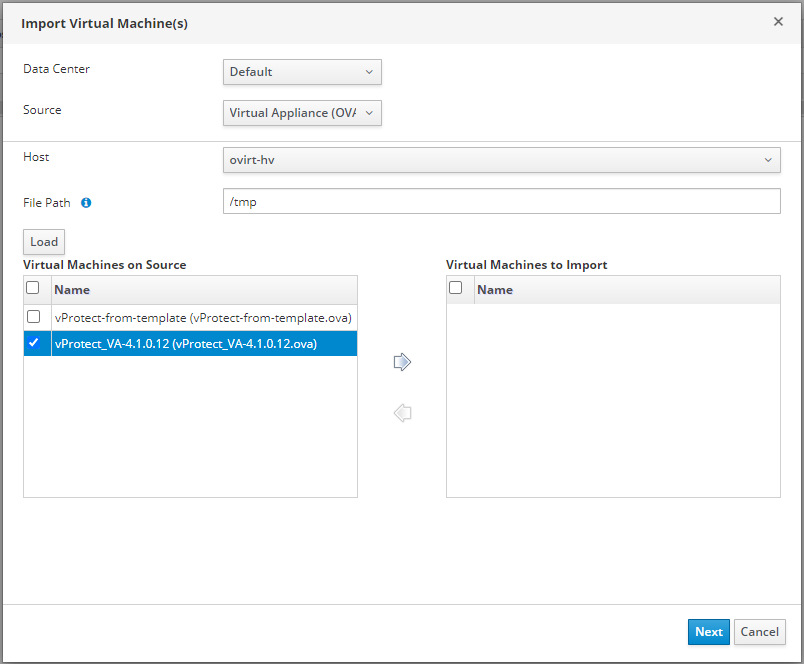
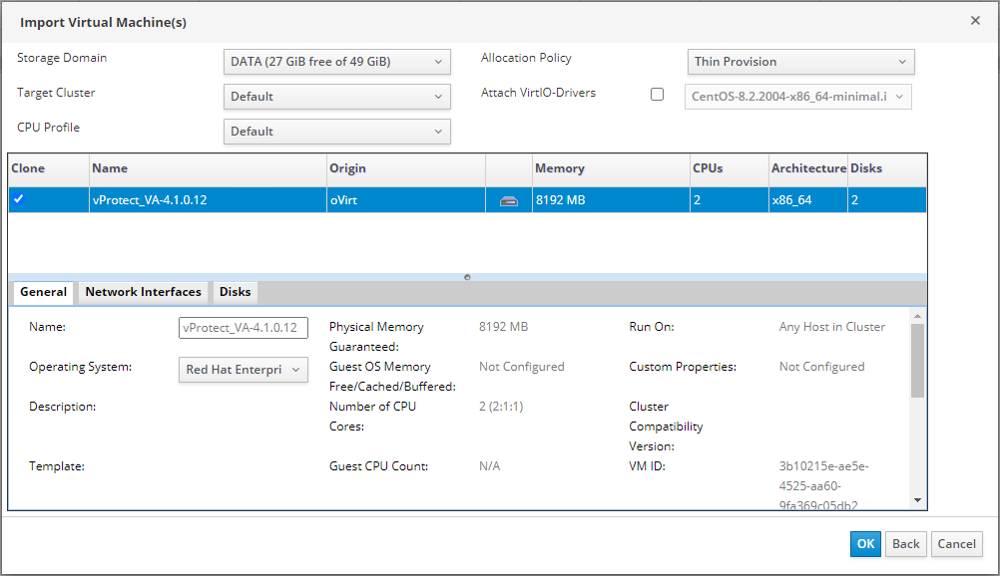

# RHV/oVirt/OLVM Virtual Appliance

Unpack downloaded tar pack:

```text
   [root@storage temp]# tar -xvf vProtect-RHV.tar.gz
   vProtect-RHV/
   vProtect-RHV/master/
   vProtect-RHV/master/vms/
   vProtect-RHV/master/vms/70dd2959-f827-42f9-a40c-1e384cb37084/
   vProtect-RHV/master/vms/70dd2959-f827-42f9-a40c-1e384cb37084/70dd2959-f827-42f9-a40c-1e384cb37084.ovf
   vProtect-RHV/images/
   vProtect-RHV/images/27afaa2a-079a-4fba-8e88-5f05c752d039/
   vProtect-RHV/images/27afaa2a-079a-4fba-8e88-5f05c752d039/c4d596fb-a4d2-4cb9-bbb5-e8e29c4e9519
   vProtect-RHV/images/27afaa2a-079a-4fba-8e88-5f05c752d039/c4d596fb-a4d2-4cb9-bbb5-e8e29c4e9519.meta
   vProtect-RHV/images/a425fde0-bd64-4ef9-ba13-71372c84e56c/
   vProtect-RHV/images/a425fde0-bd64-4ef9-ba13-71372c84e56c/a8bccf24-dfc6-4b4f-b916-836a7be7a66a
   vProtect-RHV/images/a425fde0-bd64-4ef9-ba13-71372c84e56c/a8bccf24-dfc6-4b4f-b916-836a7be7a66a.meta
```

Optionally change owner for the downloaded files

```text
   chown user_name:group_name vProtect-RHV/ -R
```

Copy pack to your export domain:

```text
   cp -rf temp/vProtect-RHV/* 6abe3ee7-b174-4cc3-953a-af89c6e8b82c/
```

Log in to RHV/oVirt, go to "Compute", and "Virtual Machines" - Click the three dots icon on the right, then select import.



Now you see Import wizard. Select the source of import - "Virtual appliance \(OVA\)".



Enter a path where you place OVA files and click on the load button.


Now select Virtual Machine to import.



The last window with a summary of the virtual machine to be imported



After the image is imported into the environment, select network interface.

Then connect to VM \(console or ssh\), run nmtui &gt; "Edit a connection" and check network adapter settings.

You can find login credentials [here](./).

