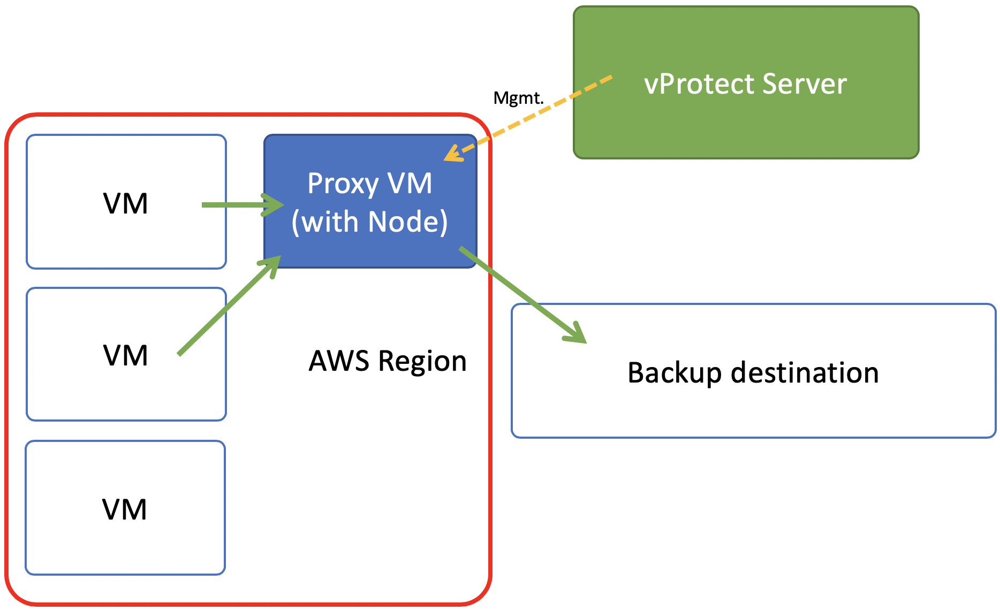

# Deployment in AWS EC2 environment

vProtect supports AWS EC2 cloud platform by using a VM called “Proxy VM”. Node invokes commands on AWS to snapshot and attach EBS drives of a specific VM to itself \(Proxy VM\). Proxy VM is able to read the data from the attached disk snapshots and forward them to backup provider.

This means that you need to create an EC2 instance \(Proxy VM\) in each region. Keep in mind that if you don't want to transfer data between AZ during the backup you may want to deploy Proxy VMs in each AZ.

vProtect Server can be deployed anywhere, but keep in mind that Nodes need to be able to call server over HTTP\(S\) on the port you have specified.

Backup strategy for AWS allows you to exclude drives from backup which you don’t need. Remember that, you need to install 1 Proxy VM per AWS region, so that drives that Node tries to attach are reachable.

All backup destinations can be used but keep in mind that you may be charged for transferring data between regions, AZs and to external backup providers.



## Typical use cases

There are several scenarios for AWS which may suit your case:

* **Backup EC2 to S3** - in this case after dumping backup vProtect can push them to S3 bucket. You may consider using VPC endpoint to boost your store operation performance
* **Backup EC2 to EBS volume on the proxy** - you then can use VDO to deduplicate data and optimize your storage consumption significantly. Keep in mind that you may want to protect your EBS volume using EBS snapshots as well.
* **Backup EC2 to your local backup provider** - if you have already central enterprise backup solution you may want to use it for as a backup provider for EC2 instances running in AWS. You should consider using Direct connect to have higher bandwidth available.
* **Backup EC2 to your other cloud provider** - If you're using multiple clouds you also may consider storing data in GCS or Azure backup providers.

**Notice**: In all cases depending on your target - you may be charged for data transfers.

## Setup considerations

It is assumed that you have a working experience with AWS EC2 to be able to deploy vProtect Node instances. You also need to have IAM user with permissions that allow you to deploy instance and generate access/secret keys for vProtect.

Remember to use **CentOS 7 AMI** as a base image - both for Server and Nodes. After you deploy 

You add AWS EC2 as Hypervisor Manager. You need to provide account ID and access/secret keys of a user that has permissions to handle snapshot, AMI and EBS volume operations,  EC2 instance creation.

In the same screen you also specify if AMIs of root volumes should be created during backup process. For Windows instances we recommend to keep also AMI image with each backup to have option to restore original root volume as well. You also can skip AMI creation, but this means that during restore you need to specify appropriate AMI ID that you want to boot from. 

## Permissions

Here are IAM permissions that vProtect needs to have for backup/restore operations

```text
{
  "Version": "2012-10-17",
  "Statement": [
    {
      "Sid": "Stmt1565003475859",
      "Action": [
        "ec2:AttachNetworkInterface",
        "ec2:AttachVolume",
        "ec2:CreateImage",
        "ec2:CreateSecurityGroup",
        "ec2:CreateSnapshot",
        "ec2:CreateTags",
        "ec2:CreateVolume",
        "ec2:DeleteSnapshot",
        "ec2:DeleteVolume",
        "ec2:DeregisterImage",
        "ec2:DescribeAvailabilityZones",
        "ec2:DescribeImages",
        "ec2:DescribeInstances",
        "ec2:DescribeSecurityGroups",
        "ec2:DescribeSnapshots",
        "ec2:DescribeVolumes",
        "ec2:DetachVolume",
        "ec2:RegisterImage",
        "ec2:RunInstances",
        "ec2:StopInstances",
        "ec2:TerminateInstances"
      ],
      "Effect": "Allow",
      "Resource": [
        "arn:aws:ec2:*:*:instance/*",
        "arn:aws:ec2:*:*:volume/*",
        "arn:aws:ec2:*:*:snapshot/*",
        "arn:aws:ec2:*:*:image/*",
        "arn:aws:ec2:*:*:network-interface/*",
        "arn:aws:ec2:*:*:security-group/*"
      ]
    }
  ]
}
```

