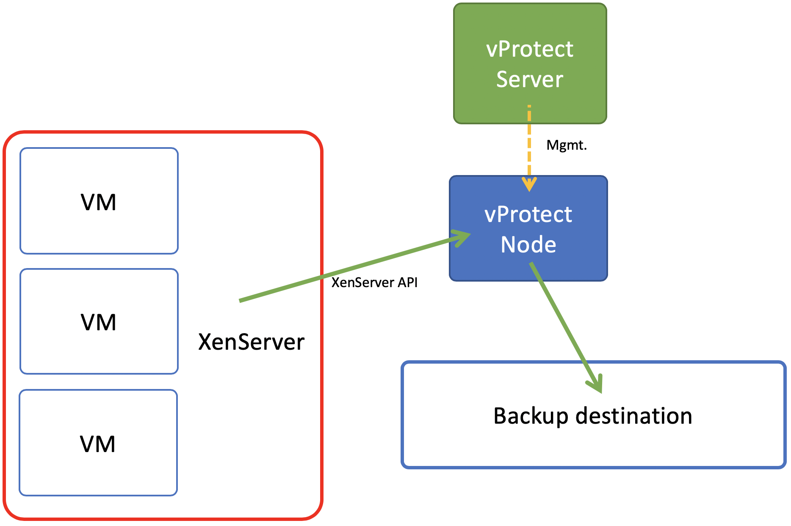

# Deployment in Citrix XenServer environment

vProtect supports 2 backup strategies for Citrix XenServer.

## Backup strategy 1 - XVA-based

In this strategy VM is exported as a single XVA bundle containing all of the data. Incremental backup is also supported. Data is transferred directly from XenServer API without the need to setup anything on the hosts.

## Backup strategy 2 - Changed-Block Tracking

In this strategy VM is exported using XenServer API \(full backup\) and Network Block Device service \(NBD, incremental backups\) on the XenServer hosts. CBT feature in Citrix XenServer 7.3+ may require additional license. Result backup has separate files for each disk + metadata, so you have option to exclude specific drives as well.

Notice, that for full backups only you can still used this strategy without CBT enabled on the hypervisor.

