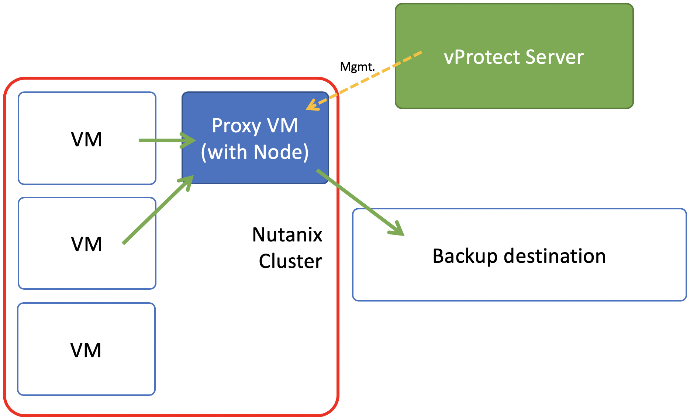

# Deployment in Nutanix AHV environment

vProtect supports Nutanix AHV platform by using a VM called “Proxy VM”. Node invokes commands on your hypervisor manager to snapshot and attach drives of a specific VM to itself \(Proxy VM\). Proxy VM is able to read the data from the attached disk snapshots and forward them to backup provider.

This strategy allows you to exclude drives from backup which you don’t need. Remember that, you need to install 1 Proxy VM per cluster, so that drives that Node tries to attach are reachable.

