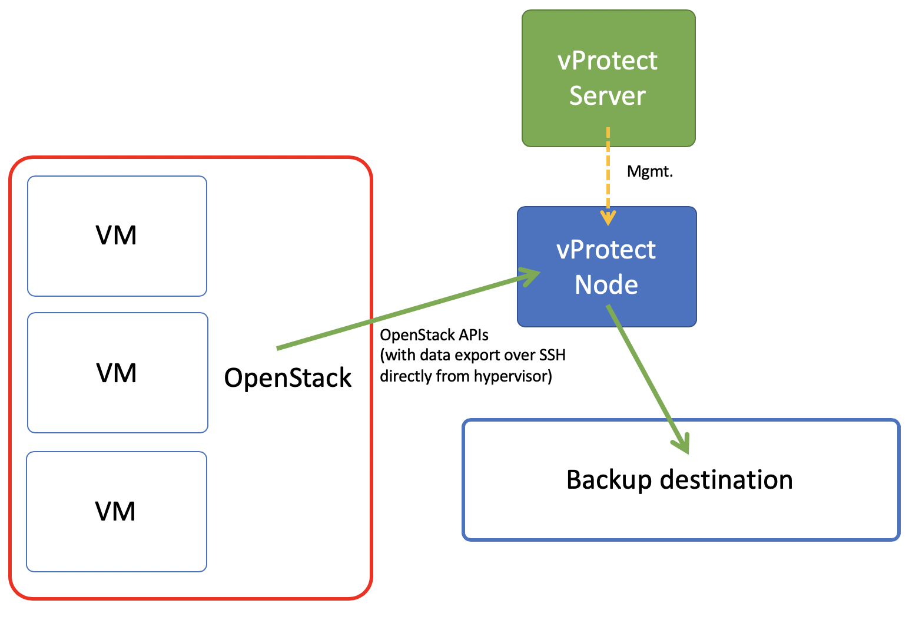

# Deployment in OpenStack environment

vProtect supports OpenStack environments that use KVM hypervisors and VMs running on QCOW2 or RAW files. vProtect communicates with OpenStack APIs such as Nova and Glance to collect metadata and for import of the restored process. However the actual backup is done over SSH directly from the hypervisor. Process is exactly the same as in [Deployment in KVM/Xen environment](deployment-in-kvm-xen-environment.md). vProtect Node can be installed anywhere - it just needs to reach OpenStack APIs and hypervisors SSH via network. Both full and incremental backups are supported.

