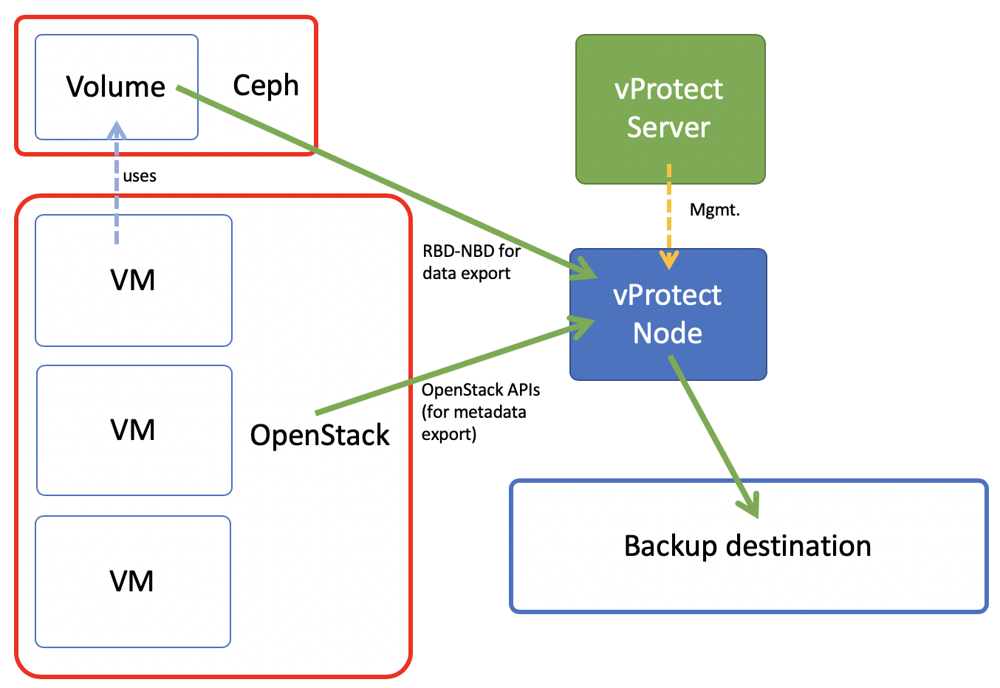
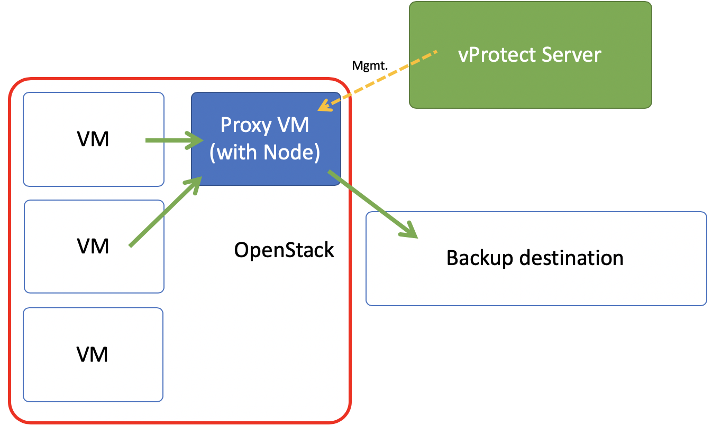

# Deployment in OpenStack environment

## Libvirt strategy

vProtect supports OpenStack environments that use KVM hypervisors and VMs running on QCOW2 or RAW files. vProtect communicates with OpenStack APIs such as Nova and Glance to collect metadata and for import of the restored process. However the actual backup is done over SSH directly from the hypervisor. Process is exactly the same as in [Deployment in KVM/Xen environment](deployment-in-kvm-xen-environment.md). vProtect Node can be installed anywhere - it just needs to reach OpenStack APIs and hypervisors SSH via network. Both full and incremental backups are supported.

### OpenStack with Ceph RBD storage backend

vProtect supports also deployments with Ceph RBD as a storage backend. vProtect communicates directly with Ceph monitors using RBD-NBD \(notice that if NBD is not available, you need to use disk attachment method\) for both full and incremental backups.

## Disk attachment using Cinder

vProtect supports also disk-attachment method using cinder. This should allow you to use cinder-compatible storage and still allow vProtect to create backups. Currently only full backup is supported. vProtect needs to communicate OpenStack service's API to attach drives to the proxy VM with the vProtect Node installed.

