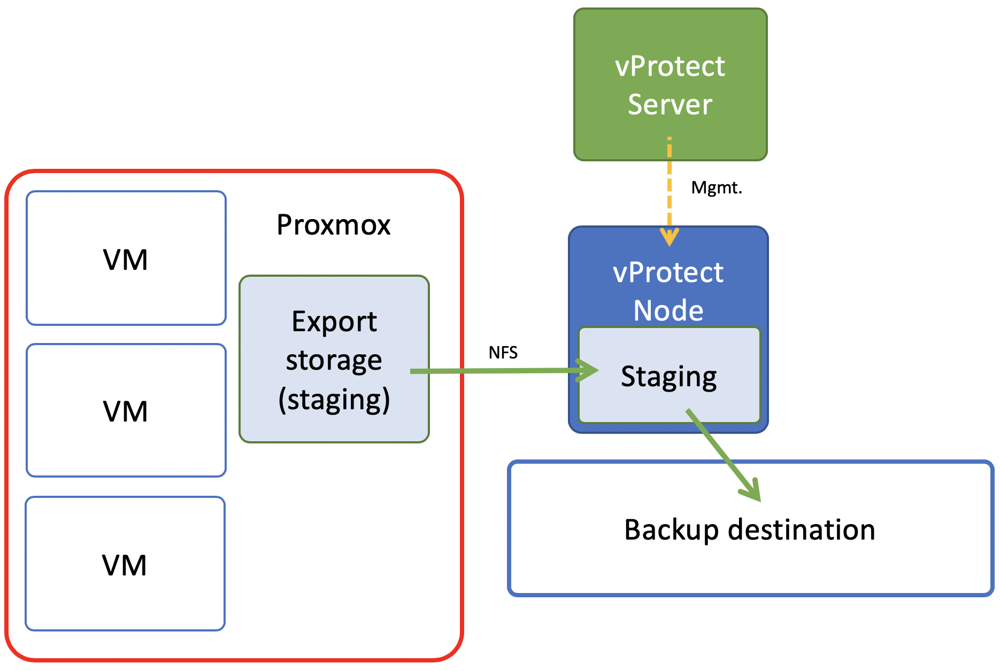

# Deployment in Proxmox VE environment

Proxmox environment requires you to create storage used for VM export. Export storage should accessible also by vProtect Node in its staging directory. This implies that storage space doesn't have to be exported by vProtect Node - it can be mounted from external source. The only requirement is to have it visible from both Proxmox hosts and Node itself. Keep in mind that ownership of the files on the share should allow both vProtect and Proxmox to read and write files. Please refer to [Proxmox setup](../initial_config/virtualization-platforms/setup_proxmox.md) for details.

